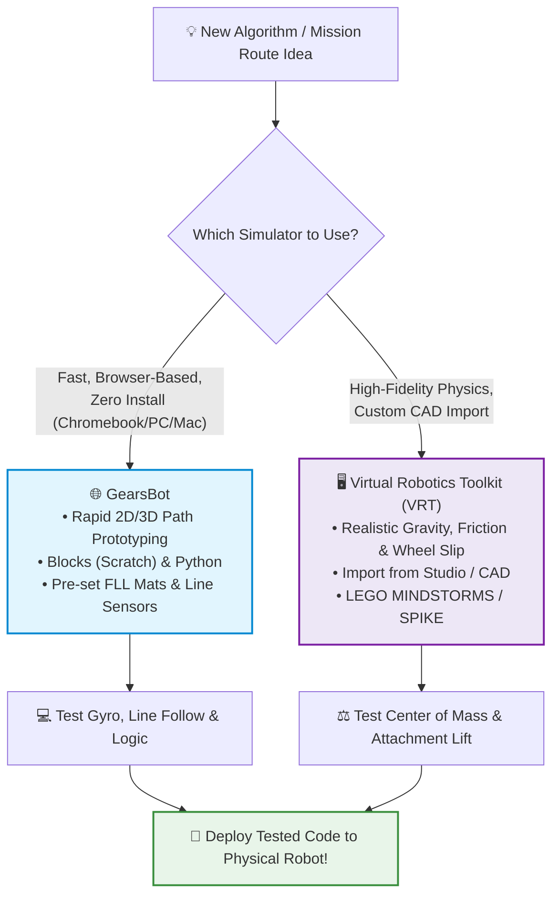
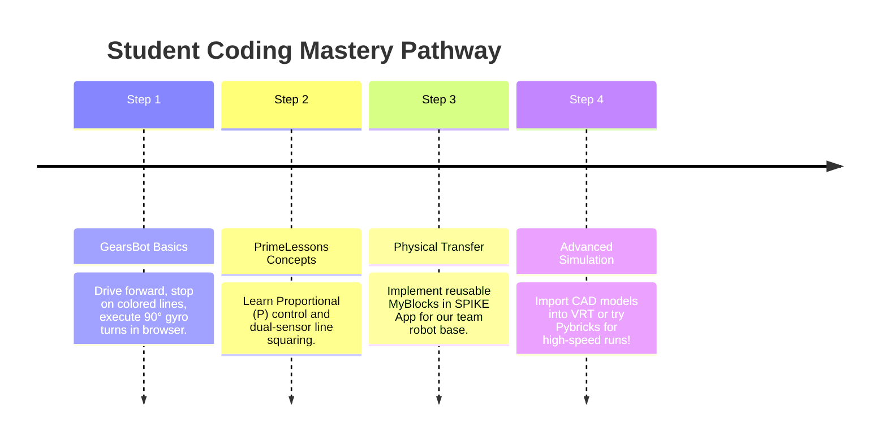

# 🎮 Advanced FLL Coding Tutorials, Simulators & Learning Hub

> *"You don't need a physical robot in your hands 24/7 to become a world-class programmer."*

In FIRST LEGO League (FLL), our team has one competition mat and two SPIKE Prime driving bases, but **nine team members** who all want to build code and test mission algorithms. 

**Robot simulators and advanced tutorial platforms** solve this problem completely:
- Practice coding at home on any computer or Chromebook without taking the physical robot home.
- Test routing algorithms, gyro turns, and line-following logic in seconds.
- Rapidly prototype ideas without wearing down LEGO gears or draining Hub batteries.

Here are the top simulators, video courses, and programming resources recommended by FLL champions, coaches, and the global robotics community.

---

## 🕹️ Top FLL Robot Simulators

---

### 1. 🌐 GearsBot — Fast, Browser-Based Prototyping

* **Website:** [gears.aposteriori.com.pt](https://gears.aposteriori.com.pt/)
* **Platform:** 100% Web Browser (Chrome, Safari, Edge — runs great on Chromebooks and laptops).
* **Cost:** **Free & Open Source**.
* **Language Support:** Blockly / Scratch blocks (identical to the LEGO SPIKE App) and MicroPython.

#### Why FLL Teams Love It:
GearsBot is overwhelmingly the community favorite on Reddit (`r/FLL`) for quick algorithmic experimentation. You can jump directly into a web browser, select a virtual robot configured with dual color sensors, ultrasonic sensors, and a gyro, drop it onto a competition-style mat, and run code immediately.

#### Best Used For:
- **Proportional Line Following:** Tuning P-controller constants without chasing a runaway robot across the room.
- **Line Squaring (Dual Sensor Alignment):** Testing the logic of stopping each wheel independently when it sees black.
- **Gyro Turn Accuracy:** Understanding how heading angle adjustments compensate for wheel slippage.
- **Homework & Solo Practice:** Teammates can test their mission route theories at home during the week.

> [!TIP]
> **Getting Started with GearsBot:**
> 1. Visit [gears.aposteriori.com.pt](https://gears.aposteriori.com.pt/).
> 2. Click **Simulator** in the top bar.
> 3. Select an arena (e.g., Grid, Line Track, or custom mat image).
> 4. Switch between the **Blocks** tab (looks like SPIKE Scratch) or **Python** tab.
> 5. Click the green **Run** button to watch your code drive the virtual bot!

---

### 2. 🪐 Virtual Robotics Toolkit (VRT) — Physics-Based 3D Simulation

* **Website:** [virtualroboticstoolkit.com](https://www.virtualroboticstoolkit.com/)
* **Platform:** Windows PC and macOS (Desktop application).
* **Cost:** Free trial available; individual / classroom license.
* **Compatibility:** Integrates with LEGO Digital Designer (LDD), BrickLink Studio (`.ldr`/`.io`), and official LEGO programming environments.

#### Why Advanced Teams Use It:
While GearsBot excels at fast code logic, **Virtual Robotics Toolkit (VRT)** is a full physics sandbox. It simulates real-world friction, wheel torque, surface resistance, gravity, and attachment collisions.

#### Best Used For:
- **Custom Robot CAD Import:** You can design your robot in BrickLink Studio or our [3D CAD Studio](../webtools/mission_cad_studio.html), export the model, and load your *exact* physical design into VRT!
- **Weight Distribution & Center of Gravity:** See if high-mounted heavy attachments will cause your robot to tip when accelerating or stopping abruptly.
- **Complex Mission Model Physics:** Testing if a mechanical lever arm has enough torque to lift an FLL mission model weight before building it with real bricks.

---

### 📊 Simulator Comparison Matrix

| Feature | 🌐 GearsBot | 🪐 Virtual Robotics Toolkit (VRT) |
| :--- | :--- | :--- |
| **Installation** | None (instant in-browser) | Desktop download (Win/Mac) |
| **Hardware Requirements** | Runs on anything (Chromebooks, tablets, laptops) | Needs dedicated GPU/decent CPU |
| **Cost** | 100% Free | Commercial (Free trial available) |
| **Code Formats** | Scratch Blocks, Python | LEGO MINDSTORMS, SPIKE, EV3 |
| **Physics Realism** | Good for routing & sensor logic | Extremely high (friction, gravity, inertia) |
| **Custom Model Import** | Modular pre-sets & customizable dimensions | Full custom CAD import (`.ldr`, `.io`) |
| **Best For** | Daily practice, line following, gyro algorithms | Mechanical stability, CAD-to-sim validation |

---

## 🎓 Masterclass Tutorials & Course Platforms

Beyond simulators, these curated educational resources provide world-class tutorials specifically designed for FLL teams using SPIKE Prime.

---

### 3. 🎬 FLLCasts — Mission Masterclasses & Mechanical Guides

* **Website:** [fllcasts.com](https://www.fllcasts.com/)
* **Platform:** Online video tutorials, CAD building guides, and step-by-step courses.
* **Topics:** SPIKE Prime, Robot Inventor, attachment design, season mission walkthroughs.

#### What Makes It Great:
FLLCasts is a specialized online academy for FIRST LEGO League teams. They provide professional video breakdowns of:
- **Modular Attachment Mechanisms:** Drop-in, pin-less attachment mounts, passive ratchets, and gearbox multipliers.
- **Mission-by-Mission Strategy:** Deep tactical analysis of scoring density, distance-to-point efficiency, and return routes.
- **Sensors Deep Dives:** How to filter ambient light noise from color sensors and how to properly reset and calibrate the SPIKE Prime built-in gyro.

---

### 4. 🥇 PrimeLessons.org & EV3Lessons.org (Seshan Brothers)

* **Website:** [primelessons.org](https://primelessons.org/)
* **Platform:** 100% Free downloadable slides and guides.
* **Authors:** Sanjay & Arvind Seshan (World Champions, FLL Hall of Fame, *Not the Droids You Are Looking For*).

#### Why Every FLL Team Should Bookmark This:
PrimeLessons is considered the **gold standard curriculum** in competitive FLL. Their lessons are clear, free of fluff, and teach professional robotics software engineering concepts:
- **Gyro Straight Driving (Proportional P-Controller):** How to keep a robot driving in a laser-straight line even if the wheels slip or weight is uneven.
- **Line Squaring (Double Color Sensor):** The fundamental technique for aligning square against black boundary lines on the mat to eliminate odometry drift.
- **MyBlocks with Parameters:** How to write clean, reusable modular code blocks instead of copying and pasting huge blocks of code.
- **Reliability Engineering:** Practical advice on battery voltage consistency, wheel cleaning, and friction reduction.

---

### 5. ⚡ Pybricks — Next-Level MicroPython for SPIKE Prime

* **Website:** [pybricks.com](https://pybricks.com/)
* **Platform:** Web-based IDE communicating directly via Bluetooth to the SPIKE Prime Hub.
* **Cost:** Free & Open Source.

#### Why Advanced Teams Migrate to Pybricks:
As student coders outgrow Scratch blocks, Pybricks offers the fastest, most precise Python runtime for LEGO Hubs:
- **Built-in Acceleration Profiling:** Motors accelerate and decelerate smoothly without jarring or wheel skidding.
- **Native Gyro Integration:** Drive straight commands automatically use the internal IMU gyro under the hood without needing complex loops.
- **Instant Bluetooth Run:** Programs upload and execute in less than 1 second.

---

## 🗺️ Recommended Student Learning Roadmap

Where should a 10-year-old student coder start? Follow this 4-step training path:

1. **Step 1 — Virtual Experiments (GearsBot):**
   - Spend 20 minutes in [GearsBot](https://gears.aposteriori.com.pt/).
   - Write a program that drives until the color sensor sees a black line, then turns exactly 90 degrees using the gyro.
2. **Step 2 — Master the Core Algorithmic Techniques (PrimeLessons):**
   - Read the [PrimeLessons Gyro Straight guide](https://primelessons.org/).
   - Understand why checking error (`target_angle - current_angle`) and multiplying by a small correction factor keeps the robot on target.
3. **Step 3 — Field Validation on the Real Table:**
   - Take the virtual algorithm and test it on Team 76265's competition mat.
   - Observe the difference between virtual wheels (perfect grip) and physical rubber wheels (mat seams, battery voltage changes).
4. **Step 4 — Attachment Architecture (FLLCasts & CAD):**
   - Study passive triggers (forklifts, levers, rubber-band latches) on [FLLCasts](https://fllcasts.com/) and sketch ideas in our [Printable Design Sketchpad](../marketing/handouts/mission_design_sketchpad.html) or [3D CAD Studio](../webtools/mission_cad_studio.html).

---

## 🔗 Quick Resource Directory

| Resource | Category | Link | Access |
| :--- | :--- | :--- | :--- |
| **GearsBot Simulator** | Web Simulator | [gears.aposteriori.com.pt](https://gears.aposteriori.com.pt/) | Free |
| **Virtual Robotics Toolkit** | 3D Physics Simulator | [virtualroboticstoolkit.com](https://www.virtualroboticstoolkit.com/) | Free Trial / Paid |
| **PrimeLessons.org** | Lessons & Code | [primelessons.org](https://primelessons.org/) | Free |
| **FLLCasts** | Courses & Missions | [fllcasts.com](https://fllcasts.com/) | Free / Subscription |
| **Pybricks** | Advanced Python | [pybricks.com](https://pybricks.com/) | Free |
| **FIRST Inspires Resource Library** | Official Rules & Updates | [firstinspires.org](https://www.firstinspires.org/resource-library/fll/challenge/competition-resources) | Free |
| **FLL Tutorials & Strategy** | Strategy & Judging | [flltutorials.com](https://flltutorials.com/) | Free |
| **Team 3D CAD Studio** | Local Web Tool | [3D CAD Studio](../webtools/mission_cad_studio.html) | Free (In Repo) |
| **Team Match Practice Timer** | Local Web Tool | [Interactive Timer](../webtools/index.html) | Free (In Repo) |
