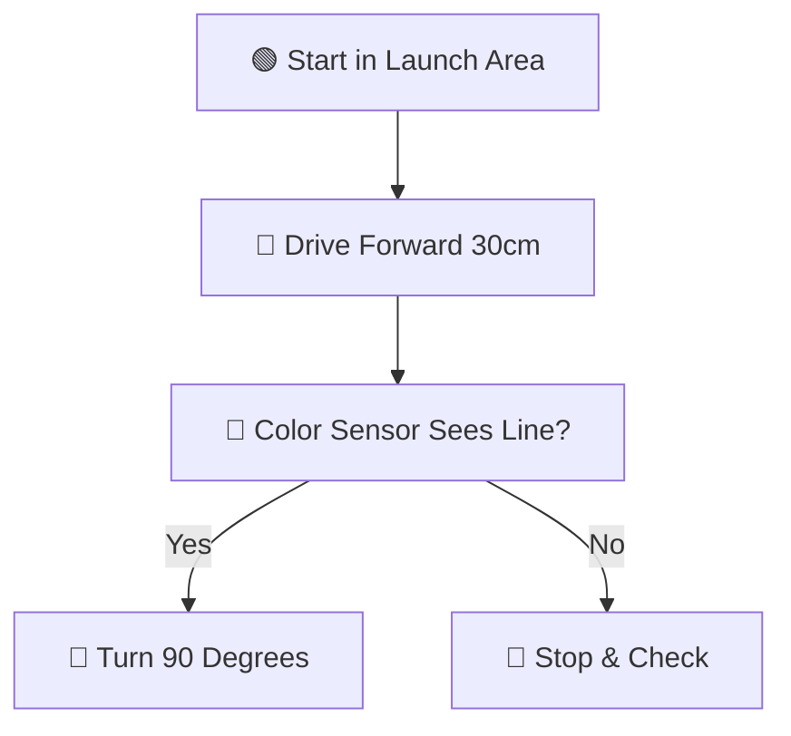

# 📚 Student Guide: How to Write & Publish Team Documentation

Welcome, Team BIOGLOW engineers and storytellers! 🌊🤖

In FIRST® LEGO® League, documenting your team journey is just as important as building the robot. The judges love to see how your ideas started, what failed, how you solved problems, and how your code evolved.

The best part? **You don't need to know HTML or web design to update this website.** You write simple notes in **Markdown**, and our automated cloud system builds and publishes this website for you!

---

## ⚡ How the System Works (The 3-Step Magic Loop)

Whenever you have a new idea, meeting note, or mission score to share, here is what happens:


1. **Step 1: Write** — You edit or create a simple `.md` (Markdown) file in the `doc/` folder.
2. **Step 2: Commit** — You save your work to GitHub (either on GitHub.com or using VS Code / git).
3. **Step 3: Auto-Publish** — GitHub Actions wakes up automatically, turns your Markdown into beautiful web pages using **Material for MkDocs**, and updates the live site in under 60 seconds!

---

## 📝 How to Update Docs: Choose Your Favorite Way

### Method 1: Directly in Your Web Browser (Easiest & Fastest! 🚀)

You can edit documents from any Chromebook, iPad, or laptop without installing anything!

1. Open our team GitHub repository:  
   👉 **[FLL_76265_2026_BIOGLOW on GitHub](https://github.com/jaimeyu/FLL_76265_2026_BIOGLOW)**
2. Navigate to the folder you want to update (for example, `doc/journal/README.md` or `doc/ideas/README.md`).
3. Click the **Pencil Icon** (✏️ *Edit this file*) in the top right corner of the file.
4. Type your notes, meeting recap, or code ideas using simple Markdown.
5. Click the green **Commit changes...** button at the top right.
6. Type a short description of what you did (e.g., `"Added meeting notes for Sept 12"`), and click **Commit changes**.
7. **That's it!** In about 1 minute, your updates will appear live on the team website!

---

### Method 2: On Your Computer Using VS Code & Git 💻

If you are working on team code or writing longer reports on your laptop:

1. Open the repository folder in **VS Code**.
2. Edit or create your Markdown file under the `doc/` directory.
3. Open your terminal and push your changes:
   ```bash
   git add .
   git commit -m "Update engineering journal with motor test data"
   git push origin main
   ```
4. GitHub Actions will trigger automatically on your push!

---

## 🎨 Cool Markdown Formatting Tricks

Markdown is a simple way to format text with plain keyboard symbols:

### 1. Headings
```markdown
# Big Title (Level 1)
## Main Section (Level 2)
### Subsection (Level 3)
```

### 2. Bold, Italic & Strikethrough
```markdown
**Bold text** for emphasis
*Italic text* for subtle notes
~~Crossed out~~ for discarded ideas
```

### 3. Checklists (Great for Mission Tasks!)
```markdown
- [x] Test ultrasonic distance sensor
- [x] Build motorized gear attachment
- [ ] Practice Mission 03 scoring run
```
Renders as:
- [x] Test ultrasonic distance sensor
- [x] Build motorized gear attachment
- [ ] Practice Mission 03 scoring run

### 4. Cool Colored Callout Boxes (Admonitions)
You can create eye-catching callout boxes with `!!!`:

```markdown
!!! tip "Pro Tip for Coders"
    Always reset your motor rotation encoders to zero before leaving home base!

!!! note "Meeting Reminder"
    Next Saturday meetup is at 10:00 AM. Bring your safety glasses!

!!! warning "Watch Out"
    Keep hands clear of the active gearbox when testing at 100% motor power.
```

They render like this:

!!! tip "Pro Tip for Coders"
    Always reset your motor rotation encoders to zero before leaving home base!

!!! note "Meeting Reminder"
    Next Saturday meetup is at 10:00 AM. Bring your safety glasses!

!!! warning "Watch Out"
    Keep hands clear of the active gearbox when testing at 100% motor power.

### 5. Pictures and Screenshots 📸
Put images in your folder and link them:
```markdown

```

### 6. Flowcharts and Diagrams (Mermaid)
You can draw flowcharts right in your notes without any drawing tools:

````markdown

````

Renders as:


---

## 🤖 Where Does the Magic Happen? (GitHub Actions)

In our project, there is a special automation file located at:  
[`.github/workflows/deploy-pages.yml`](https://github.com/jaimeyu/FLL_76265_2026_BIOGLOW/blob/main/.github/workflows/deploy-pages.yml)

Here is what it does every time someone commits:
1. **Wakes up** an automated virtual machine in GitHub's cloud.
2. **Installs Material for MkDocs**, our documentation engine.
3. **Runs `mkdocs build`**, which converts all Markdown files into clean HTML.
4. **Copies interactive web tools** (the Match Timer and Mission Scoring Calculator).
5. **Deploys the fresh site** to GitHub Pages!

### How to Check the Build Status:
1. Go to the **[Actions tab](https://github.com/jaimeyu/FLL_76265_2026_BIOGLOW/actions)** on GitHub.
2. You will see a green checkmark (✅) when the site finishes building.
3. If there is a red cross (❌), click on it to see which file had an issue (like a broken link or typo in `mkdocs.yml`).

---

## 🛡️ Child Safety & Privacy Rules (Our AI Constitution)

Always keep our team safe online! Before publishing anything, check:

- [x] **First Names Only:** Never write teammates' last names, home addresses, or phone numbers.
- [x] **No School Details:** Do not post your school name or personal schedule.
- [x] **Safe Photos:** Ensure photos only show robots, mechanism builds, and team activities without identifying personal documents.
- [x] **Gracious Professionalism:** Keep write-ups positive, encouraging, and supportive!

---

!!! success "You're Ready to Contribute!"
    Go ahead and add your thoughts, notes, and mission strategies. Every entry makes our team stronger for competition day! 🚀🎉
