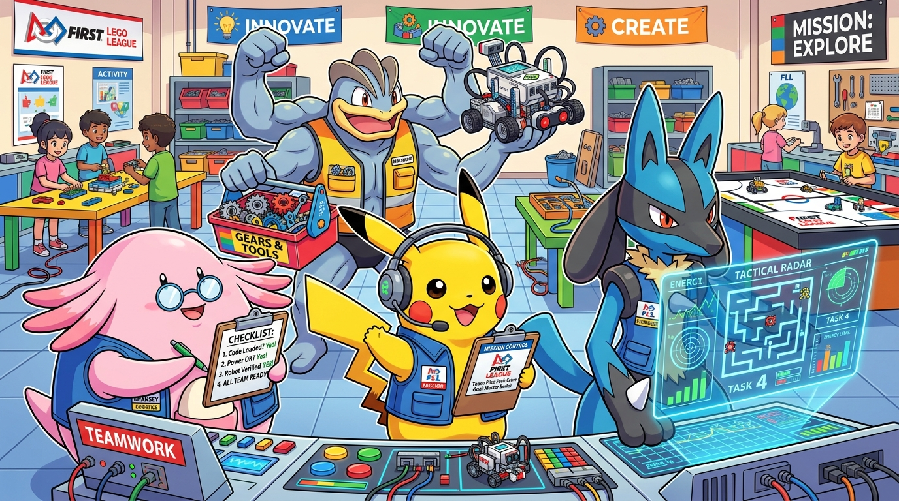
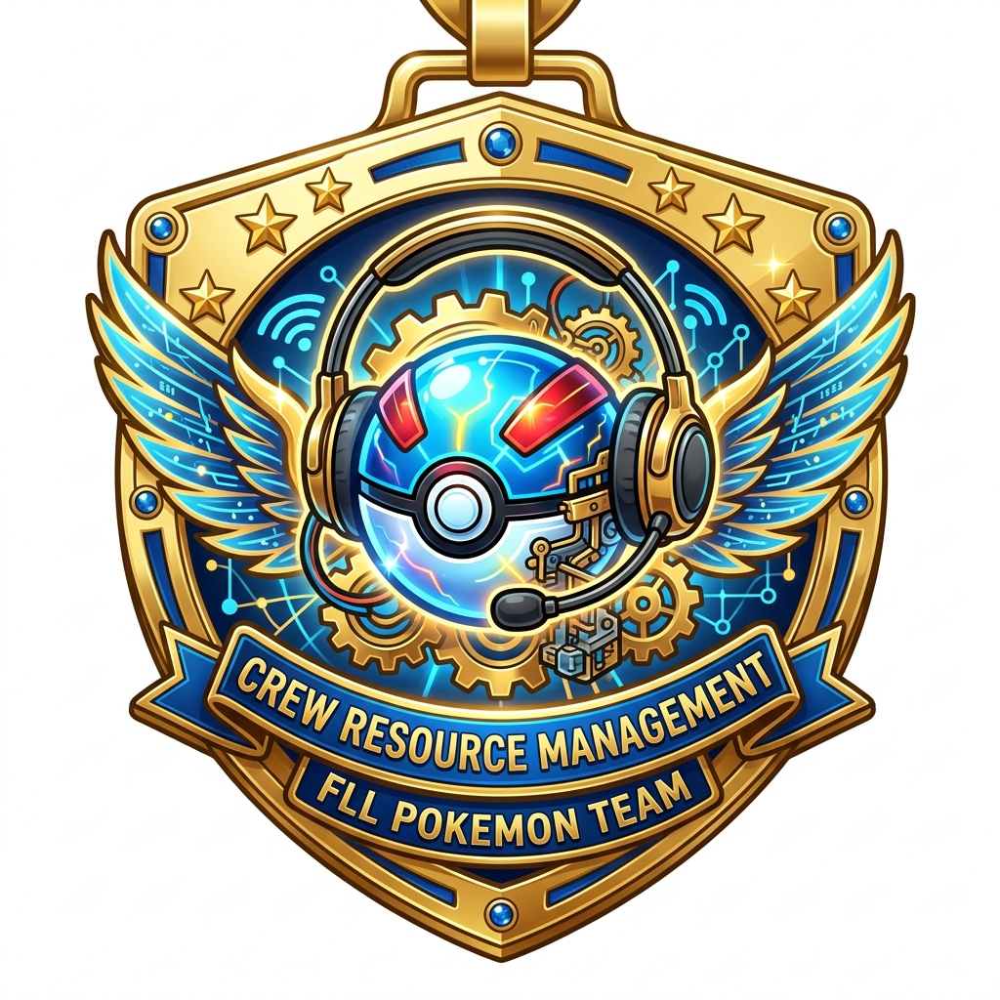
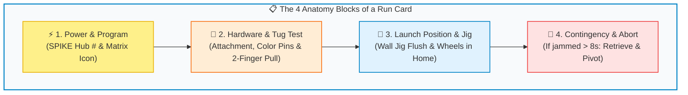
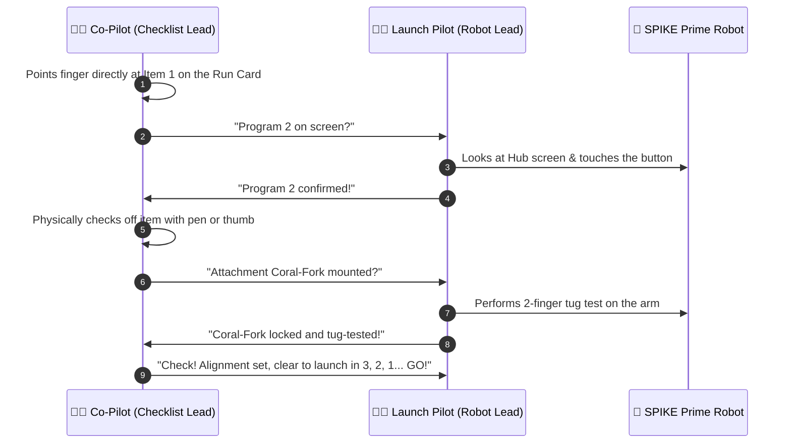
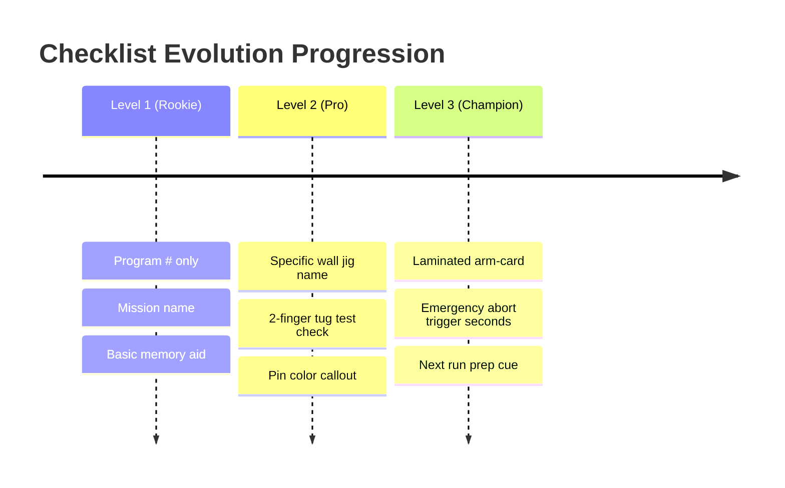

# 📋 How to Build Champion Checklists — Pokémon CRM Guide for Kids

<div style="background: linear-gradient(135deg, #eff6ff 0%, #dbeafe 100%); border-left: 6px solid #0284c7; padding: 1.2rem; border-radius: 8px; margin-bottom: 1.5rem;">
  <h3 style="margin-top: 0; color: #0369a1;">🖨️ Printable Checklist Builder Worksheet</h3>
  <p style="margin-bottom: 0.5rem; color: #1e293b;">
    Want the print-ready handout with the interactive <strong>Run Card Workshop</strong> for team binders and pit tables?
  </p>
  <a href="crew_resource_management_kids.html" style="display: inline-block; background: #0284c7; color: white; padding: 0.55rem 1.15rem; border-radius: 6px; font-weight: 700; text-decoration: none;">📄 Open Printable Checklist Flyer &rarr;</a>
</div>



> *"In FIRST LEGO League, when the 2.5-minute match buzzer goes BEEP, you don't rely on memory alone. You rely on your team checklist to communicate cleanly and navigate calmly!"*

---

## 🧠 Why Do Pokémon Champions & Astronauts Use Checklists?

In commercial aviation, space missions, and FIRST LEGO League table matches, mistakes rarely happen because students lack brainpower. Mistakes happen when **adrenaline surges**:

* The 2.5-minute match clock is ticking down on the big screen.
* Arena music is booming, parents are cheering, and referees are staring.
* Your heart beats at 150 BPM and your hands shake.

When that happens, your brain's **short-term working memory naturally drops**. Trying to remember 6 sequential mission numbers, motor ports, Technic pin alignments, and launch directions from memory causes avoidable mistakes.

**A checklist takes the memory load out of your brain.** It lets your eyes and brain focus on what matters most: **smooth communication and sharp navigation!**

<div align="center">
  
</div>

---

## 🛠️ The 4 Building Blocks of Every Mission Checklist

Every great mission run card has 4 core elements:



### 1. ⚡ Power & Program (The Pikachu Check)
* Which program number on the SPIKE Hub?
* *Pro-Tip:* Program the Hub's 5x5 light matrix to show a picture (like a Shark or Whale) so it's impossible to launch the wrong code!

### 2. 🔧 Hardware & Tug Test (The Machamp Check)
* Which attachment clicks onto the chassis?
* What color are the friction pins? (e.g., *Black pins into Port C*).
* **The 2-Finger Tug Test:** Gently tug the attachment twice. If it wiggles or bends, fix it before hitting launch!

### 3. 🧭 Launch Position & Wall Jig (The Lucario Navigation Check)
* Which alignment jig does the robot press against?
* Are the drive wheels sitting 100% inside the Home area?
* Is the driving path clear of stray LEGO cables?

### 4. 🚨 Contingency & Abort Plan (The Tactical Mind)
* What is our backup move if the mission misses?
* *The Golden Rule:* If the robot spins or gets stuck for more than 8 seconds, **call "Abort to Home!"**, take the touch penalty, and save the clock for the remaining missions!

---

## 👉 The "Point & Call" Superpower (Shisa Kanko)

Japanese bullet train conductors and airline flight crews use **Pointing and Calling** to eliminate 85% of human mistakes. 

Don't just stare silently at your checklist with your eyes. Use your **finger** and your **voice**:



---

## 📝 Hands-On Workshop: Design Your Own Run Card!

Grab a dry-erase card or print out the [Checklist Flyer](crew_resource_management_kids.html) to practice filling this out in pairs:

```text
+-----------------------------------------------------------------------+
| 🎯 RUN #____ : [Mission Name Here]                                     |
| ⏱️ TARGET TIME: [e.g., 22 Seconds]                                    |
+-----------------------------------------------------------------------+
| [ ] 1. HUB PROGRAM: Program #____ (Screen Icon: _______________)      |
| [ ] 2. ATTACHMENT : ____________________ (2-Finger Tug Test: [ ])     |
| [ ] 3. ALIGN JIG  : Jig [A/B] flush against [North / East] Border     |
| [ ] 4. CARGO LOAD : ____________________ seated in hopper             |
|                                                                       |
| 🚨 CONTINGENCY PLAN:                                                  |
| If model jams > 8s: Call "Abort to Home" & advance to Run #____!      |
+-----------------------------------------------------------------------+
```

---

## 📈 How Checklists Evolve as Your Team Levels Up

A checklist is not set in stone by coaches—**it belongs to the kids and evolves after every practice match**:



* **Did an attachment fall off mid-run?**  
  *Don't blame your teammate!* **Plus the checklist:** Add `[ ] 2-finger tug test` right under Step 2.
* **Did the robot start backward?**  
  *Don't get upset!* **Plus the checklist:** Add `[ ] Wheels touching South Jig line` to Step 3.

---

## 🔗 Related Resources

* [📄 Printable Checklist Flyer & Worksheet (HTML)](crew_resource_management_kids.html)
* [✈️ Coach CRM Guide & Operational Philosophy](../../mentors/plan/crew_resource_management.md)
* [🥊 Session 3 CRM Stress Gauntlet Plan](../../mentors/plan/2026-sept-26.md)
* [🎯 Season Goals Worksheet](goals_worksheet.html)
* [✏️ Robot Design & Mission Sketchpad](mission_design_sketchpad.html)
