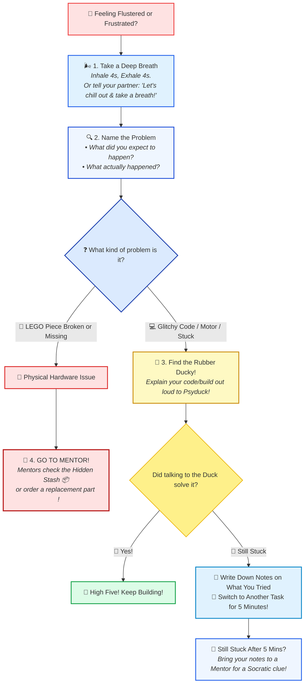

# 😤 Frustration Buster & Reset Checklist — Kid's Pocket Guide (Team #76265 "Lego Legends")

!!! info "🖨️ Printable Pocket Cards (4 Cards per A4 Sheet)"
    Need pocket cards for team members' pockets, lanyards, or workstation binders?
    
    [📄 Open & Print 4-per-A4 Pocket Checklist Sheet &rarr;](frustration_checklist_kids.html)

  

---

## 🧠 Why Do We Get Frustrated in Robotics?

In FIRST LEGO League, when your robot makes 4 perfect turns and then misses the mission model on the 5th attempt, or when a Technic axle snaps right before a practice run, it is **100% normal to feel heat in your chest, clenched fists, or tears in your eyes**.

Here is what is happening inside your body:
* Your brain has a small alarm system called the **amygdala**. 
* When things stop working, your amygdala thinks you are in danger and pumps **adrenaline** into your blood.
* This shuts off your **prefrontal cortex**—the clever part of your brain that solves code puzzles and builds cool mechanisms!

> 💡 **The Golden Team Rule:**  
> When frustration spikes, you cannot solve the problem by pushing harder or getting angry.  
> **Pause &bull; Reset &bull; Explain!**

---

## 🛑 The 3 Frustration Triggers

Whenever you feel like yelling, throwing a brick, or shutting down, ask yourself which of these 3 traps you fell into:

1. **Something isn't working:** The robot veered off, the color sensor read 15% instead of 80%, or your code loop didn't stop.
2. **It's broken!:** A Technic beam cracked, a pin bent, a motor wire won't connect, or an essential piece vanished into thin air.
3. **It's too hard!:** You've been staring at the screen for 20 minutes, your brain feels like mashed potatoes, and you don't know what to do next.

---

## 🌬️ The 4-Step Calm Down Reset

---

### Step 1: 🫁 Take a Deep Breath (or Help Your Partner Chill)
* **The 4x4 Box Breath:** Inhale through your nose for 4 seconds, hold for 2 seconds, exhale slowly through your mouth for 4 seconds.
* **How to Talk to a Frustrated Partner:**
  * ❌ *Never say:* `"Calm down!"` or `"You're doing it wrong!"` (That makes people feel blamed!).
  * ✅ *Say gently:* **"Hey partner, let's chill out for 10 seconds, take a deep breath together, and reset."**

---

### Step 2: 🔍 Identify the Problem & Explain It Clearly
Before touching any buttons or tearing down bricks, explain the problem using the **2-Question Formula**:
1. *"What was the robot or code SUPPOSED to do?"*
2. *"What did it ACTUALLY do just now?"*

When you can say: *"I expected Motor A to turn 180 degrees, but it only clicked and stayed still,"* you have already solved half the mystery!

---

### Step 3: 🦆 Find the Rubber Ducky (Psyduck Debugging)
Software engineers at Google and NASA use **Rubber Duck Debugging**:
* Take your team rubber ducky (or visit our team **Psyduck**!).
* Explain what each line of code or each LEGO gear is doing out loud to the duck.
* *Why it works:* In 80% of cases, while explaining it out loud to the duck, your brain spots the bug: *"Wait a minute! Port C is plugged into Port D! A ha!"*

---

### Step 4: 🧭 Choose Your Action Path (What To Do Next)

#### 🧱 Path A: A LEGO Piece is Broken or Missing
* **Do NOT panic or hide the piece:** In robotics, plastic parts snap and pins wear out. **You will NEVER be in trouble for a broken part!**
* **Go straight to a Mentor:**
  * Mentors will open the **Hidden Stash 📦** (the secret drawer of backup axles, friction pins, frames, and cables).
  * If the piece is unique and not in the stash, the coach will log it on our parts wishlist to order a replacement from LEGO/BrickLink!

#### 🤯 Path B: A Frustrating Brain-Block / Tricky Code
1. **Talk to the Rubber Ducky 🦆:** Explain what you tried.
2. **Write Down Your Notes 📝:** Write what you tested on your [Robot Design Sketchpad](mission_design_sketchpad.html) or whiteboard.
3. **Go Do Something Else for 5 Minutes 🔄:**
   * Step away from the robot table.
   * Grab a sip of water, sort some Technic pins in the tray, or check in on the Innovation Project research.
   * *The science:* While your brain is doing something simple, your subconscious "diffuse thinking" keeps untangling the puzzle!
4. **Bring Your Notes to a Mentor 🙋:**
   * If you're still stuck after 5 minutes, raise your hand and show the mentor your notes: *"Here is what we expected, here is what happened, and here are the 2 things we tested."*
   * Mentors will give you a **clue or a Socratic question**, not take over your build!

---

## 🖨️ How to Use the Pocket Cards (4 per A4 Sheet)

1. Open [frustration_checklist_kids.html](frustration_checklist_kids.html).
2. Click **Print 4 Pocket Cards (A4)** (set printer paper to A4, portrait, with background graphics enabled).
3. Cut along the dashed lines with scissors.
4. Punch a hole in the top-right circle to clip it to your team lanyard, or slide it right into your front pocket!

---

## 🔗 Related Resources

* 🖨️ [Printable Pocket Reset Cards (4 per A4 Sheet)](frustration_checklist_kids.html)
* ⚡ [Pokémon CRM Guide for Kids (Run Cards & Checklists)](crew_resource_management_kids.html)
* 📇 [Mentor Workshop Cue Card (Queuing & Socratic Prompts)](../../mentors/plan/guides/mentor_crm_cue_card.md)
* 👥 [Team Roles Matrix & Leadership Responsibilities](../../responsibilities/roles_matrix.md)
* ✏️ [Printable Robot Design Sketchpad](mission_design_sketchpad.html)
