# FLL Session 1: Welcome, Workshop Safety & Building the Field

**Date:** Sunday, September 13, 2026  
**Time:** 1:00 PM – 4:00 PM  
**Attendees:** 9 Kids, Parents (first 30 min), Mentors/Coaches  
**Season Phase:** Team Orientation, Safety & Field Setup  

---

## 📌 Coach's Prep & Materials Checklist

* **Print Worksheets:** Print 10 copies of the [Printable Season Goals Worksheet](../../marketing/goals_worksheet.html) on standard Letter paper.
* **Pens & Colored Markers:** Have writing utensils ready for kids to fill out their goals and favorite Pokémon.
* **Workshop Safety Prep:**
  * Clear aisles and tuck away extension cords around the robot table.
  * Designate distinct zones: Build Area, Robot Testing Mat, Battery Charging Station, and Parent Waiting Area.
  * Locate first-aid kit and note nearest restrooms and emergency exits.
* **Prep the Blind Build:**
  * Prepare 5 pre-built small LEGO models (10–15 pieces max) hidden inside paper bags or boxes.
  * Prepare 5 matching bags of loose matching pieces for the builders.
* **Field Assembly Ready:**
  * Have the FLL season mission model boxes and field mat ready.
  * Prepare tablets or printed instruction manuals for step-by-step assembly.
* **Rewards Ready:** Pokémon cards and team incentive tokens.

---

## 🕒 Schedule Breakdown (1:00 PM – 4:00 PM)

```mermaid
gantt
    title Session 1 Timeline (Sunday, Sep 13)
    dateFormat HH:mm
    axisFormat %H:%M

    section Safety & Orientation (With Parents)
    Welcome, Safety Walkthrough & Intros : 13:00, 30m

    section Team Culture & Goal Setting
    How We Work & Season Goals Worksheet : 13:30, 15m

    section Hands-On Challenges
    The Blind Build Challenge            : 13:45, 30m
    Building the Field Mission Models    : 14:15, 75m

    section Wrap-Up
    Clean-Up Protocol Sprint             : 15:30, 15m
    Daily Learning & Pokémon Cards       : 15:45, 15m
```

---

### 1:00 - 1:30 PM | Welcome, Introductions & Workshop Safety (30 min)

*(Parents attend this first 30 minutes so everyone knows the workspace layout, expectations, and safety rules.)*

* **1:00 – 1:10 PM | Welcome Circle & Fun Introductions (10 min):**
  * Sit together in a circle (kids, parents, mentors). Mentors introduce themselves first to set an open, relaxed tone.
  * **Quick Round:** Everyone shares their **name** and their **favorite Pokémon (or favorite LEGO theme)**!
  * **Coach Jaime shares his goal:**
    > *"My #1 goal this season is to make sure every single person has FUN, I know everyone's name, and I know everyone's favorite Pokémon!"*
* **1:10 – 1:25 PM | Workshop Safety & Space Tour (15 min):**
  * Walk parents and students through the workspace boundaries:
    * 🧱 **Build Zone:** Tables for assembling models and sorting pieces. *Rule: Keep bins on tables; no running with trays.*
    * 🤖 **Robot Mat Zone:** Dedicated table for autonomous driving runs. *Rule: Keep perimeter completely clear of backpacks and chairs so drivers can move freely.*
    * 🔌 **Charging & Electronics Zone:** Power strips for SPIKE Prime Hubs and tablets. *Rule: Only mentors or designated students plug into wall outlets.*
    * 🚸 **Facilities & Movement:** Emergency exit paths, restroom locations, and water station.
  * **Core Safety Rules:**
    1. **Closed-toe shoes** are mandatory at all sessions.
    2. **Instant Floor Sweep:** If a LEGO piece, pin, or axle drops, pick it up immediately so nobody slips or steps on it.
    3. **Tucked Cords:** All tablet charging cables and power cords must stay taped down or against walls.
* **1:25 – 1:30 PM | The Golden Rule & Parent Send-Off (5 min):**
  * Introduce our core team motto to parents and kids:
    > *"We are not here to build a robot. We are here to build a team who happens to build robots."*
  * Explain that in FLL, learning, teamwork, and laughing when things go wrong are far more important than winning trophies.
  * **Dismiss Parents:** Thank parents for their partnership. Confirm pickup is at **4:00 PM sharp** (parents are invited to arrive 10 minutes early at 3:50 PM to see the day's creations!). Transition into the kids-only workshop.

---

### 1:30 - 1:45 PM | How We Work Together & Season Goals Worksheet (15 min)

* **Interactive Team Culture Principles (5 min):**
  * **"Plus'ing":** We never shoot down an idea with *"No, that's dumb."* We say, *"I love that big thinking! What if we add tall wheels to it?"* We build on each other's creativity.
  * **Failure is Awesome:** Ask the kids: *"Have you ever lost a level in a video game or had a LEGO tower crash? Did you quit?"* No—you figured out why and tried again! In this room, when code bugs out or a robot attachment pops off, that is 100% normal. We smile, find the cause, and fix it.
  * **Everyone Has a Spot:** An FLL team is like a real engineering firm. We need builders and coders, but also researchers, writers, artists, and speakers. Every role is valued.
* **Season Goal Activity (10 min):**
  * Hand out the printed [Season Goals Worksheet](../../marketing/goals_worksheet.html).
  * Kids fill in their name, their favorite Pokémon (or favorite LEGO theme), and write **one fun goal** for the season.
  * Direct kids to the **Idea Sparkers** on the sheet (e.g., *"I made the robot complete a task!"*, *"I designed an attachment to test out (doesn't have to score points)!"*, or *"I learned everyone's name!"*).
  * Emphasize: This is NOT a graded test, and it does NOT need to be about scoring points or flawless robot success! It's all about trying something fun.
  * Kids sign the **High-Five Team Spirit Pledge**.
  * Mentors collect the sheets to place in team binders to guide individual mentoring throughout the season.

---

### 1:45 - 2:15 PM | Team Building: The Blind Build Challenge (30 min)

* **The Setup:** Divide the 9 kids into 4 pairs of two, and 1 trio of three.
* **The Rules:**
  * One student is the **"Looker"** and the other is the **"Builder"** (in the trio, two are builders).
  * The Looker gets a pre-built LEGO model hidden in a paper bag.
  * The Builder gets a pile of matching loose pieces.
  * The Looker must describe how to assemble the model **using words only**—no touching pieces, no pointing, and the Builder cannot look at the model!
  * Time limit: **12 minutes**.
* **The Debrief (8–10 min):**
  * Line up all built models next to the originals in the center of the table.
  * Compare results, laugh at the funny differences, and celebrate what worked.
  * **Discussion:**
    * *"What words helped your partner understand best?"* (Names of shapes, counting studs, color references).
    * *"What was tricky?"* (Explaining orientations and which way pieces face).
  * **Coach Takeaway:** In robotics, coders and builders must describe mechanisms clearly. Clear, patient communication makes the team unstoppable!

---

### 2:15 - 3:30 PM | Main Activity: Unboxing & Building the Field Kits (75 min)

* **The Task:** Open the official season mission model boxes and build the models for the competition mat.
* **Execution:**
  * Pair up students and assign specific mission model bag numbers.
  * Open digital instructions on tablets or printed LEGO guides.
  * **The 3x Friction-Free Trigger Test Rule:**
    * Before mounting any mission model to the mat, test its mechanical lever, slide, or latch **3 times** to verify it moves freely without friction or binding.
* **Mentor Coaching:**
  * Step back and observe. Do not assemble parts for the kids.
  * Point out Technic principles: axle lengths, bushing placements, gear tooth alignment, and why rigid bracing matters.
  * Encourage "Plus'ing" whenever partners get stuck.

---

### 3:30 - 3:45 PM | The Clean-Up Protocol Sprint (15 min)

* **Stop immediately at 3:30 PM.** No exceptions!
* Explain that a clean workspace is a safe and high-performance engineering environment.
* Assign squad responsibilities:
  * 🧹 **Floor Sweepers:** Check under tables and chairs for stray pins and axles.
  * 📦 **Piece Sorters & Kit Keepers:** Pack loose parts into sorting bins and secure instruction manuals.
  * 🧽 **Table Captains:** Straighten build tables and push in chairs.
* Make it a 10-minute sprint challenge—award bonus team points for zero pieces left on the floor!

---

### 3:45 - 4:00 PM | Closing Circle, Daily Learning & Rewards (15 min)

* **Circle Up:** Everyone gathers in the center circle (parents arriving early are welcome to observe).
* **Daily Learning Round:**
  * Every single person (kids and mentors) shares:
    * *"One new thing I learned today (about LEGO, code, or a teammate)."*
* **Light Homework Preview:**
  * Watch the official season challenge reveal video on YouTube with family and come back next week with one question or ocean idea!
* **The Reward:**
  * Hand out Pokémon cards / incentive tokens to celebrate outstanding teamwork, safety, and clean-up speed!

---

## 🎯 Coach's Evaluation & Success Criteria

By 4:00 PM, Session 1 is a success if:
- [ ] Parents and kids participated in the workshop safety tour and know space boundaries.
- [ ] Every student filled out their [Season Goals Worksheet](../../marketing/goals_worksheet.html) with a fun personal goal and favorite Pokémon (or LEGO theme).
- [ ] Every student participated in the Blind Build challenge and experienced communication in action.
- [ ] Progress made on building the FLL field mission models with verified 3x trigger tests.
- [ ] Clean-up protocol sprint completed with zero loose pieces on the floor.
- [ ] Every student shared a daily learning takeaway and received their reward card.