# FLL Session 2: One-Hand Duck Build, Driving Camp & Peer Ambassador Handoff

**Date:** Saturday, September 19, 2026  
**Time:** 1:00 PM – 4:00 PM  
**Attendees:** 9 Kids, Mentors/Coaches  
**Season Phase:** Training Camp & Field Completion

> [!IMPORTANT]
>
> ### 🤝 Signature Coaching Strategy: The Peer Ambassador Information Handoff
>
> Today introduces our peer-to-peer knowledge transfer system (see [Coach's Notes](mentors_notes.md#2-the-peer-ambassador-system-intuitive-information-handoff)):
>
> * When stations swap at 2:45 PM, **1–2 students stay behind** at each station as **Ambassadors** to teach the incoming group.
> * Mentors step back into shadow mode (**zero lecturing!**).
> * At 3:00 PM, the Ambassadors return to their home team, and their teammates perform a **Reverse Handoff** to teach them what was accomplished in their absence.
> * **Goal:** Build communication skills, leadership, and structured information handoffs!

---

## 📌 Coach's Prep & Materials Checklist

* **Keep It Snappy:** Avoid lectures. Give 2-minute instructions, then let them get their hands on the bricks and robots.
* **Mentor Alignment on Ambassador Handoff:** Remind all co-mentors that at 2:45 PM, mentors do NOT lecture or onboard the incoming group. The student ambassadors run the onboarding.
* **Prep the One-Hand Duck Kits:**
   * Prepare 5 plastic sandwich bags ahead of time.
   * Put the exact same **10 LEGO bricks** in each bag (e.g., standard yellow/orange bricks, slopes, eye tiles, or beak piece).

* **Robot Stations Ready:**
   * Have 2 SPIKE Prime driving bases built and batteries 100% charged.
   * Ensure tablets/Chromebooks have SPIKE App open and Bluetooth tested.

* **Field Assembly Ready:**
   * Sort out the remaining unbuilt FLL mission model bags.
   * Keep printed building manuals or tablets open to LEGO Education instructions.

* **Voting Setup:**
   * Whiteboard or chart paper with colored markers.
   * Colored dot stickers (2 per student) for democratic voting.

* **Rewards:** Pokémon cards / team incentive tokens.

---

## 🕒 Schedule Breakdown (1:00 PM – 4:00 PM)

```mermaid
gantt
    title Session 2 Timeline (Saturday, Sep 19)
    dateFormat HH:mm
    axisFormat %H:%M

    section Icebreaker and Culture
    Welcome and One-Hand Duck Build : 13:00, 25m
    Team Name Brainstorm            : 13:25, 20m

    section Activity Block 1
    Station 1 (Drive vs Build)    : 13:45, 45m
    Pick Peer Ambassadors        : 14:30, 5m
    Bio Break and Energy Recharge : 14:35, 10m

    section Activity Block 2
    Ambassador Handoff and Station Rotation : 14:45, 45m

    section Wrap-Up
    Clean-Up Protocol Sprint       : 15:30, 15m
    Circle Up, Vote and Rewards   : 15:45, 15m
```

---

### 1:00 - 1:25 PM | Welcome & Warm-Up: The One-Hand Duck Challenge (25 min)

* **The Goal:** Jump immediately into active teamwork, eliminate hesitation, and practice physical communication.
* **The Setup:**
   * Pair the 9 kids up: 3 pairs of 2, plus 1 trio of 3 (or pairs with an observing mentor).
   * Hand each team one 10-piece LEGO duck bag.

* **The Rules:**
   1. Each student must place **one hand behind their back** (or inside their pocket).
   2. You can **only use ONE hand** for the entire build!
   3. Working together with your partner's single hand, build a standing, recognizable **duck** using all 10 pieces.
   4. Timer: **5 minutes**.

* **The Debrief (5–7 min):**
   * Line up all ducks in the center of the circle!
   * **Ask the Kids:**
      * *"What was hard about having only one hand?"* (Holding a brick still while pressing another on top).
      * *"How did you solve that?"* (One person became the 'anchor/clamp' while the other pressed; talked before moving).

   * **Coach Takeaway:** In robotics, coders and mechanical builders are like those two hands—one can't succeed without the other holding steady and communicating clearly!

---

### 1:25 - 1:45 PM | Team Culture: Team Name Brainstorm & Idea Presentation (20 min)

* **The Goal:** Give the kids complete ownership of their team identity, and surface early biodiversity thinking for the missions.
* **Step 1: Rapid-Fire Brainstorming (10 min):**
   * Remind the team of the **"Plus'ing"** rule: *No ideas are bad; we build on each other's ideas.*
   * Prompt themes: Ocean biology, glowing creatures (BIOGLOW), robotics, deep sea exploration, clever science puns.
   * Write every suggestion on the whiteboard without judgment.

* **Step 2: Quick Presentations (10 min):**
   * Each kid or pair shares their favorite team name idea **and** any interesting biodiversity fact or mission-solving idea they've been thinking about.
   * Keep it casual — 30 seconds per student, no slides needed.

* **Note:** We will **NOT vote yet** — the official Secret Dot Vote happens during the closing circle at the end of session, once everyone has had the whole day to keep thinking about it.

---

### 1:45 - 2:35 PM | Main Activity Block 1: Split Stations (50 min)

Divide the 9 students into two active stations:

#### 🟢 Station A: Finish Building the Field Kits + Create New Animals (4–5 Kids)

* **Objective:** Assemble the remaining mission models so the competition mat is 100% complete, then design and build the required "new animal" element for the Innovation Project.
* **Execution:**
   * Students work in pairs with specific model bags.
   * Follow digital step-by-step instructions.
   * **Testing Rule:** Before setting a model on the mat, test its mechanical trigger (lever, latch, sliding weight, hinge) 3 times to make sure it moves freely without friction.
   * Once field kits are fully assembled and mounted, move on to designing/building the team's new animal(s) for the biodiversity mission element.

* **If Finished Early:** To avoid getting ahead of the Station B coding curriculum (which stays paced with next session), students who finish early should either:
   1. **Research Mode:** Look up real bioluminescent/deep-sea animals and jot down biodiversity notes and mission-solving ideas for later group discussion, or
   2. **Merge into Station B:** Join the Driving Camp group and get a **1:1 ambassador-style intro** from a Station B teammate — great low-stakes practice for this session's peer-teaching theme.

* **Mentor Coaching:** Do not assemble parts for them. Point out Technic axle sizes, bushing placements, and gear alignments.

#### 🔵 Station B: Robot Coding Camp — Animal Alarm (4–5 Kids)

* **Objective:** Following the [FLL Explore BIOGLOW Team Meeting Guide](https://firstinspires.blob.core.windows.net/fll/explore/2026-27/fll-explore-bioglow-TMG.pdf), run the **Animal Alarm** coding session.
* **Curriculum:** SPIKE App *Animal Alarm* tutorial (per TMG).
* **Key Skills Taught:**
   1. Powering on the Hub and pairing via Bluetooth.
   2. Setting movement motor ports (e.g. `Set movement motors to [C+D]`).
   3. Difference between **Speed** vs. **Precision**: Why 30–50% power is better than 100% in competition.
   4. Building the Animal Alarm behavior block-by-block per the TMG tutorial.
   5. Testing and iterating the alarm trigger on the mat.

* **If Finished Early:** If the Animal Alarm tutorial goes faster than expected, queue up additional short coding challenges from the TMG (e.g. moving for distance, smooth turns) so the group stays productively engaged without skipping ahead too far for next session.

#### 🎓 2:30 PM — Peer Ambassador Nomination (5 min)

* Before heading to the bio break, each station group nominates **1 or 2 Peer Ambassadors**:
   * **Station A (Build Ambassadors):** 1–2 students who know which bags/models were built, where the instructions are, and how the mechanical triggers work.
   * **Station B (Drive Ambassadors):** 1–2 students who know how to pair the Hub, configure motor ports, and run the 60 cm line-stop code.

* **The Mission:** Mentors brief the ambassadors: *"When we come back from break, the groups will swap stations. BUT you will stay here for 15 minutes as the lead instructors. No mentor lecturing—you're running the show and teaching the incoming group!"*

---

### 2:35 - 2:45 PM | Bio Break & Brain Recharge (10 min)

* Hands off keyboards and LEGO bricks!
* Water break, healthy snacks, stretch, bathroom visit.

---

### 2:45 - 3:30 PM | Main Activity Block 2: Peer Ambassador Handoff & Station Rotation (45 min)

We use our __Peer Ambassador Information Handoff__ strategy for this rotation. See the full step-by-step protocol in [Coach's Notes](mentors_notes.md#2-the-peer-ambassador-system-intuitive-information-handoff) for how the swap, teaching, and reverse handoff work.

* **2:45 PM:** Stations swap. Ambassadors stay behind to teach the incoming group (mentors in shadow mode — zero lecturing).
* **3:00 PM:** Ambassadors return home; teammates give them a Reverse Handoff on what was accomplished while they were gone.
* **3:05 - 3:30 PM:** Full collaboration sprint — everyone finishes their challenges together.

---

### 3:30 - 3:45 PM | The Clean-Up Protocol Sprint (15 min)

* **Stop immediately at 3:30 PM.** No exceptions!
* Assign squad responsibilities:
   * 🧹 **Floor Sweepers:** Check under tables for stray LEGO pins and axles.
   * 📦 **Kit Keepers:** Pack loose mission models and secure instruction manuals.
   * 🔌 **Charging Crew:** Plug in SPIKE Prime Hubs and tablets to charge for next week.
   * 🧽 **Table Captains:** Wipe down desks and straighten chairs.

* Set a 10-minute timer—reward bonus points for zero pieces left on the floor!

---

### 3:45 - 4:00 PM | Circle Up, Daily Learning & Rewards (15 min)

* **Circle Up:** Everyone gathers in the center circle.
* **Daily Learning & Growth Check-In (Core Strategy 3):**
   * Go around the circle so every kid shares:
      1. **Personal Learning:** *"What is one concrete thing you learned today?"* (e.g., motor ports, gear alignment, stop-line precision).
      2. **Handoff Reflection:** *"What was it like teaching someone else (or being taught by a teammate) during the ambassador handoff?"*

   * **Mentor Growth Tracking:** Mentors note these reflections to track each student's progress against the secret goals written on Day 1.

* **The Secret Dot Vote:**
   * List all team name ideas from the earlier brainstorm on the whiteboard.
   * Each kid gets 2 colored dot stickers to place next to their favorite name(s) — no peeking or peer pressure, keep it a secret ballot.
   * Tally the dots together as a group; the name with the most dots wins!

* **Celebrate Our New Team Name:**
   * Take a group photo holding up the whiteboard with the official new team name!

* **Midweek Virtual Session Preview:**
   * Remind everyone about **Wednesday's virtual check-in (Sep 23 at 6:30 PM)** to pick Innovation Project topics.

* **The Reward:**
   * Hand out Pokémon cards / incentive tokens for outstanding communication, peer teaching, and clean-up speed!

---

## 🎯 Coach's Evaluation & Success Criteria

By 4:00 PM, the session is a success if:

- [ ] Every kid participated in the One-Hand Duck build and practiced communication.
- [ ] Every kid presented a team name idea and/or a biodiversity note or mission-solving idea.
- [ ] An official team name was democratically chosen via Secret Dot Vote during the closing circle.
- [ ] 100% of the FLL table mission models are built, verified with 3x trigger tests, and mounted on the field mat.
- [ ] Station A's new animal element(s) are designed/built (or research notes captured if time ran short).
- [ ] Peer Ambassador information handoff ran smoothly with kids teaching kids (zero mentor lectures).
- [ ] Reverse handoff occurred so returning ambassadors were successfully caught up by their teammates.
- [ ] Every student made progress on the Animal Alarm coding tutorial.
- [ ] Every student shared a daily learning takeaway during the closing circle.
- [ ] The room is spotless and all SPIKE Hubs are plugged in to charge.
