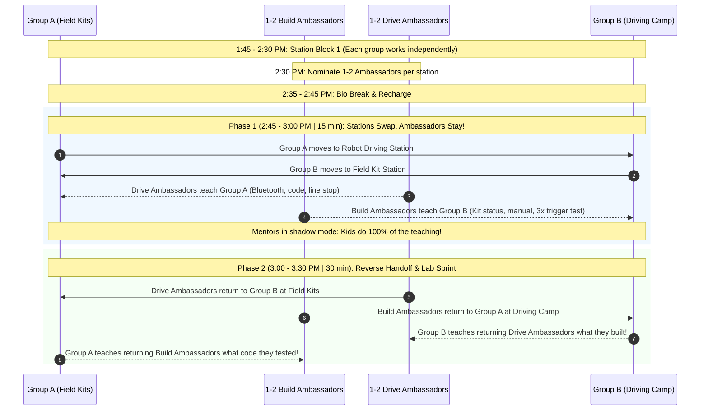

# FLL Session 2: One-Hand Duck Build, Driving Camp & Peer Ambassador Handoff

**Date:** Saturday, September 19, 2026  
**Time:** 1:00 PM – 4:00 PM  
**Attendees:** 9 Kids, Mentors/Coaches  
**Season Phase:** Training Camp & Field Completion  

> [!IMPORTANT]
> ### 🤝 Signature Coaching Strategy: The Peer Ambassador Information Handoff
> Today introduces our peer-to-peer knowledge transfer system (see [Coach's Notes](mentors_notes.md#2-the-peer-ambassador-system-intuitive-information-handoff)):
> * When stations swap at 2:45 PM, **1–2 students stay behind** at each station as **Ambassadors** to teach the incoming group.
> * Mentors step back into shadow mode (**zero lecturing!**).
> * At 3:00 PM, the Ambassadors return to their home team, and their teammates perform a **Reverse Handoff** to teach them what was accomplished in their absence.
> * **Goal:** Build communication skills, leadership, and structured information handoffs!

---

## 📌 Coach's Prep & Materials Checklist

* **Keep It Snappy:** Avoid lectures. Give 2-minute instructions, then let them get their hands on the bricks and robots.
* **Mentor Alignment on Ambassador Handoff:** Remind all co-mentors that at 2:45 PM, mentors do NOT lecture or onboard the incoming group. The student ambassadors run the onboarding.
* **Prep the One-Hand Duck Kits:**
  * Prepare 5 plastic sandwich bags ahead of time.
  * Put the exact same **10 LEGO bricks** in each bag (e.g., standard yellow/orange bricks, slopes, eye tiles, or beak piece).
* **Robot Stations Ready:**
  * Have 2 SPIKE Prime driving bases built and batteries 100% charged.
  * Ensure tablets/Chromebooks have SPIKE App open and Bluetooth tested.
* **Field Assembly Ready:**
  * Sort out the remaining unbuilt FLL mission model bags.
  * Keep printed building manuals or tablets open to LEGO Education instructions.
* **Voting Setup:**
  * Whiteboard or chart paper with colored markers.
  * Colored dot stickers (2 per student) for democratic voting.
* **Rewards:** Pokémon cards / team incentive tokens.

---

## 🕒 Schedule Breakdown (1:00 PM – 4:00 PM)

```mermaid
gantt
    title Session 2 Timeline (Saturday, Sep 19)
    dateFormat HH:mm
    axisFormat %H:%M

    section Icebreaker & Culture
    Welcome & One-Hand Duck Build : 13:00, 25m
    Team Name Brainstorm & Vote   : 13:25, 20m

    section Activity Block 1
    Station 1 (Drive vs Build)    : 13:45, 45m
    Pick Peer Ambassadors        : 14:30, 5m
    Bio Break & Energy Recharge   : 14:35, 10m

    section Activity Block 2
    Phase 1: Ambassador Handoff   : 14:45, 15m
    Phase 2: Reverse Handoff & Lab: 15:00, 30m

    section Wrap-Up
    Clean-Up Protocol Sprint      : 15:30, 15m
    Daily Learning & Growth Circle: 15:45, 15m
```

---

### 1:00 - 1:25 PM | Welcome & Warm-Up: The One-Hand Duck Challenge (25 min)

* **The Goal:** Jump immediately into active teamwork, eliminate hesitation, and practice physical communication.
* **The Setup:**
  * Pair the 9 kids up: 3 pairs of 2, plus 1 trio of 3 (or pairs with an observing mentor).
  * Hand each team one 10-piece LEGO duck bag.
* **The Rules:**
  1. Each student must place **one hand behind their back** (or inside their pocket).
  2. You can **only use ONE hand** for the entire build!
  3. Working together with your partner's single hand, build a standing, recognizable **duck** using all 10 pieces.
  4. Timer: **5 minutes**.
* **The Debrief (5–7 min):**
  * Line up all ducks in the center of the circle!
  * **Ask the Kids:**
    * *"What was hard about having only one hand?"* (Holding a brick still while pressing another on top).
    * *"How did you solve that?"* (One person became the 'anchor/clamp' while the other pressed; talked before moving).
  * **Coach Takeaway:** In robotics, coders and mechanical builders are like those two hands—one can't succeed without the other holding steady and communicating clearly!

---

### 1:25 - 1:45 PM | Team Culture: Team Name Brainstorm & Democratic Vote (20 min)

* **The Goal:** Give the kids complete ownership of their team identity.
* **Step 1: Rapid-Fire Brainstorming (8 min):**
  * Remind the team of the **"Plus'ing"** rule: *No ideas are bad; we build on each other's ideas.*
  * Prompt themes: Ocean biology, glowing creatures (BIOGLOW), robotics, deep sea exploration, clever science puns.
  * Write every suggestion on the whiteboard without judgment.
* **Step 2: Narrowing & Combining (5 min):**
  * Group similar ideas together.
  * Let students advocate in 1 sentence for their favorites.
* **Step 3: The Secret Dot Vote (7 min):**
  * Hand each kid **2 sticky dots**.
  * Kids walk up and place their dots on their top 1 or 2 choices.
  * Tally the dots, announce the winning official Team Name, and celebrate with a huge team cheer!

---

### 1:45 - 2:35 PM | Main Activity Block 1: Split Stations (50 min)

Divide the 9 students into two active stations:

#### 🟢 Station A: Finish Building the Field Kits (4–5 Kids)
* **Objective:** Assemble the remaining mission models so the competition mat is 100% complete!
* **Execution:**
  * Students work in pairs with specific model bags.
  * Follow digital step-by-step instructions.
  * **Testing Rule:** Before setting a model on the mat, test its mechanical trigger (lever, latch, sliding weight, hinge) 3 times to make sure it moves freely without friction.
* **Mentor Coaching:** Do not assemble parts for them. Point out Technic axle sizes, bushing placements, and gear alignments.

#### 🔵 Station B: Robot Driving Camp — Training Camp 1 (4–5 Kids)
* **Objective:** Take the robot driving base for its very first autonomous spin!
* **Curriculum:** SPIKE App *Training Camp 1: Driving Around*.
* **Key Skills Taught:**
  1. Powering on the Hub and pairing via Bluetooth.
  2. Setting movement motor ports (e.g. `Set movement motors to [C+D]`).
  3. Difference between **Speed** vs. **Precision**: Why 30–50% power is better than 100% in competition.
  4. Moving for distance: `move [forward] for [20] cm` vs `rotations`.
  5. Making smooth turns: `turn [right] for [90] degrees`.
* **Mini-Challenge on Mat:**
  * Start inside the green Launch Area.
  * Program the robot to drive straight 60 cm, stop precisely on the black navigation line, wait 1 second, and reverse back into the Launch Area!

#### 🎓 2:30 PM — Peer Ambassador Nomination (5 min)
* Before heading to the bio break, each station group nominates **1 or 2 Peer Ambassadors**:
  * **Station A (Build Ambassadors):** 1–2 students who know which bags/models were built, where the instructions are, and how the mechanical triggers work.
  * **Station B (Drive Ambassadors):** 1–2 students who know how to pair the Hub, configure motor ports, and run the 60 cm line-stop code.
* **The Mission:** Mentors brief the ambassadors: *"When we come back from break, the groups will swap stations. BUT you will stay here for 15 minutes as the lead instructors. No mentor lecturing—you're running the show and teaching the incoming group!"*

---

### 2:35 - 2:45 PM | Bio Break & Brain Recharge (10 min)

* Hands off keyboards and LEGO bricks!
* Water break, healthy snacks, stretch, bathroom visit.

---

### 2:45 - 3:30 PM | Main Activity Block 2: Peer Ambassador Handoff & Station Rotation (45 min)

Instead of mentors giving another lecture or tossing kids into the deep end, we use our **Peer Ambassador Information Handoff** strategy (see [Coach's Notes](mentors_notes.md#2-the-peer-ambassador-system-intuitive-information-handoff)):



#### 🔄 Phase 1: Ambassador Peer-Teaching (2:45 – 3:00 PM | 15 min)
* **The Station Swap:**
  * Group A leaves Station A and walks over to Station B (Driving Camp).
  * Group B leaves Station B and walks over to Station A (Field Kits).
  * **Crucial Rule:** The **1–2 Ambassadors stay behind** at their original station!
* **At Station B (Robot Driving Camp):**
  * **Drive Ambassadors lead the onboarding:**
    1. Show incoming Group A students how to power on the Hub and pair via Bluetooth.
    2. Guide them to open the SPIKE App project.
    3. Explain motor port configuration (`[C+D]`) and why 30–40% power gives precision over speed.
    4. Challenge them to run the 60 cm line-stop challenge on the mat!
* **At Station A (Field Kit Assembly):**
  * **Build Ambassadors lead the onboarding:**
    1. Show incoming Group B students which mission models are finished and mounted on the mat.
    2. Hand off the current building bag and open digital instructions.
    3. Demonstrate the **3x friction-free trigger test rule**.
* **Mentors' Job in Phase 1:** **Step back into the shadow!** Zero lecturing. Do not touch mice, tablets, or bricks. If an incoming kid asks a mentor *"What do we do?"*, redirect them: *"Ask your student ambassador!"*

#### 🔁 Phase 2: Ambassador Return & The Reverse Handoff (3:00 – 3:30 PM | 30 min)
* **Ambassadors Swap Back (3:00 PM):**
  * At 3:00 PM, the Ambassadors leave their teaching posts and rejoin their original home groups:
    * Drive Ambassadors head over to Station A (Field Kits) to rejoin Group B.
    * Build Ambassadors head over to Station B (Driving Camp) to rejoin Group A.
* **The Reverse Handoff (3:00 – 3:05 PM | 5 min):**
  * Because the Ambassadors spent 15 minutes teaching, they missed what their home team accomplished at the new station.
  * **Now their teammates must teach the returning Ambassadors:**
    * Group B students catch up the Drive Ambassadors: *"Look at the mission model we just built! Here is how the lever works."*
    * Group A students catch up the Build Ambassadors: *"Look at the drive program we tested! Let me show you how it stops on the line."*
* **Full Collaboration Sprint (3:05 – 3:30 PM | 25 min):**
  * Both groups finish their challenges with all team members fully onboarded and actively engaged.
  * Ensure every single student gets hands-on time driving on the mat and assembling mechanisms.

---

### 3:30 - 3:45 PM | The Clean-Up Protocol Sprint (15 min)

* **Stop immediately at 3:30 PM.** No exceptions!
* Assign squad responsibilities:
  * 🧹 **Floor Sweepers:** Check under tables for stray LEGO pins and axles.
  * 📦 **Kit Keepers:** Pack loose mission models and secure instruction manuals.
  * 🔌 **Charging Crew:** Plug in SPIKE Prime Hubs and tablets to charge for next week.
  * 🧽 **Table Captains:** Wipe down desks and straighten chairs.
* Set a 10-minute timer—reward bonus points for zero pieces left on the floor!

---

### 3:45 - 4:00 PM | Circle Up, Daily Learning & Rewards (15 min)

* **Circle Up:** Everyone gathers in the center circle.
* **Daily Learning & Growth Check-In (Core Strategy 3):**
  * Go around the circle so every kid shares:
    1. **Personal Learning:** *"What is one concrete thing you learned today?"* (e.g., motor ports, gear alignment, stop-line precision).
    2. **Handoff Reflection:** *"What was it like teaching someone else (or being taught by a teammate) during the ambassador handoff?"*
  * **Mentor Growth Tracking:** Mentors note these reflections to track each student's progress against the secret goals written on Day 1.
* **Celebrate Our New Team Name:**
  * Take a group photo holding up the whiteboard with the official new team name!
* **Midweek Virtual Session Preview:**
  * Remind everyone about **Wednesday's virtual check-in (Sep 23 at 6:30 PM)** to pick Innovation Project topics.
* **The Reward:**
  * Hand out Pokémon cards / incentive tokens for outstanding communication, peer teaching, and clean-up speed!

---

## 🎯 Coach's Evaluation & Success Criteria

By 4:00 PM, the session is a success if:
- [ ] Every kid participated in the One-Hand Duck build and practiced communication.
- [ ] An official team name was democratically chosen and celebrated.
- [ ] 100% of the FLL table mission models are built, verified with 3x trigger tests, and mounted on the field mat.
- [ ] Peer Ambassador information handoff ran smoothly with kids teaching kids (zero mentor lectures).
- [ ] Reverse handoff occurred so returning ambassadors were successfully caught up by their teammates.
- [ ] Every student successfully ran at least one autonomous drive program on the mat.
- [ ] Every student shared a daily learning takeaway during the closing circle.
- [ ] The room is spotless and all SPIKE Hubs are plugged in to charge.
