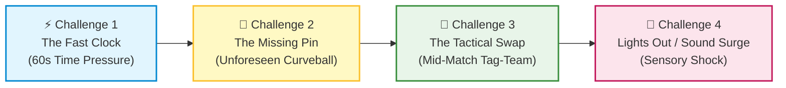

# FLL Session 3: CRM Stress Gauntlet, Ocean Issues & Robot Attachment Modularity

**Date:** Saturday, September 26, 2026  
**Time:** 1:00 PM – 4:00 PM  
**Attendees:** 9 Kids, Mentors/Coaches  
**Season Phase:** Team Dynamics, Stress Resilience & Mechanical Modularity  

> [!IMPORTANT]
> ### ✈️ Signature Coaching Strategy: The 4-Stage CRM Stress Gauntlet
> Today introduces practical **Crew Resource Management (CRM)** (see our [Mentor CRM Guide](crew_resource_management.md)). 
> * **The Core Mechanic: The One-Handed Duo Build.** Every kid puts one hand in their pocket. They *must* work in pairs where one student stabilizes/clamps while the other pins/aligns. No single student can dominate or hog the build!
> * **The Core Lesson:** Adrenaline makes people freeze (*"deer in headlights"*), rush, or blame. Through 4 rapid-fire mini-challenges, we teach 10-year-olds to rely on **Aviate, Navigate, Communicate**, standard callouts, and blameless problem-solving under pressure!

---

## 📌 Coach's Prep & Materials Checklist

* **Prep the CRM Challenge Bags (5 identical kits):**
  * Use 5 small plastic bins or zip bags.
  * In each bag, place pieces for a simple Technic mechanical arm/lever:
    * 2x Technic 13M Beams (e.g., Grey or Black)
    * 1x Technic 7M Beam (different color, e.g., Yellow or Blue)
    * 4x Black friction pins with ridges
    * 2x Blue axle-pins
    * 1x 4M axle + 1x 24-tooth gear (for a simple pivot hinge)
  * *For Challenge 2 (Secret Prep):* Mentors keep 1 extra bag with spare pins hidden away.
* **Match & Activity Timer:**
  * Project the team's [Interactive Match Timer](../../webtools/index.html) onto the large TV/monitor with audio alerts enabled, or use a large digital stopwatch.
* **Room Lighting Control:**
  * Know where the room light switch is for Challenge 4 (or have a flashlight/phone light handy).
* **Robot Hardware Ready:**
  * 2x SPIKE Prime Hubs fully charged (100%).
  * Modular drive base chassis elements sorted for Group A.
  * Medium/Large angular motors and sample attachment linkages ready for Group B.
* **Innovation Project Materials:**
  * Whiteboard and colored dry-erase markers for ocean problem affinity mapping.
  * Kids' completed [Innovation Project Worksheets](../../marketing/handouts/innovation_project_worksheet.html) or research notes from midweek.
* **Rewards:** Pokémon cards & team incentive tokens.

---

## 🕒 Schedule Breakdown (1:00 PM – 4:00 PM)

```mermaid
gantt
    title Session 3 Timeline (Saturday, Sep 26)
    dateFormat HH:mm
    axisFormat %H:%M

    section Warm-Up & Culture
    Welcome & Stress Mindset Check-In   : 13:00, 15m

    section CRM Stress Gauntlet
    Challenge 1 (The Fast Clock)       : 13:15, 10m
    Challenge 2 (The Missing Pin)      : 13:25, 10m
    Challenge 3 (The Tactical Swap)    : 13:35, 15m
    Challenge 4 (Sensory Shock / Lights Out) : 13:50, 10m

    section Innovation Project
    Ocean Issues & Bioluminescence Homework : 14:00, 20m
    Bio Break & Energy Recharge        : 14:20, 10m

    section Robot Building & Training Camp
    Station Rotation A & B (Modularity & Motors) : 14:30, 45m
    Peer Ambassador Handoff & Reverse Swap : 15:15, 15m

    section Wrap-Up
    Clean-Up Protocol Sprint           : 15:30, 15m
    Circle Up, Learning Log & Rewards  : 15:45, 15m
```



---

## 🚀 1:00 - 1:15 PM | Welcome & Stress Mindset Check-In (15 min)

* **Gather the team in a circle.**
* **Coach Prompt:**
  > *"Have you ever played a game or taken a test where your heart started thumping super fast, your hands felt jittery, and your brain felt frozen like a deer in headlights? That is 100% normal—it's adrenaline! Even NASA astronauts and fighter pilots get that rush. But pilots have a secret superpower called **Crew Resource Management (CRM)**. Today, we're going to unlock that superpower so you feel totally in control during FLL matches!"*
* Introduce the golden 3-word rule: **Aviate, Navigate, Communicate** (see [CRM Guide](crew_resource_management.md#%EF%B8%8F-the-core-pillar-aviate-navigate-communicate)):
  1. **Aviate:** First, control the physical situation (hold the part steady, stop the runaway bot).
  2. **Navigate:** Check the clock and decide what's next.
  3. **Communicate:** Talk out loud to your partner so you act as one brain!

---

## 🥊 1:15 - 2:00 PM | The 4-Stage CRM Stress Gauntlet (45 min)

### The Universal Ground Rules for All 4 Challenges:
1. **The One-Handed Duo Constraint:** Each student puts their non-dominant hand firmly in their pocket (or behind their back). They may only use **ONE hand**!
   - *Why:* One kid cannot take over. One person must be the **Anchor** (holding the beam steady) while the other is the **Builder** (inserting pins and sliding gears).
2. **Pairs:** 4 pairs of 2 (plus 1 mentor pair or trio of 3).
3. **The Target Model:** Build a 4-part pivoting Technic lever arm (mentor shows a 10-second demo model on the table).



---

### ⚡ Challenge 1: The Fast Clock (60 Seconds)
* **The Scenario:** You have exactly **60 seconds** on the big screen timer to assemble the complete lever arm.
* **What Mentors Will Observe:** Kids rushing, dropping pins, fumbling with one hand, getting quiet, or frantically yelling *"Hurry up!"*
* **The Rules:**
  1. Timer starts with an official match buzzer: *"3, 2, 1, LEGO!"*
  2. Build until the horn sounds at 0:00.
* **The 2-Minute Debrief:**
  - *"Raise your hand if your heart beat faster when you heard the countdown!"*
  - *"Did rushing make you faster or did it make pins slip out of your fingers?"*
  - **Coach Takeaway:** In FLL, **smooth is fast**. When you rush silently, you drop parts. Next time, tell your partner: *"Hold beam grey flat!"* then slide the pin.

---

### 🧩 Challenge 2: The Missing Pin (Unforeseen Obstacle)
* **The Secret Setup:** Before starting, the mentor quietly removes **one black connector pin** from every team's tray without telling them!
* **The Scenario:** 60-second timer starts. Kids attempt to finish the arm, but quickly realize: *the final beam cannot be secured because a pin is missing!*
* **What Usually Happens:** Kids freeze, search through the carpet, blame their partner (*"Did you drop it?!"*), or stand paralyzed.
* **The Expected CRM Behavior:**
  - **Aviate:** Finish what can be assembled.
  - **Navigate:** Realize a required piece is physically absent.
  - **Communicate:** Raise a hand, look at the mentor/referee, and assertively call: *"Supply! We are missing one black friction pin!"*
  - Mentor immediately tosses them the missing pin.
* **The 2-Minute Debrief:**
  - *"Was it your fault the pin was missing?"* (No!).
  - *"Did blaming your partner help?"* (No!).
  - **Coach Takeaway:** At tournaments, models jam and parts break through no fault of your own. Don't waste 20 seconds freezing. **Aviate, Navigate, Communicate! Speak up assertively!**

---

### 🔄 Challenge 3: The Tactical Swap / "Tap Out" (Mid-Build Handoff)
* **The Scenario:** 90-second build timer. But at the **45-second mark**, the mentor blows a loud whistle and shouts:  
  **"TACTICAL SWAP! Everyone on the RIGHT side, stand up and rotate one table to the left!"**
* **The Chaos:** Half the room is moving. Every student now has a brand-new partner and an unfamiliar, half-built mechanism in front of them!
* **The Rule:**
  - The partner who stayed in place is the **Station Lead (Pilot)**.
  - The Station Lead has **5 seconds** to brief their new incoming partner:
    - *"We already pinned the grey beam. You need to hold the yellow lever so I can slide the axle through!"*
  - Both resume one-handed building until the 90-second mark.
* **The 2-Minute Debrief:**
  - *"Incoming builders: What made your new partner easy or hard to work with?"* (Clear explanation vs. confusion).
  - *"Station Leads: How did it feel taking charge and directing the build?"*
  - **Coach Takeaway:** This is **exactly** how the two-technician swap works in the 2.5-minute FLL match! If a teammate taps out, the incoming technician needs a crisp 3-second handoff: *"Run 3 ready, checklist item 2!"*

---

### 🔦 Challenge 4: Lights Out / Sensory Shock ("Gojira Mode")
* **The Scenario:** Final 60-second speed build to see which pair can construct the cleanest, most rigid lever arm.
* **The Curveball:** At 30 seconds, the mentor **shuts off the room lights** (or blasts a loud siren/crowd cheering audio clip on the Bluetooth speaker)!
* **What to Teach:**
  - When unexpected shock hits, do NOT scream or abandon your station.
  - Call the magic CRM word: **"HOLD!"**
  - Both partners pause, laugh off the surprise, adapt (bring the model closer to the window/screen glow or phone light), and calmly finish.
* **The Debrief & High-Five:**
  - *"Tournaments are crazy noisy, chaotic, and unpredictable. You just survived all 4 levels of the gauntlet without breaking down!"*
  - Group cheer: *"DIFI-IT!"*

---

## 🌊 2:00 - 2:20 PM | Innovation Project: Ocean Environment & Bioluminescence Issues (20 min)

* **Objective:** Review the midweek homework where kids explored environmental issues affecting deep-sea and marine life (BIOGLOW season theme).
* **Step 1: Rapid Share Around the Circle (10 min):**
  * Each student shares one problem they researched:
    * *Coral bleaching and ocean temperature rise.*
    * *Deep-sea plastic pollution and microplastics.*
    * *Underwater noise pollution disrupting bioluminescent and echolocating creatures.*
    * *Loss of habitat in deep underwater trenches.*
* **Step 2: Affinity Mapping on the Whiteboard (10 min):**
  * Group similar problems together into 2–3 major categories.
  * Remind the kids of **Plus'ing**: When someone shares a problem, ask: *"Yes, and how does that connect to what Maya noticed about ocean light?"*
  * We will select our final team problem statement next session!

---

## 🥪 2:20 - 2:30 PM | Bio Break & Energy Recharge (10 min)

* Mandatory hands-off-bricks time.
* Water break, healthy snacks, stretch, wash hands.

---

## 🤖 2:30 - 3:30 PM | Main Activity Block: Robot Building & Training Camp (60 min)

Since robot training was abbreviated in Session 2, we execute our full split-station rotation with the **Peer Ambassador Handoff** (see [Coach's Notes](mentors_notes.md#2-the-peer-ambassador-system-intuitive-information-handoff)).

Divide the 9 students into two active stations:

```mermaid
sequenceDiagram
    autonumber
    participant A as Station A (Modular Base Builders)
    participant AmbA as Station A Ambassador
    participant AmbB as Station B Ambassador
    participant B as Station B (Motor & Attachment Camp)

    Note over A,B: Block 1 (25 min) - Master respective domains
    Note over AmbA,AmbB: 2:55 PM: Pick 1-2 Peer Ambassadors per station
    
    rect rgb(240, 248, 255)
        Note over A,B: Rotation Handoff (10 min): Ambassadors teach incoming group
        A->>B: Group A moves to Motors; AmbB teaches them motor calibration
        B->>A: Group B moves to Chassis; AmbA teaches them modular lock system
    end

    rect rgb(245, 255, 245)
        Note over A,B: Reverse Handoff (20 min): Ambassadors rejoin home group
        AmbB->>A: AmbB caught up by teammates on what was built
        AmbA->>B: AmbA caught up by teammates on what code was tested
    end
```

---

### 🟢 Station A: Building the Modular Quick-Swap Chassis (4–5 Kids)
* **Objective:** Build the standardized driving chassis that supports quick-swapping modular attachments without needing pins pulled apart during matches.
* **Key Mechanical Concepts:**
  - **Pin-less Slide Mounts:** Using vertical guide axles and gravity/catch-latches so attachments drop onto the robot in under 3 seconds.
  - **Rigidity vs. Weight:** Ensuring the chassis doesn't flex when lifting heavy mission elements.
* **Testing Challenge:** Build a drop-in attachment bracket. Test dropping it onto the chassis 5 times consecutively—it must lock in under 3 seconds every time!

---

### 🔵 Station B: Motor & Attachment Mechanism Training (4–5 Kids)
* **Objective:** Hands-on mechanics with SPIKE Prime Medium & Large Angular Motors.
* **Key Engineering Concepts:**
  - **Motor Ports & Direction:** Testing clockwise vs. counter-clockwise rotation (`run for X degrees` vs. `run for X seconds`).
  - **Gear Ratios (Speed vs. Torque):**
    - Small 12-tooth driver gear turning large 36-tooth gear = **3:1 Torque Multiplier** (for heavy lifting levers).
    - Large gear turning small gear = **Speed Multiplier** (for fast sweepers).
  - **Linear Sliders vs. Hinged Levers:** Testing which mechanism reliably lifts the season mission models.
* **Testing Challenge:** Program a motor to rotate an arm exactly 90 degrees, hold for 1 second, and return smoothly to zero.

---

### 🎓 2:55 PM — Peer Ambassador Swap & Reverse Handoff
1. At 2:55 PM, Station A and B nominate 1–2 ambassadors.
2. Stations swap; ambassadors stay behind to train incoming peers for 10 minutes (**zero mentor lecturing!**).
3. At 3:05 PM, ambassadors return to their home tables for the Reverse Handoff.

---

## 🧹 3:30 - 3:45 PM | Clean-Up Protocol Sprint (15 min)

* **Stop immediately at 3:30 PM.**
* Assign roles:
  * 🧹 **Floor Sweepers:** Check for Technic pins and axles under the mat.
  * 📦 **Kit Keepers:** Sort loose beams and return Challenge Kits to their bins.
  * 🔌 **Charging Crew:** Plug in SPIKE Prime Hubs and tablets to 100% charging ports.
* Reward bonus tokens for a clean room with zero pieces on the floor!

---

## 🌟 3:45 - 4:00 PM | Circle Up, Daily Learning & Rewards (15 min)

* **Gather in the closing circle.**
* **Growth Check-In:** Every single kid answers:
  1. *"What was the most surprising thing that happened to you during the 4 CRM challenges today?"*
  2. *"What is one way you helped or communicated with your partner when things got stressful?"*
* **Mentor Reflection Tracking:** Record observations on which students demonstrated composure, assertive communication, or great handoffs.
* **Rewards:** Distribute Pokémon cards / tokens for outstanding CRM teamwork and Plus'ing!

---

## 🎯 Coach's Evaluation & Success Criteria

By 4:00 PM, Session 3 is a complete success if:

- [ ] Every student participated in all 4 stages of the One-Handed CRM Stress Gauntlet.
- [ ] Students used closed-loop communication instead of silent rushing or blaming.
- [ ] In Challenge 2, kids learned to assertively communicate and request missing parts rather than freezing.
- [ ] In Challenge 3, students successfully executed a 5-second dynamic handoff with a new partner.
- [ ] Every student shared their ocean environmental research topic for the Innovation Project.
- [ ] Modular chassis assembly and motor/gear attachment training were completed across both stations.
- [ ] Peer Ambassador and Reverse Handoff occurred with kids teaching kids.
- [ ] Every student shared a reflection in the closing circle.
- [ ] Workshop is clean and all SPIKE Hubs are charging.