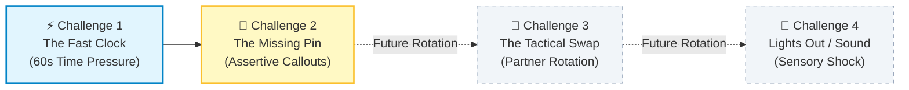

# FLL Session 3: Team Identity, Innovation Launch, Robot Base Modularity & CRM Challenges

**Date:** Saturday, September 26, 2026  
**Time:** 1:00 PM – 4:00 PM  
**Attendees:** 9 Kids, Mentors/Coaches  
**Season Phase:** Team Dynamics, Innovation Project Launch, Base Modularity & Stress Resilience

> [!IMPORTANT]
> ### 🧭 Session 3 Coaching Architecture: Front-Load Thinking, End with High-Energy Action
>
> Today’s curriculum is strategically ordered to match 10-year-olds' natural cognitive and energy curves:
>
> 1. **Start with Team Identity & Innovation (1:00 – 1:45 PM):** While minds are fresh, establish our official Team Name, hand out student-driven **DRI (Directly Responsible Individual)** roles, cover any preso or topics a student wants to share, and launch our Innovation Project research direction.
> 2. **Build Modular Robots with Peer Handoffs (1:55 – 2:50 PM):** Hands-on engineering on the Advanced Modular Driving Base and SPIKE motor programming, driven by the **Peer Ambassador Handoff** system.
> 3. **Finish with the CRM Stress Gauntlet (3:00 – 3:30 PM):** Right before clean-up, channel afternoon energy into our signature **Crew Resource Management (CRM)** one-handed duo challenges to drill stress resilience, assertive callouts, and blameless teamwork!

---

## 📌 Coach's Prep & Materials Checklist

* **Team Identity & Innovation Materials:**
   * Whiteboard and colored dry-erase markers for Team Name voting and ocean problem affinity mapping.
   * Sticky notes or voting dots for Team Name selection.
   * 8 DRI role cards or assignment sheet.
   * Kids' completed [Innovation Project Worksheets](../../marketing/handouts/innovation_project_worksheet.html) or research notes from midweek.
   * Reference copy of the [Mentor Innovation Project Rubric Guide](innovation_project_rubric_guide.md).

* **Robot Hardware Ready:**
   * 2x SPIKE Prime Hubs fully charged (100%).
   * LEGO Education SPIKE Prime Core + Expansion Sets sorted.
   * Tablets with SPIKE App installed and paired to Hubs via Bluetooth.
   * Building instructions bookmarked: [Advanced Driving Base Assembly](https://education.lego.com/en-us/lessons/prime-competition-ready/assembling-an-advanced-driving-base/).
   * Motor and sensor testing modules ready for Station B: [SPIKE Prime Getting Started](https://spike.legoeducation.com/prime/start/).

* **CRM Challenge Kits (5 identical kits for 4 pairs + 1 mentor pair):**
   * Use 5 small bins or zip bags. In each bag, place pieces for a simple Technic lever arm:
      * 2x Technic 13M Beams (Grey or Black)
      * 1x Technic 7M Beam (different color, e.g., Yellow or Blue)
      * 4x Black friction pins with ridges
      * 2x Blue axle-pins
      * 1x 4M axle + 1x 24-tooth gear (for a pivot hinge)
   * *For Challenge 2 (Secret Prep):* Mentors keep 1 extra bag with spare pins hidden away.

* **Match & Activity Timer:**
   * Project the team's [Interactive Match Timer](../../webtools/index.html) onto the large TV/monitor with audio alerts enabled, or use a large digital stopwatch.

* **Rewards & Handouts:**
   * Pokémon cards & team incentive tokens.
   * 10 copies of the [Pokémon CRM Kids Checklist Flyer](../../marketing/handouts/crew_resource_management_kids.html) ([Guide](../../marketing/handouts/crew_resource_management_kids.md)) for team binders.
   * 2–3 cardstock copies of the [Mentor CRM Pocket Cue Card](mentor_crm_cue_card.html) ([Guide](mentor_crm_cue_card.md)) for coaches/mentors.

---

## 🕒 Schedule Breakdown (1:00 PM – 4:00 PM)

```mermaid
gantt
    title Session 3 Timeline (Saturday, Sep 26)
    dateFormat HH:mm
    axisFormat %H:%M

    section Team Identity & Innovation
    Welcome & Official Team Name Vote   : 13:00, 15m
    Innovation Project & 8 DRI Roles    : 13:15, 30m

    section Recharge Break
    Bio Break & Energy Snack            : 13:45, 10m

    section Robot Building & Training
    Split-Station Robot Camp (Block 1)  : 13:55, 30m
    Peer Ambassador Teaching Swap       : 14:25, 10m
    Reverse Handoff & Testing           : 14:35, 15m
    Station Debrief & Learnings         : 14:50, 10m

    section CRM Stress Gauntlet
    CRM Intro (Aviate-Navigate-Communicate) : 15:00, 05m
    Gauntlet Mini-Challenges (Rotated)      : 15:05, 25m

    section Wrap-Up
    Clean-Up Protocol Sprint            : 15:30, 15m
    Circle Up, Rubber Ducky & Rewards   : 15:45, 15m
```



---

## 🚀 1:00 - 1:15 PM | Welcome, Circle-Up & Official Team Name Selection (15 min)

* **Gather the team in a circle.**
* **High-Energy Kickoff:** Quick check-in on the week and team energy.
* **Brainstorm & Vote on Official Team Name:**
   * Every FLL team needs a distinct identity, mascot, and team culture!
   * Write student suggestions on the whiteboard (e.g., themed around *BIOGLOW*, ocean bioluminescence, robotics, or Calgary local identity).
   * **The 2-Minute Voting Process:** Give every student 2 sticky dots (or marker tallies) to vote for their favorite top 2 candidates.
   * Confirm the consensus name and celebrate with the team!
* **Core Values Cheer:** Practice our team mnemonic **"DIFI-IT!"** *(Discovery, Innovation, Fun, Impact, Inclusion, Teamwork)*:
   > Coach: *"What do we do to challenges?"*  
   > Kids: *"DIFI-IT!"*

---

## 🌊 1:15 - 1:45 PM | Innovation Project: Discovery, Presentation Vision & DRI Roles (30 min)

### 1. Midweek Homework Review
* Go around the circle: What ocean and aquatic habitat problems did each student discover?
* What issues sparked excitement? (e.g., microplastic ingestion, noise pollution disturbing marine mammals, biofouling on municipal pilings, harsh floodlights disrupting deep bioluminescent creatures).

### 2. The Strategic Question: Go Global or Go Local?
Guide the students through the big dilemma using Socratic prompts (see our [Mentor Innovation Rubric Guide](innovation_project_rubric_guide.md)):
* *"Do we want to try to solve global climate change, or do we want to go local and help our home region (e.g., Calgary, the Bow River watershed, or a specific localized ecosystem)?"*
* **Mentor Tip:** Remind kids that in FLL judging, **hyper-specific, localized problems score much higher than broad global topics** because the team can reach real experts and design a targeted solution!

### 3. Creative Presentation Formats
Prompt the team to envision how they want to present in the 5-minute judging room:
* A theatrical **skit** with a storyline?
* Scientific **documentary / TV news broadcast** with anchor desks?
* Custom **costumes** or character props?
* A musical intro or creative visual demonstration?

### 4. Assigning the Innovation Project DRI Roles (Pokémon Theme Codenames! ⚡)
To ensure every student has clear ownership without feeling overwhelmed, we use the **DRI (Directly Responsible Individual)** framework powered by **Pokémon Champion Codenames**:

> 💡 **The DRI Philosophy:** The DRI is the **organizer and collator** of their domain—**not** the person doing all the work alone! Everyone contributes ideas, but the DRI is the go-to point person who registers the team's input, keeps the checklist on track, and represents that domain. This prevents forcing tasks onto kids who don't want them and ensures 100% agency.

| Role # | DRI Title | Pokémon Codename | Signature Move / Superpower | Operational Responsibilities |
| :---: | :--- | :--- | :--- | :--- |
| **1** | **📦 Physical Presentation Lead** | **Machamp** 💪 | *Dynamic Punch / Heavy Slam* | **Four Arms on Stage:** Organizes heavy trifold poster boards, cardboard mockups, stage layout, tape, and visual backdrops before the 5-minute timer starts! |
| **2** | **🔬 Research Lead** | **Alakazam** 🧠 | *Calm Mind / Future Sight* | **The 5,000 IQ Brain:** Organizes facts, habitat research papers, water quality metrics, and source citations so judges know our science is rock-solid. |
| **3** | **🛠️ Prototype Lead** | **Tinkaton** 🔨 | *Gigaton Hammer / Forge* | **The Master Craftsman:** Forges our physical prototype out of LEGO Technic, cardboard, and CAD; ensures gears turn and moving parts snap cleanly! |
| **4** | **🤝 Outreach Coordinator** | **Dragonite** 📬 | *Extreme Speed / Wing Attack* | **The Global Messenger:** Flies our message across the ocean! Gathers teammate questions, drafts emails to marine biologists, and logs expert feedback for V2.0! *(Crucial for the Rubric "Share" Rule!)* |
| **5** | **🎭 Creative Director** | **Jigglypuff** 🎤 | *Sing / Hyper Voice* | **The Headline Performer:** Directs the spotlight, polishes the 5-minute script, choreographs props, and makes sure every teammate has their solo moment on the mic! |
| **6** | **💰 Budget & Materials Accountant** | **Meowth** 🪙 | *Pay Day!* | **The Pay-Day Specialist:** Counts every coin! Tracks supplies (glue, cardboard, sensors), manages the receipt ledger, and ensures the team stays strictly under budget. |
| **7** | **🕵️ Historical Intelligence & Video Scout** | **Greninja** 🥷 | *Shadow Sneak / Water Shuriken* | **The Stealth Scout:** Sneaks through YouTube archives, analyzes past FLL World Champion presentations, and reports back on winning judge hooks! |
| **8** | **🦆 Team Rubber Ducky** | **Psyduck** 🦆 | *Amnesia / Psychic Calm* | **The Empathy Duck:** When someone gets a headache or feels stuck, Psyduck listens blamelessly, cools down the stress, and translates feelings to mentors safely! |
| **9** | **⚡ Energy & Time Captain** *(9th Member / Co-Lead)* | **Pikachu** ⚡ | *Volt Tackle / Spark* | **The Spark Plug:** Keeps team energy high, monitors the 5-minute presentation countdown timer, and leads team cheers (*"DIFI-IT!"*) during transitions! |

---

## 🥪 1:45 - 1:55 PM | Bio Break & Energy Recharge (10 min)

* Mandatory hands-off-bricks time.
* Water break, healthy snacks, bathroom, quick stretch to reset physical energy for building.

---

## 🤖 1:55 - 2:50 PM | Main Activity Block: Robot Building & Training Camp (55 min)

Since robot training was abbreviated in Session 2, we execute our full split-station rotation driven by the **Peer Ambassador Handoff** (see [Coach's Notes](mentors_notes.md#2-the-peer-ambassador-system-intuitive-information-handoff)).

Divide the 9 students into two active stations:

```mermaid
sequenceDiagram
    autonumber
    participant A as Station A (Modular Base Builders)
    participant AmbA as Station A Ambassador
    participant AmbB as Station B Ambassador
    participant B as Station B (Motor & Attachment Camp)

    Note over A,B: Block 1 (30 min) - Master respective domains
    Note over AmbA,AmbB: 2:25 PM: Pick 1-2 Peer Ambassadors per station
    
    rect rgb(240, 248, 255)
        Note over A,B: Rotation Handoff (10 min): Ambassadors teach incoming group
        A->>B: Group A moves to Motors; AmbB teaches them motor calibration
        B->>A: Group B moves to Chassis; AmbA teaches them modular lock system
    end

    rect rgb(245, 255, 245)
        Note over A,B: Reverse Handoff (15 min): Ambassadors rejoin home group
        AmbB->>A: AmbB caught up by teammates on what was built
        AmbA->>B: AmbA caught up by teammates on what code was tested
    end
```

---

### 🟢 Station A: Advanced Modular Robot Base Assembly (4–5 Kids)

* **Online Guide:** [LEGO Education Advanced Driving Base Lesson](https://education.lego.com/en-us/lessons/prime-competition-ready/assembling-an-advanced-driving-base/)
* **Objective:** Assemble the rigid competition drive chassis with integrated wheel encoders and square bumper frames.
* **Key Engineering Concepts:**
   - **Modularity:** Why build attachments that snap on/off with pins rather than rebuilding the whole robot every run?
   - **Structural Rigidity:** Cross-bracing Technic beams so the chassis doesn't flex when pushing heavy mission models.
   - **Following Technical Diagrams:** Reading step-by-step CAD instructions and double-checking pin colors.
* **Challenge:** Complete the base chassis assembly, ensure drive wheels spin with zero friction drag, and test the front pin-locking slot.

---

### 🔵 Station B: Motor & Attachment Mechanism Training (4–5 Kids)

* **Online Guide:** [SPIKE Prime Getting Started & Hardware Exploration](https://spike.legoeducation.com/prime/start/)
* **Objective:** Explore the SPIKE App programming interface, test motor precision, and understand mechanical gear linkages.
* **Key Engineering Concepts:**
   - **Motor Degrees vs. Rotations vs. Seconds:** Why time-based drive code fails as batteries drain, while degree-based rotation stays consistent.
   - **Gears & Mechanical Advantage:** How a 24-tooth gear driving an 8-tooth gear speeds up an arm, while the reverse increases lifting torque.
   - **Sensor & Port Mapping:** Knowing which port connects to which motor.
* **Testing Challenge:** Program an angular motor to rotate an attachment arm **exactly 90 degrees**, hold firmly for 1 second, and return smoothly to zero degrees.

---

### 🎓 2:25 - 2:50 PM | Peer Ambassador Swap & Reverse Handoff

1. **At 2:25 PM:** Station A and Station B each nominate **1–2 Peer Ambassadors**.
2. **Phase 1 Swap (10 min - 2:25 to 2:35 PM):** Groups swap tables, but ambassadors stay behind to train incoming peers (**zero mentor lecturing!**).
   - Driving ambassadors teach incoming Group A how to run the motor degree code.
   - Chassis ambassadors show incoming Group B how the modular chassis pins click together.
3. **Phase 2 Reverse Swap (15 min - 2:35 to 2:50 PM):** Ambassadors rejoin their home teams. Teammates must now spend 5 minutes catching their returning ambassadors up on what they accomplished!

---

## 💬 2:50 - 3:00 PM | Station Debrief & Hardware Reflection (10 min)

* Bring both stations together around the competition mat.
* **Quick Round-Robin:**
   - What worked smoothly with the modular base?
   - What surprised us about how motors behave when given degree inputs?
   - What mechanical attachments do we want to start prototyping next session?

---

## 🥊 3:00 - 3:30 PM | The CRM Stress Gauntlet (30 min)

> 💡 **Coaching Note:** We do **not** need to run all 4 challenges in every session! Running 2 focused challenges per session keeps the exercises crisp, prevents sensory fatigue, and keeps students on their toes. Today, we run **Challenge 1** and **Challenge 2** (with Challenge 3 & 4 reserved for future rotations).

### The Golden CRM Rule: "Aviate, Navigate, Communicate"
Before starting, gather pairs and review the 3-word pilot axiom (see [CRM Guide](crew_resource_management.md#the-core-pillar-aviate-navigate-communicate)):
1. **🛩️ Aviate:** Control the physical piece first—hold it steady!
2. **🧭 Navigate:** Check the clock and know what piece is missing or needed next.
3. **📢 Communicate:** Speak loud and clear so your partner acts as one brain!

### The Universal Ground Rule: The One-Handed Duo Constraint
* Each student puts their non-dominant hand firmly in their pocket (or behind their back).
* **They may only use ONE hand!**
* *Why:* One child cannot take over. One student must act as the **Anchor** (holding the beam steady) while the other acts as the **Builder** (inserting pins and sliding gears).



---

### ⚡ Challenge 1: The Fast Clock (60 Seconds)

* **The Scenario:** You have exactly **60 seconds** on the big screen timer to assemble the complete pivoting Technic lever arm.
* **What Mentors Will Observe:** Kids rushing, dropping pins, fumbling with one hand, getting quiet, or frantically yelling *"Hurry up!"*
* **The Rules:**
   1. Timer starts with an official match buzzer: *"3, 2, 1, LEGO!"*
   2. Build until the horn sounds at 0:00.
* **The 2-Minute Debrief:**
   - *"Raise your hand if your heart beat faster when you heard the countdown!"*
   - *"Did rushing make you faster or did it make pins slip out of your fingers?"*
   - **Coach Takeaway:** In FLL, **smooth is fast**. When you rush silently, you drop parts. Next time, tell your partner: *"Hold beam grey flat!"* then slide the pin calmly.

---

### 🧩 Challenge 2: The Missing Pin (Unforeseen Obstacle)

* **The Secret Setup:** Before starting, the mentor quietly removes **one black connector pin** from every team's tray without telling them!
* **The Scenario:** 60-second timer starts. Kids attempt to finish the arm, but quickly realize: *the final beam cannot be secured because a pin is missing!*
* **What Usually Happens:** Kids freeze, search through the carpet, blame their partner (*"Did you drop it?!"*), or stand paralyzed.
* **The Expected CRM Behavior:**
   - **Aviate:** Finish what can be assembled.
   - **Navigate:** Realize a required piece is physically absent.
   - **Communicate:** Raise a hand, look at the mentor/referee, and assertively call: *"Supply! We are missing one black friction pin!"*
   - Mentor immediately tosses them the missing pin.
* **The 2-Minute Debrief:**
   - *"Was it your fault the pin was missing?"* (No!).
   - *"Did blaming your partner help?"* (No!).
   - **Coach Takeaway:** At tournaments, models jam and parts break through no fault of your own. Don't waste 20 seconds freezing. **Aviate, Navigate, Communicate! Speak up assertively!**

*(Challenges 3 & 4: Tactical Mid-Build Swap and Lights-Out Sensory Shock are held in reserve for upcoming sessions!)*

---

## 🧹 3:30 - 3:45 PM | Clean-Up Protocol Sprint (15 min)

* **Stop immediately at 3:30 PM.**
* Assign clean-up roles:
   * 🧹 **Floor Sweepers:** Check for Technic pins and axles under the mat and tables.
   * 📦 **Kit Keepers:** Sort loose beams and return Challenge Kits to their bins.
   * 🔌 **Charging Crew:** Plug in SPIKE Prime Hubs and tablets to 100% charging ports.
* Reward bonus tokens for a clean room with zero pieces left on the floor!

---

## 🌟 3:45 - 4:00 PM | Circle Up, Rubber Ducky Check-In & Rewards (15 min)

* **Gather in the closing circle.**
* **Team Rubber Ducky Debrief:** Have our newly appointed Rubber Ducky share any observations or constructive feedback heard during the day.
* **Growth Reflection Question:** Every student shares one sentence:
   - *"What was one moment today where you felt proud of how you communicated with your teammate?"*
* **Celebrate Milestones:**
   - Officially congratulate the team on their **Official Team Name** and **8 DRI Roles**!
* **Rewards:** Distribute Pokémon cards / tokens for outstanding CRM communication, peer teaching, and Plus'ing!

---

## 🎯 Coach's Evaluation & Success Criteria

By 4:00 PM, Session 3 is a complete success if:

- [ ] Team officially selected and voted on their **Official Team Name**.
- [ ] Every student chose or was assigned one of the **8 DRI (Directly Responsible Individual) Roles**.
- [ ] Innovation Project research topic narrowed down (global vs. local to Calgary/region).
- [ ] Modular Advanced Driving Base chassis assembled and verified with zero wheel drag.
- [ ] Motor degrees and sensor programming tested at Station B.
- [ ] Peer Ambassador Handoff and Reverse Swap executed with kids teaching kids.
- [ ] Students completed Challenges 1 & 2 of the One-Handed CRM Stress Gauntlet using closed-loop callouts.
- [ ] In Challenge 2, students assertively called out to supply/referee rather than freezing or blaming.
- [ ] Team Rubber Ducky participated in the closing circle.
- [ ] Workshop is clean and all SPIKE Hubs are plugged in and charging.