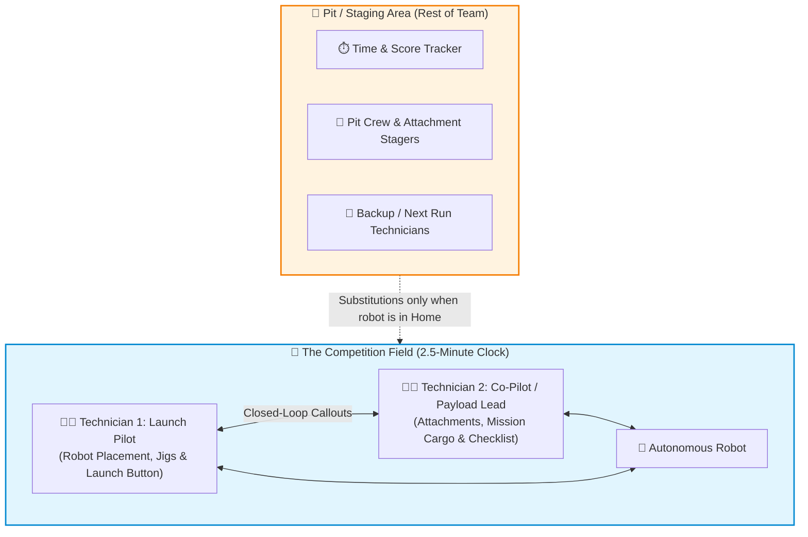
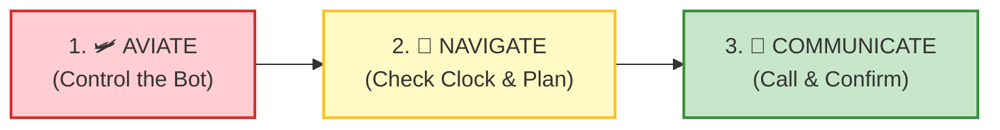
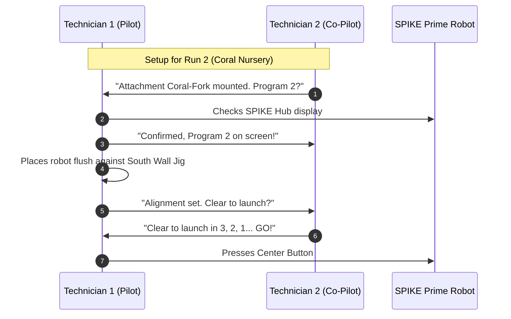
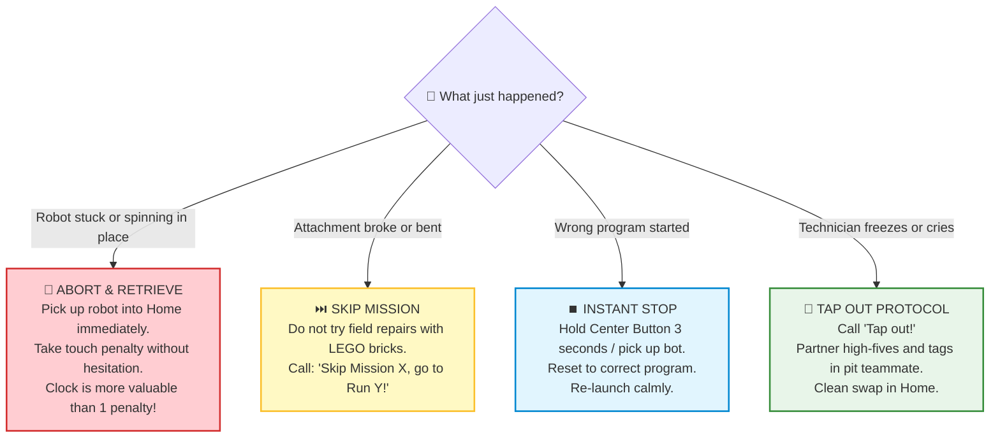
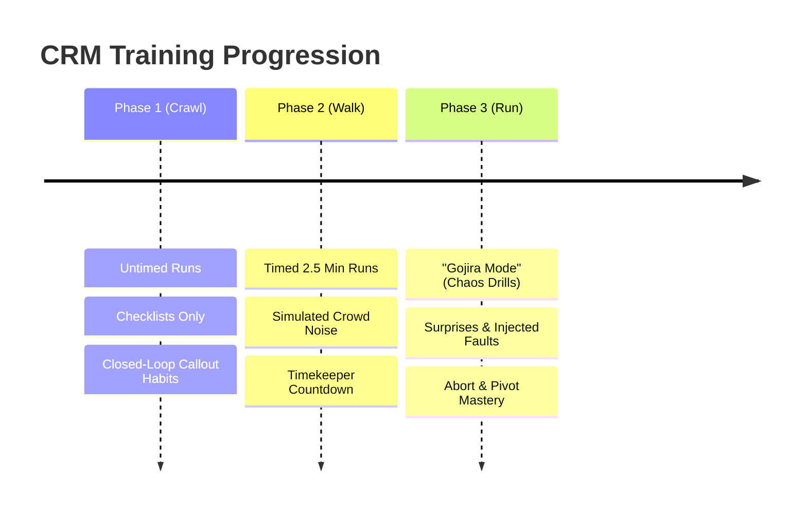
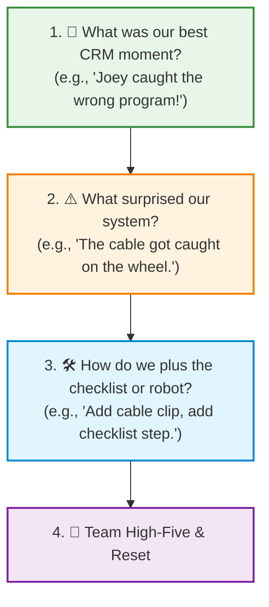

# ✈️ Crew Resource Management (CRM) for FLL Technicians

## Mental Readiness, Stress Resilience & Field Operations for 10-Year-Olds

> *"Competence means keeping your head in a crisis, sticking with a task long enough to see it through, and learning to help others do the same."*
>
> — Chris Hadfield (Canadian Astronaut and former ISS Commander)

---

## 🧭 Preamble: Why Teach Aviation CRM to 10-Year-Olds?

In commercial aviation, space flight, and mission-critical engineering operations, disaster rarely strikes because someone lacks technical intelligence. Accidents happen when **stress hijacks human biology**:

- Adrenaline surges.
- Heart rate jumps to 150+ BPM.
- Tunnel vision sets in, and situational awareness drops to zero.
- The brain shifts into **fight, flight, or freeze** (*"deer in headlights"*).

In FIRST LEGO League (FLL), a 2.5-minute Robot Game match produces that exact physiological storm in a 10-year-old child:

- Loud arena speakers blasting music and countdown buzzers.
- Spectators shouting, parents cheering, referees staring with clipboards.
- The adjacent team's robot violently crashing into a wall.
- A LEGO attachment peg snapping off 30 seconds into the run.

Left untrained, kids will naturally freeze, snap at each other, panic, or point fingers (*"Joey dropped it! Joey ruined our run!"*). **Throwing kids into that environment without mental preparation is throwing them into shark-infested waters.**

**Crew Resource Management (CRM)** is the proven operational framework developed by NASA and commercial aviation to counter this exact breakdown. CRM teaches crews that:

1. Human error is an expected physical reality, not a moral failure.
2. Rigid communication protocols beat adrenaline-clouded memory.
3. Psychological safety and blameless systems allow teams to stay in control when things break.

This guide provides mentors with the training progression, vocabulary, and drills needed to guide our 10-year-old technicians from panic to poise.

For our season, I am suggesting that mentor will provide the exercises to practice CRM but the kids should come up with the specific executions. So when it comes to checklists, we should let them develop the checklist and iterate it. Same for communication or prioritizations, let the kids come up with the needs and plan. We should help guide and provide feedback but letting them come up with the actual plans will give them more agency and confidence.

---

## 🎭 The FLL Field Reality: The Two-Technician System

Under FLL rules, **only two team members (designated as "Technicians") may stand at the competition table at any one time**. Other team members remain in the designated staging/pit area behind the barrier.



### 1. Clear Division of Responsibilities at the Table

When two kids approach the table, they cannot have overlapping, fuzzy jobs. One cannot assume the other loaded the cargo or selected the right program.

| Role | Operational Title | Primary Responsibilities |
| :--- | :--- | :--- |
| **Technician 1** | **The Pilot (Launch Lead)** | • Robot positioning & alignment jig placement.<br/>• Selecting and verifying the program on the SPIKE Prime screen.<br/>• Final finger on the Hub button.<br/>• Eyes on the robot's physical heading. |
| **Technician 2** | **The Co-Pilot (Payload Lead)** | • Attachment swapping and mechanical pin locking.<br/>• Loading mission models / cargo into the robot or launcher.<br/>• Holding the laminated run checklist.<br/>• Calling out program numbers and reading the match clock. |

---

## 🛩️ The Core Pillar: "Aviate, Navigate, Communicate"

This classic aviation axiom is the mental anchor that prevents the "deer in headlights" freeze. When an alarm blares or a part breaks, pilots drill this three-word priority order:



### 1. AVIATE: Control the Robot First!

- **Rule:** Before talking, debating, or crying over lost points, **physically control the immediate situation**.
- If the robot is driving in circles, spinning against a wall, or rolling away toward off-table doom:
   - **Do NOT watch it wander for 20 seconds** hoping for a miracle.
   - **Touch and retrieve it!** Take the touch penalty calmly. Bring it immediately back to Home.
   - Shut down running motors or reset the attachment.

### 2. NAVIGATE: What is Our Position & Priority?

- Once the robot is safely in Home, take a 1-second breath.
- **Check the clock:** How many seconds remain?
- **Check the field:** Is the next mission still possible, or is the path/model blocked?
- **Check the hardware:** Is an attachment broken? If yes, pivot to the contingency plan.

### 3. COMMUNICATE: Speak Loud, Clear, and Closed-Loop

- Verbalize the decision immediately so both technicians and the ref know what is happening.
- Example: *"Robot recovered. Skip Mission 3. Go straight to Mission 4. Confirm?"*

---

## 🗣️ Closed-Loop Communication & Standard Callouts

In noisy gymnasiums, casual speaking fails. Technicians must use **Closed-Loop Communication** (call-and-response), ensuring every command is acknowledged before action is taken.



### Standardized Vocabulary Table for Kids

Kids love code words. Standardizing phrases removes emotional ambiguity:

| Phrase / Callout | Who Says It | Meaning | Required Response |
| :--- | :--- | :--- | :--- |
| **"Check Program!"** | Tech 2 (Co-Pilot) | Verifying SPIKE Hub number matches checklist. | *"Program [X] locked!"* |
| **"Jig Set!"** | Tech 1 (Pilot) | Robot is squared against mechanical alignment jig. | *"Alignment confirmed!"* |
| **"Clear to Launch?"** | Tech 1 (Pilot) | Hands off, field path clear, ready to press button. | *"Clear to launch!"* (or *"HOLD! [Reason]"*) |
| **"HOLD!"** | Anyone | Immediate abort before button press (pin loose, cord stuck). | Both freeze; solve problem. |
| **"Abort & Retrieve"** | Either Tech | Robot missed target / stuck. Pull robot back to Home. | Both grab robot safely into Home. |
| **"Skip to [Run #]"** | Either Tech | Mission broken/failed. Move immediately to backup run. | *"Skipping to [Run #], checklist ready!"* |
| **"Tap Out!"** | Either Tech | A technician feels overwhelmed and requests a teammate swap. | Next technician steps in from pit immediately. |

---

## 📋 The Power of Checklists: Memory Fails Under Stress

When heart rates climb above 120 BPM, short-term working memory severely degrades. Expecting a 10-year-old to remember 6 sequential mission numbers, motor speed settings, and attachment pins from memory is setting them up for failure.

### The Laminated Run Card 

Technicians are allowed to have a paper with their checklist on it. They cannot use it to position the robot or be on the table. The checklist should be taped to the kid's arms so its out of the way but easily accessible to read. 

```md
+-----------------------------------------------------------+
| 🟢 RUN 2: CORAL NURSERY & SHARK RELEASE                    |
+-----------------------------------------------------------+
| [ ] ATTACHMENT: Dual-Lift Fork (Yellow Pegs clicked into C) |
| [ ] CARGO CHECK: 2 Seedlings loaded in hopper              |
| [ ] HUB DISPLAY: Program #2                                |
| [ ] ALIGNMENT: Jig B against East Wall, wheels straight     |
| [ ] PATH CHECK: Referee and opposing bot clear             |
|                                                           |
| ⚠️ CONTINGENCY:                                            |
| If Shark lever jams -> DO NOT RETRY. Advance to Run 3!     |
+-----------------------------------------------------------+
```

> [!TIP]
> **Checklist Discipline:** Technician 2 physically points their finger at each item on the card and reads it aloud. Technician 1 executes and verbally replies: *"Checked!"*
>
> Based on Shisa Kanko (pointing and calling)

---

## ⚡ The Contingency Matrix: What to Do When Disaster Strikes

Things **will** go wrong on the competition field. An axle will slip, a wheel will snag on the mat seam, or a mission model will fail to trigger.

Panic happens when kids have to **invent a solution on the fly**. Confidence happens when kids **execute a pre-rehearsed plan**.



### 1. The "No Cowboy" Rule

In the heat of the moment, a kid might think: *"Wait, let me push the robot by hand toward the model!"* or *"Let me quickly rebuild this 15-piece linkage right now!"*

- **Rule:** **No cowboy actions.** Don't start doing something with everyone understanding and agreeing to what you're doing. Take a step back and make sure people are in agreement.

### 2. The Math of the Touch Penalty vs. The Clock

Kids are often terrified of touch penalties. They will stand frozen for 25 seconds watching a stuck robot grind its wheels against a border wall because they "don't want to lose points."

- **Mentors must teach the math:**  
   *A precision token penalty costs 5–10 points. But losing 25 seconds of match time costs 50 points from missing your final two mission runs!*
- **A quick touch penalty is a smart strategic investment, not a mistake.**

---

## 🤝 The "Tap Out" Protocol & Substitutions

In FLL, team members may swap at the table, provided the robot is completely inside Home when the swap occurs.

### Normalizing the "Personal Timeout"

A 10-year-old might feel sensory overload, panic, or shake uncontrollably during a match. Society often teaches kids that admitting you are overwhelmed is "quitting" or "weakness."

In Team 76265, **we teach the opposite:**

- In NASCAR, a driver pits when a tire is bald.
- In commercial aviation, if a pilot feels incapacitation, the first officer immediately assumes control.
- **Tapping out is an act of high team maturity.** You are prioritizing the mission over your personal ego.

### How the Tap Out Works:

1. Technician at the table recognizes they are locking up or shaking: *"I need to tap out."*
2. Co-technician acknowledges: *"Got it, tapping out next Home return."*
3. When the robot enters Home, the outgoing technician tags their partner's hand, steps backward out of the technician zone, and a teammate from the staging area steps in with zero drama.
4. The incoming teammate asks: *"What run are we on?"* — Co-technician answers: *"Run 4, card is ready."*

---

## 🛑 The "Two-Challenge Rule" (Assertive Advocacy)

In cockpit CRM, junior first officers were historically hesitant to correct older senior captains, leading to fatal crashes. Aviation introduced the **Two-Challenge Rule**:

- If you observe an unsafe condition or procedural violation, you **must speak up at least twice** assertively.
- If the first callout is ignored, you escalate.

### How 10-Year-Olds Use the Two-Challenge Rule:

Imagine Technician 1 is about to press launch, but selected Program 4 instead of Program 3:

- **First Challenge (Inquiry):**  
   Tech 2: *"Check program, Joey. Does the screen say 3?"*
- **Second Challenge (Assertive Stop):**  
   *(If Tech 1's finger is still moving toward the launch button)*  
   Tech 2: *"HOLD! STOP LAUNCH! The screen says 4, we need Run 3!"*  
   *(Physically covers the button or waves hand over Hub).*
- **Resolution:** Tech 1 looks, smiles, says: *"Good catch! Changing to 3 now."*

> [!IMPORTANT]
> **Mentoring Rule:** Celebrate the kid who caught the error with huge praise! *"That second challenge just saved our team 40 points. That is world-class teamwork!"*

---

## ➕ Blameless Culture & Plus'ing: Eliminating the Blame Game

When an incident occurs in aviation or tech operations, organizations conduct a **Blameless Post-Mortem**.

### Why Blaming Joey Destroys Teams

If Joey misaligns the robot and it crashes into the subsea crater, human instinct is to yell: *"Joey! Why did you put it there?! You ruined it!"*

- Joey feels humiliated and defensive.
- Other kids become afraid to touch the robot because they don't want to be blamed next.
- The root cause is never fixed.

### The System-First Mindset

Human error is never the root cause; **human error is a symptom of a weak system**.

| The Incident | The Blame Reaction (❌ Toxic) | The CRM / Plus'ing Reaction (✅ System Fix) |
| :--- | :--- | :--- |
| Joey aligned the robot 5 mm to the left, causing it to miss the lever. | *"Joey has bad aim. Don't let Joey launch anymore."* | *"Why was it possible to misalign? Let's 3D-print or build a LEGO **alignment jig** so the robot can only sit in ONE exact spot against the wall."* |
| Maya forgot to click the motor attachment peg in, so the arm fell off. | *"Maya wasn't paying attention."* | *"Our checklist didn't have a physical tug-test. Let's add **'Tug test arm 2x'** to the laminated run card!"* |
| The wrong program was launched. | *"You can't even read numbers!"* | *"The SPIKE hub numbers are small. Let's program the Hub light matrix to display a large graphic icon (e.g., a Whale for Run 1, a Shark for Run 2)."* |

We **"Plus"** mistakes:  
*"We dropped points because our alignment slipped. **YES**, that happened, **AND** how can we engineer a mechanical wall jig this afternoon so it is physically impossible to align incorrectly ever again?"*

---

## 🏋️ Mentoring Training Drills: The Crawl-Walk-Run Progression

We do not expect 10-year-olds to execute CRM on Day 1. We train them systematically through three distinct stages:



---

### Phase 1: Crawl — The Silent & Slow Table Walk (Sessions 1–3)

- **Environment:** Quiet room. No timer. Unlimited time.
- **Objective:** Pure muscle memory and voice habits.
- **Drill:**
   1. Technicians stand at the table with the laminated run cards.
   2. Every single step must be spoken aloud in full closed-loop sentences (*"Program 1 selected" -> "Program 1 confirmed"*).
   3. If a student touches a piece without speaking the callout, the mentor gently taps the table: *"Rewind 5 seconds. What is the callout?"*
   4. Reward kids with high-fives whenever callouts sound crisp and rhythmic.

---

### Phase 2: Walk — The Pressure Cooker (Sessions 4–6)

- **Environment:** Simulated competition noise. 2.5-minute timer running on a large display.
- **Objective:** Maintaining situational awareness while the sensory load increases.
- **Drill:**
   1. Bluetooth speaker plays loud tournament arena music and referee chatter.
   2. Other teammates stand around the table clapping, shouting encouragement, and waving hands.
   3. Pit timekeeper calls out match marks: *"1 minute remaining!"*, *"30 seconds!"*
   4. Technicians practice keeping their focus locked inside the 2x4 foot Home area, ignoring outside visual distractions.

---

### Phase 3: Run — "Gojira Mode" (Chaos Engineering Drills) (Sessions 7+)

In software and operations, engineers test resilience with "Chaos Monkey"—deliberately breaking systems in production to ensure failovers work. In FLL, mentors run **"Gojira Mode"**:

- **The Setup:** Tell the kids: *"This run, something crazy is going to happen. Your job is NOT to get a perfect score. Your job is to Aviate, Navigate, Communicate and adapt without freezing!"*
- **Mentor Injected Faults (Choose one per mock match):**
   - **The Missing Peg:** Mentor secretly removes one connecting pin from an attachment while staging. Can the co-pilot catch it during checklist inspection?
   - **The Table Shift:** Right after launch, mentor gently bumps the robot off course. Technicians must immediately execute **Abort & Retrieve**, take the penalty, and reset.
   - **The Broken Attachment:** Right before Run 3, mentor says: *"The fork attachment just snapped in half. You have 45 seconds left. What do you do?"* (Correct response: Skip Run 3, advance immediately to Run 4 checklist).
   - **The Referee Mystery:** Mentor acts as a stern referee, asking a sudden rules question or giving a warning. The technicians must politely acknowledge (*"Thank you, Ref!"*) without breaking focus.

---

## ⏱️ The 3-Minute Post-Match Debrief Ritual

Immediately after every 2.5-minute practice match or tournament round, gather the team in a circle away from the table. Mentors lead this exact 3-minute reflection:



1. **Celebrate High-Stress Composure:** Praise the kid who called *"HOLD!"* or the kid who calmly took a touch penalty when the robot wandered.
2. **Never Leave with Frustration:** Every failure must be converted into a physical checklist item or an engineering task before the circle breaks.

---

## 🎒 Tournament Day Checklist for Mentors

- [ ] **Mentor CRM Pocket Cue Card:** Printed 4"x6" cue card or lanyard badge ([Printable HTML](mentor_crm_cue_card.html) | [Guide](mentor_crm_cue_card.md)).
- [ ] **Laminated Run Cards:** 2 complete sets on keyrings (one at the table, one in the pit).
- [ ] **Spare Attachment Pins:** Color-coded and pre-sorted in the pit box.
- [ ] **Technician Role Badges:** Clean visual indicator of who is Technician 1 and Technician 2 for each scheduled match.
- [ ] **Alignment Jigs Checked:** Ensure mechanical alignment jigs are packed and fit within launch dimensions.
- [ ] **Pre-Match Breathing Routine:** 3 deep team breaths before walking up to the competition table.
- [ ] **Reminder Call:** *"Aviate, Navigate, Communicate. Have fun, support your partner, and DIFI-IT!"*

---

## 🌟 The Lifelong Takeaway

Ten years from now, these students will not remember the exact number of LEGO points they scored at a qualifier in 2026.

What they **will** carry for the rest of their lives:

- How to take a breath when an alarm goes off instead of panicking.
- How to speak up assertively and respectfully when they spot a mistake.
- How to focus on fixing the system rather than blaming a friend.
- The confidence that they can stand in the storm, stay in control, and fly the plane home safely.