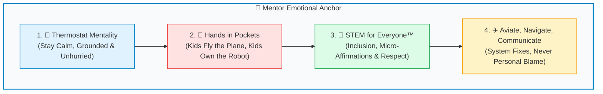

# 🏆 Mentor CRM Competition Checklist: Tournament Day Field & Pit Operations

> **Operational Crew Resource Management (CRM) & Inclusion Protocol for FIRST LEGO League Tournaments**  
> *FIRST LEGO League Team #76265 "Lego Legends" • Season 2026 BIOGLOW*  
> *Derived from Aviation CRM, FIRST® "Tips for Interacting with Teams", and Team 76265 Operational Doctrine.*

<div style="background: linear-gradient(135deg, #f0fdf4 0%, #dcfce7 100%); border-left: 5px solid #16a34a; padding: 0.85rem 1.15rem; border-radius: 8px; margin-bottom: 1.25rem;">
  <strong>🖨️ Printable Single-Page Checklist (Letter / Clipboard Size):</strong><br>
  Print this tournament day operational checklist for your mentor clipboard or lanyard binder: <a href="mentor_competition_crm_checklist.html" style="font-weight: 700; color: #15803d;">mentor_competition_crm_checklist.html &rarr;</a>
</div>

---

## 🎯 Tournament Mindset: "Hands in Pockets & Eyes on the Kids"

A FIRST LEGO League tournament day is an exhilarating, 8-hour sensory storm: blasting speakers, buzzing match clocks, crowded pit aisles, roving judges, and unexpected robot mechanical failures.

In high-stress competitive environments, human biology defaults to adrenaline-fueled tunnel vision. As mentors and coaches, **we are the emotional thermostat of the team**:

> [!IMPORTANT]
> ### 🧭 Golden Rule #1: "Not all obstacles are in your control, but your responses to obstacles are in your control."
> *(FIRST® Tips for Interacting with Teams)*  
> When an axle snaps or a referee scores a penalty, the kids look at your face before deciding whether to panic or stay poised. **Your calm response is their shield.**

> [!CAUTION]
> ### 👐 Golden Rule #2: Mentors NEVER Touch the Robot, Field, or Tablet at Competition!
> Per FIRST rules and our CRM doctrine: **Hands remain in your pockets.** If a coach touches a LEGO piece, plugs in a USB cord, or steps into the match box, the students are robbed of ownership. Mentors guide with questions, moral support, and logistics.



---

## 🌍 STEM for Everyone™: Mentor Core Reflection

Before walking through the tournament doors, every coach and mentor should reflect on the three cornerstone questions:
1. **Who are you trying to inspire today?** *(Focusing especially on students who feel hesitant or unsure).*
2. **Who do you recognize in their pursuit of STEM success?** *(Recognizing effort, sportsmanship, and problem-solving, not just match points).*
3. **How do you do that in your mentor role?** *(Through positive micro-affirmations, equitable listening, and protecting psychological safety).*

---

## 📋 Phase 1: Morning Pit Arrival & Sensory Staging (07:30 – 08:30)

- [ ] **Low-Pressure, Inclusive Arrival Greetings:**
  - [FIRST Tip] **Do not force handshakes or high-fives.** Offer choices: verbal greeting, fist-bump, peace sign, or friendly wave. Respect physical autonomy.
  - [FIRST Tip] **Respect Eye Contact Differences:** Nervousness, sensory overload, cultural differences, or neurodivergence (ADHD, autism) can make direct eye contact uncomfortable. **Never equate lack of eye contact with disrespect or inattention.** Listen attentively regardless of where their eyes are resting.
  - Introduce yourself and open the door for student pronouns: *"Hi everyone, I'm Coach Sam (he/him), excited to fly with you today!"*
- [ ] **Establish Pit Layout & "Decompression Corner":**
  - Set up one designated quiet seat or zone in the pit where a student can sit, put on noise-cancelling headphones, or draw if the gym noise becomes overwhelming.
  - Label bins clearly: Mission Attachments, Alignment Jigs, Spare Color-Coded Pins, and USB/Charging Cords.
- [ ] **Hardware & Checklist Verification (Kids Execute, Mentors Observe):**
  - Verify 2 laminated Run Card sets are secured to keyrings/lanyards.
  - Verify mechanical alignment jigs are packed and within Home launch limits.
  - Verify the battery is fully charged (100%) and spare Hub battery is staged.
- [ ] **Confirm Technician Rotation Schedule:**
  - Review who is **Technician 1 (Pilot)** and **Technician 2 (Co-Pilot)** for Practice Match, Official Round 1, Round 2, and Round 3 so there is zero confusion or arguing in the queue.

---

## 📋 Phase 2: Judging Room Staging (Innovation, Robot Design & Core Values)

- [ ] **Pre-Judging 3-Minute Centering Huddle (15 Min Before Session):**
  - Gather the team in a circle outside the judging hallway.
  - Lead **Box Breathing**: Inhale for 4s, hold for 4s, exhale for 4s, rest for 4s.
  - Affirm the team: *"The judges are volunteers who are excited to meet you! You are the world's leading experts on your project and robot."*
- [ ] **Zero Omission & Equitable Speaking Audit:**
  - [FIRST Tip] Ensure quiet, shy, or neurodiverse students have their planned section and are not spoken over by dominant teammates.
  - [FIRST Tip] **Avoid Unconscious Role Stereotyping:** Verify all genders and team members speak on mechanical gearing, code algorithms, and biomimicry research—never dividing girls to "aesthetics/poster" and boys to "mechanisms/code."
- [ ] **Mentor Behavior in the Judging Room:**
  - Stand or sit silently in the mentor chairs at the back. **Absolute radio silence.**
  - Maintain a warm, encouraging, non-verbal presence: gentle smiles, affirmative nodding, thumbs up.
  - **Zero hand gestures, whispering, or prompting.** If a student blanks out, let their teammates prompt them!
- [ ] **Respect Thinking Differences During Judge Q&A:**
  - If a student pauses for 10 seconds before answering a judge, remain patient and calm. Processing time is natural.
- [ ] **Immediate Post-Judging Plus'ing Circle:**
  - As soon as the judging door closes:
  - Lead an immediate round of team high-fives: *"You spoke with courage and passion! How did that feel?"*
  - Debrief what went well before dissecting what questions were hard.

---

## 📋 Phase 3: Volunteer & Referee Interactions (Gracious Professionalism®)

- [ ] **Model Utmost Respect for Event Volunteers:**
  - Queuers, Referees, Judges, and Timekeepers are unpaid volunteers working long, exhausting days.
  - Greet volunteers warmly: *"Good morning! Thank you for volunteering today!"*
- [ ] **Answering Volunteer & Referee Questions with Infinite Patience:**
  - [FIRST Tip] Even if you or your students have been asked the same question five times (e.g., *"Where is your team roster sheet?"* or *"Is your robot within the sizing box?"*), **answer as if you are answering for the very first time.**
  - Remain flexible, gracious, and mindful of language or translation barriers.
- [ ] **Referee Rule Discussions (The "Kids-First" Protocol):**
  - Mentors **NEVER** argue with a referee or field volunteer.
  - If a scoring discrepancy occurs on the mat:
    - Only the **Technicians at the table** may discuss the score sheet with the referee before signing.
    - Technicians use respectful, closed-loop inquiry: *"Thank you, Ref! Could you show us where the model needed to be supported for Mission 04?"*
    - If needed, the student politely requests: *"May we ask the Head Referee to take a look?"*
    - Once the score sheet is signed, accept the outcome with Gracious Professionalism®.

---

## 📋 Phase 4: Robot Game Field Operations (2.5-Minute Match Cycle)

```mermaid
sequenceDiagram
    autonumber
    participant M as Mentors (Behind Line)
    participant Q as Pit / Queuing Area
    participant T1 as Tech 1 (Pilot)
    participant T2 as Tech 2 (Co-Pilot)
    participant R as Referee & Table

    Note over M,Q: 10 Min Before Match: Queue Call
    M->>Q: "Techs 1 & 2 geared up? Run cards ready?"
    Q->>T1: Laminated Run Card attached to arm/lanyard
    Q->>T2: Check attachment container & spare pins
    
    Note over T1,T2,R: At the Table (2.5 Min Match)
    T1->>T2: "Check Program! Program 1 on screen?"
    T2->>T1: "Program 1 Confirmed! Jig set?"
    T1->>T2: "Jig Set! Clear to launch?"
    T2->>T1: "Clear to launch in 3, 2, 1... LEGO!"
    
    alt Robot jams or spins off course
        Note over T1,T2: Aviate, Navigate, Communicate
        T1->>T2: "Abort & Retrieve! Taking touch penalty!"
        T2->>T1: "Confirmed! Skip to Run 2!"
    else Technician freezes / feels overwhelmed
        Note over T1,T2: Tap Out Protocol
        T1->>Q: "Tap Out next return!"
        Q->>T1: Pit teammate swaps cleanly in Home area
    end

    Note over M,T1: Mentor Hands in Pockets at all times!
```

### Pre-Match In the Queue (5 Minutes Prior)
- [ ] **Check Technicians' Breathing & Focus:**
  - Technicians 1 & 2 have their laminated Run Card attached to their arm or lanyard.
  - Run through the standard callouts check: *"What do we say if the robot wanders?"* &rarr; *"Abort & Retrieve!"*
- [ ] **Protect from Distraction:**
  - Keep queued students focused on their own table; shield them from high-stress chatter from nearby teams.

### Live at the Table (The 2.5-Minute Run)
- [ ] **Hands in Pockets!**
  - Stand behind the designated coaching boundary line.
  - Keep hands deep in jacket or pants pockets.
  - Do not shout tactical commands (*"No! Don't press that!"*). Only shout positive team cheers (*"Great recovery!", "You got this, Lego Legends!"*).
- [ ] **Enforce Closed-Loop Discipline:**
  - Let Technicians run their checklist callouts: *"Check Program!"*, *"Jig Set!"*, *"Clear to launch?"*
- [ ] **Honor the "Tap Out" Protocol Without Drama:**
  - If a technician feels overwhelmed, experiences sensory overload, or freezes:
  - If they call *"Tap Out!"*, the backup technician from the staging area tags in seamlessly when the robot is in Home.
  - Welcome the tapping-out student with a low-pressure fist bump and quiet reassurance: *"That was incredible maturity. You prioritized the mission!"*
- [ ] **The "No Cowboy" & Touch Penalty Rule:**
  - Remind technicians prior to match: **A touch penalty costs 5–10 points; wasting 25 seconds watching a stuck bot costs 50 points!** Celebrate immediate, calm retrieves.

### Post-Match 3-Minute Debrief Ritual (Away from the Table)
- [ ] **Move Away from Match Floor Immediately:**
  - Gather the full team in a quiet corner away from the scoreboard screen.
- [ ] **Execute the 3-Minute CRM Debrief:**
  1. *What was our greatest CRM / teamwork moment?* *(e.g., "Maya caught the wrong program before button press!")*
  2. *What surprised our robot or system?* *(e.g., "The mat seam snagged our left skid.")*
  3. *How do we plus the checklist or alignment jig before Round 2?*
- [ ] **Zero Finger-Pointing / Blameless Protocol:**
  - If a mistake happened, reframe immediately: *"Human error is a symptom of a weak system. How do we make the jig foolproof?"*

---

## 📋 Phase 5: Managing Stamina, Sensory Load & Tournament Fatigue

- [ ] **Monitor Concentration & Energy Drops (13:00 – 15:00 Grind):**
  - Event days are exhausting. Watch for: slumped shoulders, tearfulness, snap irritability, withdrawal, or silence.
  - These are biological responses to sensory fatigue, not bad attitudes.
- [ ] **Enforce Hydration & Fuel Schedule:**
  - Ensure every student drinks water and eats a protein/complex snack at regular intervals.
- [ ] **Rotate Away from the Pit:**
  - Send students in pairs on "Scouting Missions" or to visit other teams' pits with Core Values cards to get them moving out of the noisy pit environment.
- [ ] **Patience with Repetitive Questions:**
  - Tired kids will ask: *"What time is our next match?"* or *"Where is my notebook?"* ten times.
  - Answer with calm warmth every single time.

---

## 💬 The 6 Micro-Affirmations Tournament Matrix

*Micro-messages are subtle cues that signal belonging or exclusion. Use this matrix to maintain positive micro-affirmations under pressure:*

| Channel | Positive Micro-Affirmation (✅ DO THIS) | Negative Micro-Message (❌ AVOID) |
| :--- | :--- | :--- |
| **1. Verbal** | • Use gender-neutral collective language: *"Engineers", "Technicians", "Lego Legends".*<br/>• *"Who is leading the launch for Run 2?"* | • *"Come on guys!"*<br/>• *"He is our main programmer, she did the poster."* |
| **2. Para-Verbal (Tone)** | • Speak with calm, rhythmic purpose, clarity, and warmth.<br/>• Lower pitch and volume when noise spikes to de-escalate anxiety. | • Sounding hurried, annoyed, sharp, or exasperated.<br/>• Sarcastic comments after a missed mission. |
| **3. Non-Verbal (Body)** | • Open posture, hands in pockets, meeting kids at eye level (kneeling/sitting).<br/>• Calm, grounding smile when a run fails. | • Slumped over, pacing nervously, biting nails, or staring at the referee with arms crossed. |
| **4. Contextual** | • Approaching a team station and asking: *"Which student is managing this attachment swap?"*<br/>• Letting kids speak directly to judges and refs. | • Assuming the male student drives and the female student holds the paper.<br/>• Answering a referee's question over a student's head. |
| **5. Omission (Listening)** | • Pausing and giving full, undivided attention to the quiet student who raises a hand.<br/>• Seeking out the student who has not spoken yet. | • Only responding to the loudest, most assertive students.<br/>• Ignoring a student looking away due to sensory overload. |
| **6. Praise & Feedback** | • Balanced praise across all domains: Praising girls on motor torque/algorithms; praising boys on empathy/presentation flair. | • Stereotyped praise: Complimenting girls only on appearance/neatness and boys on code/power. |

---

## 🎒 Tournament Day Mentor Clipboard Checklist

Keep these essential items with you at all times on competition day:

- [ ] Laminated Copy of this Checklist on Mentor Clipboard
- [ ] [Mentor CRM Pocket Cue Card (4"x6" / Lanyard)](mentor_crm_cue_card.html)
- [ ] Team Official Team Roster & Team Profile Sheet
- [ ] 2x Laminated Technician Run Cards on wristbands/keyrings
- [ ] Emergency Mechanical Toolkit (Color-coded Technic pins, spare axle bushings, rubber bands)
- [ ] Spare Fully-Charged SPIKE Prime Hub & Battery
- [ ] USB-C Cable (for emergency non-Bluetooth tethering in noisy RF arenas)
- [ ] Masking / Gaffers Tape (for pit signage and jig marks)
- [ ] First Aid & Sensory Kit (water bottles, band-aids, earplugs/noise-cancelling headphones)

---

## 🔗 Related Resources

* [📄 Printable Tournament Day Checklist HTML](mentor_competition_crm_checklist.html)
* [📋 Day-to-Day Workshop Facilitation Checklist](mentor_day_to_day_crm_checklist.md)
* [📇 Mentor CRM Pocket Cue Card (4"x6" / Lanyard)](mentor_crm_cue_card.md)
* [✈️ Full Aviation Crew Resource Management (CRM) Doctrine](crew_resource_management.md)
* [🧭 Coach Philosophy, Season Goals & Mentoring Strategies](mentors_notes.md)
* [🌐 FIRST® Tips for Interacting with Teams (Official PDF)](https://www.firstinspires.org/hubfs/web/volunteer/tips-for-interacting-with-teams.pdf?hsLang=en)
