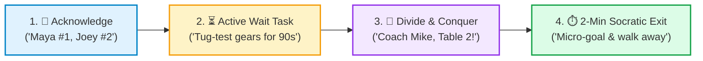
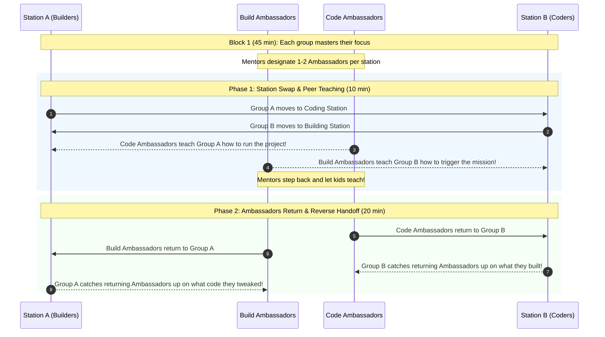

# 📋 Mentor CRM Day-to-Day Checklist: Inclusive Workshop & Session Facilitation

> **Everyday Operational Checklist for Dividing, Conquering, and Ensuring Every Child is Heard**  
> *FIRST LEGO League Team #76265 "Lego Legends" • Season 2026 BIOGLOW*  
> *Derived from FIRST® "Tips for Interacting with Teams", Aviation CRM, and Team 76265 Coaching Doctrine.*

!!! info "🖨️ Printable Single-Page Checklist (Letter / Clipboard Size)"
    Print this operational checklist for your daily session clipboard or workshop table: [mentor_day_to_day_crm_checklist.html](mentor_day_to_day_crm_checklist.html)

---

## 🎯 The Core Philosophy: "Hands in Pockets & Zero Unheard Hands"

When 8 to 10 energetic students are engineering SPIKE Prime mechanisms, writing autonomous Python/word-block code, and conducting biomimicry research, **multiple hands shoot up simultaneously**.

Without structured facilitation, mentors get bottlenecked, vocal kids dominate, quiet or neurodivergent students withdraw, and mentors instinctively take over the LEGO pieces.

> [!IMPORTANT]
> ### 👐 Mentor Golden Rule #1: "Hands in Pockets!"
> *If a mentor's hands are on the LEGO bricks or the tablet, the student has stopped learning.*  
> Point with guiding questions, not with your fingers, mouse, or hands. Let the students hold the tools.

> [!TIP]
> ### 📢 Mentor Golden Rule #2: "Never Leave a Hand Hanging in Silence"
> Kids don't shout out of impatience; they shout because **they fear being forgotten**. The moment you call their name and assign a queue number, anxiety drops to zero.

---

## 🌍 STEM for Everyone™: Everyday Mentor Reflections

*(From FIRST® Tips for Interacting with Teams)*

At the start of every workshop, mentally ground yourself with these three questions:
1. **Who am I trying to inspire today?** *(Especially the student who hesitated or seemed unsure last week).*
2. **Who do I recognize in their pursuit of STEM success?** *(Recognizing persistence, empathy, and peer assistance, not just speed).*
3. **How do I do that in my mentor role today?** *(By using positive micro-affirmations, equitable attention, and Socratic questioning).*

---

## 📋 1. 🛫 Pre-Session Sync (15 Minutes Before Kids Arrive)

- [ ] **Assign Mentor Coverage Zones (Divide & Conquer):**
  - **Mentor A:** Anchors Station A (Chassis / Mechanical Assembly / Jigs).
  - **Mentor B:** Anchors Station B (Motors / Sensors / Code / Project Research).
  - Agree on zone boundaries so mentors never accidentally cluster in one corner.
- [ ] **Review the "Silent Struggler" Radar & Watchlist:**
  - Identify any student who seemed disengaged, quiet, frustrated, or overstimulated during the last session.
  - Plan an intentional, low-pressure check-in within the first 20 minutes for that student.
- [ ] **Unconscious Bias Self-Check:**
  - [FIRST Tip] Be aware of internal biases (e.g., do you tend to approach male students for mechanical/gearing challenges and female students for artistic/poster work?).
  - Commit to offering equal, multidimensional opportunities across all stations today.
- [ ] **Physical & Sensory Space Preparation:**
  - Ensure Technic sorting trays are accessible to reduce search frustration.
  - Stage tablets, charged SPIKE batteries, and laminated Run Cards.
  - Designate a low-distraction quiet table for students who need a sensory-friendly space.

---

## 📋 2. 🤝 Arrival, Culture & Connection (First 15–20 Minutes)

- [ ] **Low-Pressure, Inclusive Greetings:**
  - [FIRST Tip] **Do not force handshakes or high-fives.** Not all students welcome physical contact. Offer a choice: verbal greeting, fist-bump, peace sign, or friendly wave.
  - [FIRST Tip] **Respect Eye Contact Differences:** Some students are uncomfortable looking directly at adults due to nervousness, sensory overload, cultural differences, or neurodivergence (ADHD/autism). **Never equate lack of eye contact with disrespect or inattention.** Be an attentive, warm listener regardless of gaze.
  - Introduce yourself and invite student preferences: *"Hi everyone, I'm Coach Alex (she/her). Welcome back!"*
- [ ] **15-Minute Culture & Connection Warm-Up:**
  - Kick off with a playful, low-stakes game (*Blind Build, One-Hand Duck Build, or Team Storyboard*).
  - Shifts brains out of school stress into creative play, laughter, and collaborative communication before touching complex missions.

---

## 📋 3. 🚨 Live Room Operations (When Multiple Hands Shoot Up)

- [ ] **Acknowledge & Sequence Publicly:**
  - Call out names immediately with a queue number:
  > *"Maya, I see you—you are #1! Joey, I hear you—you are #2! Sam, you are #3!"*
- [ ] **Assign an Active Waiting Task:**
  - Never leave a queued student idle:
  > *"Joey, while I spend 90 seconds with Maya, do a 2-finger tug test on that gear shaft and verify your axle length with the Technic ruler!"*
- [ ] **Coach-to-Coach Closed-Loop Callout:**
  - If a station has multiple requests, call out loudly to your co-mentor:
  > *"Coach Mike, Table 2 has two in queue!"* &rarr; *"Roger, taking Table 2 now!"*
- [ ] **Redirect to Peer Ambassadors ("Ask 3 Before Me"):**
  - Don't let coaches become the single bottleneck:
  > *"Have you asked Alex, our Station Ambassador? Check with Alex first, and if you're both stuck, call me right over!"*
- [ ] **Enforce the "No Dual-Coaching" Rule:**
  - If you see another mentor already helping a student, **step back immediately**. Never have two coaches hovering over one table while other students wait.
- [ ] **Radar Scanning for the "Silent Struggler":**
  - Vocal kids naturally command attention. Actively scan the room for the quiet student sitting back with crossed arms or looking down. Approach them gently:
  > *"Hey Sam, walk me through what you're testing right now."*

---

## 📋 4. ⏱️ The 2-Minute Socratic Intervention Protocol

When answering a call for help, avoid getting sucked into a 10-minute build session. Use this rapid 3-step loop:

| Step | Mentor Action | Socratic Dialogue Script |
| :--- | :--- | :--- |
| **1. Diagnose** | Ask what they expected to happen | *"What did you intend for this lever to do when the motor spins?"* |
| **2. Locate** | Point to the documentation or model | *"Where in the building guide or code does it specify that axle size?"* |
| **3. Launch & Exit** | Set 1 micro-goal and walk away! | *"Test these two gear combinations for 90 seconds. I'll be back to see what you discovered!"* |

- [ ] **Answering Repetitive Questions with Infinite Freshness:**
  - [FIRST Tip] Even if a student asks the same question you answered 10 minutes ago (*"How do I pair the Bluetooth?"* or *"Where are the blue pins?"*), **answer as if you are hearing it for the very first time.**
  - Maintain a warm, inviting tone. Be mindful of translation, vocabulary, or processing differences.
- [ ] **Prompt Bank (Ask, Don't Tell):**
  - Stuck mechanism: *"What have you already tried that didn't work? What did that teach you?"*
  - Disagreement between partners: *"You both have strong ideas! How can we test Idea A for 2 minutes, then Idea B for 2 minutes?"*
  - Successful run: *"That worked brilliantly! Now explain to your partner why that gear ratio made it stronger."*

---

## 📋 5. 🔄 Peer Ambassador System ("Jigsaw" Handoffs)

- [ ] **Designate Station Ambassadors:**
  - Pick students (especially those building confidence) to act as the "Station Lead."
- [ ] **Mentors Step Back During Peer Teaching:**
  - Let students explain concepts in their own words. Resist the urge to jump in and correct terminology unless safety is involved.

---

## 📋 6. ☕ Mid-Session Bio-Break & 30-Second Coach Huddle

While the students wash hands, drink water, and grab a quick snack:

- [ ] **30-Second Mentor Alignment:**
  1. *Who was quiet or felt unheard in Block 1?*
  2. *Which station experienced a bottleneck?*
  3. *Do we need to adjust partner pairings or send a peer ambassador to balance support?*
  4. *Did any student experience sensory overload or emotional frustration?*

---

## 💬 The 6 Micro-Affirmations Workshop Matrix

*(Applied from FIRST® Tips for Interacting with Teams to Daily Lab Practice)*

| Message Type | Positive Micro-Affirmation (✅ DO THIS) | Negative Micro-Message (❌ AVOID) |
| :--- | :--- | :--- |
| **1. Verbal** | • Use inclusive, gender-neutral terms: *"Engineers", "Builders", "Lego Legends".* • Introduce yourself with pronouns to model inclusivity. | • Using *"Hey guys"* exclusively. • Referring to builders or coders generically as *"he/him"*. |
| **2. Para-Verbal (Tone)** | • Speak with calm purpose, patience, clarity, and genuine warmth. • Keep your voice relaxed even when 4 kids are calling at once. | • Sounding rushed, annoyed, condescending, or impatient. • Sighing when asked to repeat instructions. |
| **3. Non-Verbal (Body)** | • Keep hands in pockets. • Kneel or sit on a low stool to match student eye level. • Open, welcoming body posture. | • Slumping, checking phone, crossing arms, or hovering intimidatingly over a student's chair. |
| **4. Contextual** | • Approaching a table and asking: *"Who is driving the robot for this test?"* or *"Who wrote this loop?"* | • Assuming a male student wrote the code or a female student chose the colors. |
| **5. Omission (Listening)** | • Giving full, patient attention to every child, especially quiet or hesitant thinkers. • Checking in on students who haven't spoken. | • Only engaging with eager, loud, or dominant students. • Glancing away when a child takes time to formulate a sentence. |
| **6. Praise & Feedback** | • Equitable, multidimensional praise: Praise girls on gear ratios, motor torque, and code optimization; praise boys on storytelling, documentation, and empathy. | • Splitting compliments along gendered lines (e.g., praising girls for neat handwriting and boys for clever programming). |

---

## 📋 7. 🔄 Closing Circle & Blameless Plus'ing (Last 10 Minutes)

- [ ] **Every Voice Heard in the Closing Circle:**
  - Go around the circle: Every student shares **one discovery, test, or win** from today.
  - Celebrate students who helped a teammate or acted as a great Peer Ambassador.
- [ ] **Blameless Culture ("Plus'ing" Mistakes):**
  - If a robot dropped an attachment or code failed:
  - Reframe error into an engineering challenge:
  > *"That wasn't a mistake—that was data! Human error is a symptom of a weak system. How can we 'plus' our build or checklist so this can never happen again?"*
- [ ] **Safe Clean-Up Gamification:**
  - Turn piece sorting into a 3-minute team sprint (*"Find all 2M friction pins!"*).

---

## 🔗 Related Resources

* [📄 Printable Everyday Workshop Checklist HTML](mentor_day_to_day_crm_checklist.html)
* [🏆 Competition Day Mentor CRM Checklist](mentor_competition_crm_checklist.md)
* [📇 Mentor CRM Pocket Cue Card (4"x6" / Lanyard)](mentor_crm_cue_card.md)
* [✈️ Full Aviation Crew Resource Management (CRM) Doctrine](crew_resource_management.md)
* [🧭 Coach Philosophy, Season Goals & Mentoring Strategies](mentors_notes.md)
* [🌐 FIRST® Tips for Interacting with Teams (Official PDF)](https://www.firstinspires.org/hubfs/web/volunteer/tips-for-interacting-with-teams.pdf?hsLang=en)
