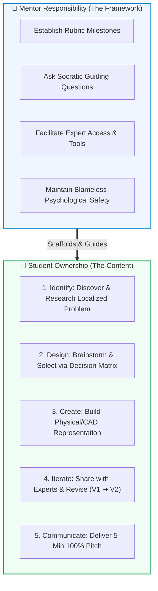
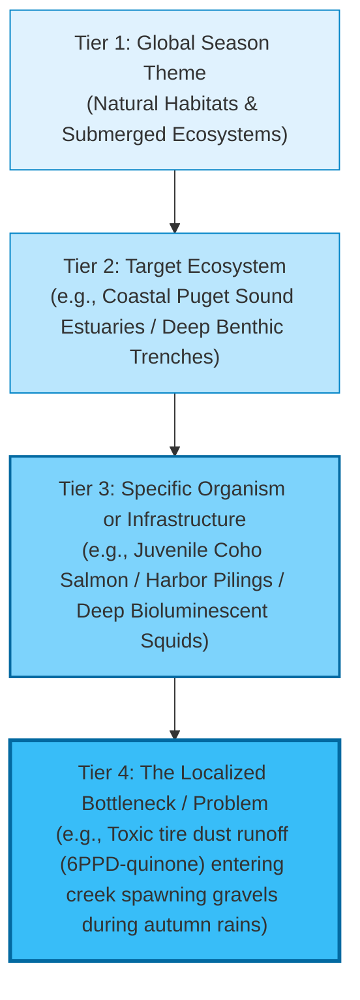
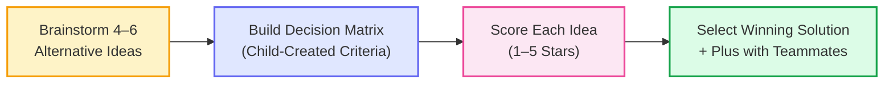
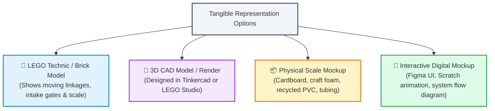
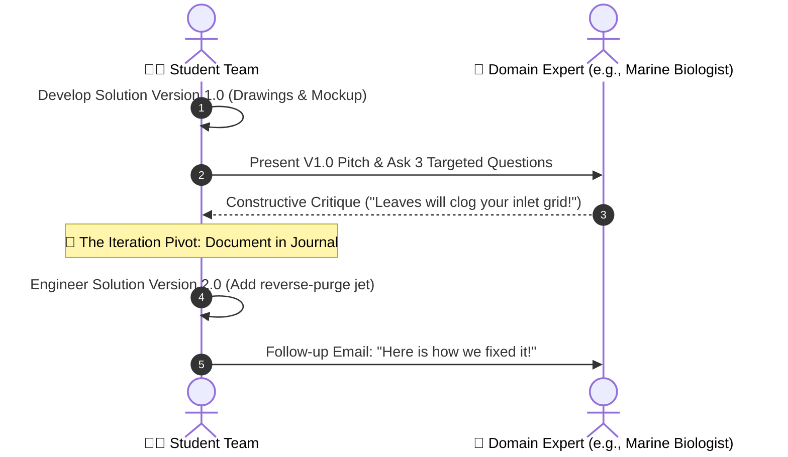
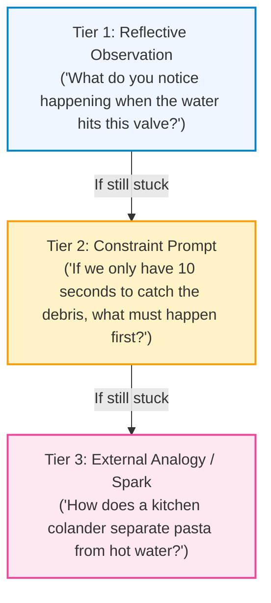

# 💡 Mentor Coaching Guide: Driving the Innovation Project

## Mastering the 5 FLL Rubric Phases (Identify, Design, Create, Iterate, Communicate) While Empowering Student Ownership

> *"The role of a mentor is not to provide the answers, but to ask the questions that compel students to think, investigate, and discover their own solutions."*
>
> — FIRST LEGO League Guiding Philosophy

---

## 🧭 The Core Coaching Philosophy: "Steer the Goalposts, Never Kick the Ball"

Every FIRST LEGO League Innovation Project is evaluated against a **universal rubric** consisting of five core engineering phases: **Identify**, **Design**, **Create**, **Iterate**, and **Communicate**. 

As mentors, our mission during the BIOGLOW season is **not** to pick the team's topic, invent their mechanism, or edit their slides. Instead, our job is to establish the structural boundaries, hold the rubric checkpoints, and use Socratic inquiry to guide students to evaluate their own options.

!!! tip "Key Coaching Insight for Mentors"
    **The solution does NOT have to be commercially viable or cost-effective right now!**  
    Judges do not expect 10-year-olds to launch a profitable startup or solve complex biochemical manufacturing. **Judges evaluate the Engineering Design Process:**  
    1. How deeply did they research?  
    2. How creatively did they solve the problem?  
    3. How systematically did they adapt their design based on real expert feedback?

---

## 📊 The Universal FLL Innovation Project Rubric at a Glance

The official FLL judging rubric rates each category across four levels: *Beginning (1)*, *Developing (2)*, *Accomplished (3)*, and *Exemplary (4)*. To achieve **Exemplary**, the team must demonstrate clear evidence across all five rubric dimensions:

| Rubric Phase | What the Judges Are Looking For | Common Trap (Where Teams Lose Points) | What Mentors Must Steer Toward |
| :--- | :--- | :--- | :--- |
| **1. IDENTIFY** | Clear definition of a specific, real-world problem related to the season theme; thorough research from diverse, credible sources. | Picking a topic that is too broad (*"ocean pollution"* or *"climate change"*) with shallow Google searches. | Funneling down to a **localized, specific problem** affecting an exact organism or habitat, supported by verified research. |
| **2. DESIGN** | Brainstorming multiple alternative solutions; selecting one innovative solution that improves an existing product or creates something new. | Choosing the first idea blurted out by the loudest child; picking an off-the-shelf product with no novel engineering. | Guiding a structured **Decision Matrix** comparing at least 3 distinct ideas against clear criteria before choosing. |
| **3. CREATE** | Developing a clear representation of the solution to explain how it functions (physical model, LEGO mockup, CAD drawing, diorama). | Believing they must build a fully functional, expensive motorized machine, or conversely, having only a flat paper drawing. | Building a **tangible 3D representation** (LEGO Technic mockup, cardboard prototype, or 3D CAD model) that demonstrates the mechanism. |
| **4. ITERATE** *(The "Share" Rule)* | Sharing the proposed solution with users and industry experts, and **documenting how expert feedback was used to improve the design**. | Sharing only with parents/friends, or sharing *after* the project is finished without changing anything. | Scheduling an **expert interview early** (V1.0) and explicitly documenting what changed to create **Version 2.0**. |
| **5. COMMUNICATE** | A clear, engaging 5-minute presentation that conveys the entire journey, with **100% equal student participation**. | 1–2 extroverted students monopolizing 4 minutes while teammates stand silently; reading slides word-for-word. | Designing a **choreographed 5-minute pitch** where every child speaks, uses visual props, and answers judge questions via CRM handoffs. |

---

## 🔍 Phase 1: IDENTIFY — Narrowing Down the Real-World Problem

### The Trap: "Boiling the Ocean"
Kids naturally start with monumental, abstract ideas: *"Our project is to clean up all plastic in the Pacific Ocean!"* or *"We're going to stop global coral bleaching!"*  
While well-intentioned, broad topics receive low scores because students cannot conduct deep, actionable research or design a meaningful solution in 12 weeks.

### The Mentor Tool: The "Problem Funnel" Exercise
Use this 4-tier funnel exercise on the whiteboard during early sessions to help students narrow their focus:

### Socratic Questions to Steer Without Deciding:
- *"Who or what suffers the most when this problem happens?"*
- *"Can you show me where on a map this is happening right now?"*
- *"If you were a scientist studying this in the field, what specific number or measurement would you be checking?"*
- *"What are existing scientists or park rangers already trying to do about this? Where does their current solution get stuck?"*

### Research Credibility Ladder:
Challenge the kids to collect at least 3 distinct source types:
1. **Tier 1 (Highest):** Direct interview with an expert (marine biologist, environmental engineer, aquarium director).
2. **Tier 2:** Academic or institutional research (NOAA, Monterey Bay Aquarium Research Institute, National Geographic, scientific journal summaries).
3. **Tier 3:** Books and documentaries.
4. *(Avoid relying solely on general search engine snippets or random blogs).*

---

## 💡 Phase 2: DESIGN — Brainstorming & The Decision Matrix

### The Trap: First-Idea Bias & The "Loudest Voice"
In any group of 10-year-olds, the first student who shouts an idea often triggers a bandwagon effect. Other kids stop thinking, or shy students keep their creative concepts hidden.

### The Mentor Tool: Divergent Brainstorming + Decision Matrix
Mentors must enforce a two-stage process:
1. **Divergent Stage (Quantity & Wild Ideas):** Every child must propose at least one distinct solution. Introduce **Biomimicry** as a catalyst: *"How did nature solve this over 3.8 billion years?"* (e.g., shark skin riblets, manta ray non-clogging filter lobes, anglerfish far-red photophores).
2. **Convergent Stage (Objective Evaluation):** Guide the team to build a simple **Student Decision Matrix** on the board.

#### Example Student Decision Matrix Template:
Let the students define their own 3–4 criteria (e.g., Innovation, Impact on Animals, Feasibility to Model, Fun):

| Solution Option | Criterion 1: Innovation (Is it unique?) | Criterion 2: Impact (Does it fix the root cause?) | Criterion 3: Can We Prototype It? | Total Score | Team Consensus |
| :--- | :---: | :---: | :---: | :---: | :--- |
| **Idea A:** Underwater vacuum drone | ⭐⭐⭐ | ⭐⭐ | ⭐⭐⭐ | 8 | Difficult to explain power source |
| **Idea B:** Manta-ray vortex stormwater filter | ⭐⭐⭐⭐⭐ | ⭐⭐⭐⭐ | ⭐⭐⭐⭐ | **13** | **Selected Winner!** |
| **Idea C:** Chemical dispersant spray | ⭐ | ⭐⭐ | ⭐⭐ | 5 | May harm beneficial microbes |

### Socratic Questions to Steer Without Deciding:
- *"Does a product like this already exist on Amazon or in municipal water systems? How is our idea substantially different or better?"*
- *"If an animal swims into your device, will it be safe?"*
- *"What is the hardest engineering obstacle this invention will face?"*

---

## 🛠️ Phase 3: CREATE — Tangible Representation & Mockups

### The Trap: The Myth of the "Working Machine"
Many teams believe that if they don't produce a functioning electronic submarine or chemical filter, judges will mark them down. This causes panic and often results in parents taking over the build.

### The Truth According to the Rubric:
Judges are looking for a **tangible representation** that proves the kids thought through the physical geometry, parts, and operational flow. A well-constructed LEGO Technic model with moving gears or a scaled cardboard diorama that clearly shows fluid movement scores just as high as an expensive electronic prototype!

### Prototyping Checklist for Mentors:
- [ ] **Physical Dimensions / Scale:** Does the model include an indicator of real-world scale (e.g., *"1 LEGO stud = 10 cm"* or a minifigure for reference)?
- [ ] **Moving Mechanisms:** Can the students manipulate a lever, hatch, or flow valve to show *how* water/materials move through it?
- [ ] **Clear Labeling:** Are the primary functional subsystems labeled (e.g., *Biomimetic Filter Riblets*, *Sonar Array*, *Clean Discharge Valve*)?
- [ ] **100% Kid-Built:** Did the students assemble and paint it themselves?

---

## 🔄 Phase 4: ITERATE — The "Share" Rule & Expert Feedback

!!! danger "Why 70% of Teams Miss Top Points Here"
    In judging rooms around the world, teams routinely tell judges:  
    > *"We shared our project with our school class, and they said they liked it!"*  
    
    **This will not earn an Exemplary score.**  
    The rubric explicitly requires:
    1. Sharing with **domain professionals, end-users, or relevant experts**.
    2. Receiving **critical constructive feedback**.
    3. **Modifying, tweaking, or iterating the design** as a direct result of that feedback.

### How Mentors Facilitate the Expert Share:
1. **Never Make the Call Yourself:** Help students draft the outreach email in their own words. Professionals love receiving emails directly from elementary and middle school robotics students.
2. **Prepare 3 Targeted Questions in Advance:** Teach kids never to ask open-ended questions like *"Do you like our project?"* Instead, coach them to ask:
   - *"What is the biggest operational challenge or failure point you see in our design?"*
   - *"What existing technology or material does our invention remind you of?"*
   - *"If a city or research institution deployed this tomorrow, what maintenance problem would arise after 30 days?"*
3. **The "Before & After" Iteration Log:** Have students write down the exact changes in their Engineering Journal:
   - **V1.0 Feature:** Static mesh filter screen.
   - **Expert Feedback (Dr. Martinez, Marine Ecologist):** *"Juvenile crabs and biofilm will clog that static mesh within 48 hours."*
   - **V2.0 Iteration:** Added a water-wheel-powered wiper blade inspired by limpet teeth to clear biofilm autonomously!

---

## 📢 Phase 5: COMMUNICATE — The 5-Minute Pitch & Judging Room CRM

### The 5-Minute Pitch Rule
At tournament, the team has **exactly 5 minutes** to deliver their presentation, followed by a 5-minute Q&A session with the judges. If the team exceeds 5 minutes, the timer stops them mid-sentence.

### The Ideal 5-Minute Pitch Time Breakdown:

```mermaid
gantt
    title The Winning 5-Minute Pitch Choreography
    dateFormat  ss
    axisFormat  %S s
    section Pitch Flow
    Hook & Localized Problem Statement   :00, 45s
    Research & Biomimicry Spark          :45, 60s
    Invention Reveal & Model Demo        :105, 90s
    Expert Sharing & Iteration (V1 to V2):195, 60s
    Core Values & Future Impact Wrap-Up  :255, 45s
```

| Time Stamp | Pitch Segment | Key Story Element | Props / Visuals Needed |
| :---: | :--- | :--- | :--- |
| **0:00 – 0:45** | **The Hook & Problem** | Grab judges' attention with a dramatic, localized fact; state the target habitat and organism clearly. | Costumes, warning sign, or visual habitat photo. |
| **0:45 – 1:45** | **Research & Nature Spark** | Summarize research findings; introduce the biomimicry creature/plant and its natural superpower. | Research binder, creature flashcard, or nature photo. |
| **1:45 – 3:15** | **The Solution & Live Demo** | Demonstrate the physical prototype; walk through each subsystem; explain how it solves the bottleneck. | **Physical 3D prototype / LEGO model (hands-on demo!)**. |
| **3:15 – 4:15** | **The Share & V1➔V2 Iteration** | **The judges' favorite part:** Name the experts consulted, show the flaw discovered, and reveal the V2.0 upgrade! | "Before & After" diagram / Engineering Journal display. |
| **4:15 – 5:00** | **Core Values & Impact Call** | Conclude with team pride, teamwork lessons, and gratitude. Finish with 10–15 seconds to spare! | Team cheer, banner, or uniform closing statement. |

### The "100% Voice Rule":
- **Every student must speak:** Divide the script so each team member has at least 25–40 seconds of speaking time.
- **Active Physical Roles:** When a student is not speaking, they must hold a prop, demonstrate the prototype mechanism, point to a poster chart, or manage visual cues. No child should stand with their hands in their pockets staring at the floor.

### Judging Room Q&A Protocol (CRM in Action):
Teach the team how to handle judge questions without chaotic cross-talk using **Crew Resource Management (CRM)**:
1. **Designated Answer Captains:** Before entering the judging room, assign domain leads:
   - *Problem & Research Questions:* Leads: Student A & B.
   - *Invention & Mechanism Questions:* Leads: Student C & D.
   - *Expert Sharing & Iteration Questions:* Leads: Student E & F.
2. **The "Closed-Loop Handoff":** If a judge asks a general question, the Team Captain acknowledges and hands off:
   > *"That's a great question about our CAD model. Joey, would you like to explain the gear ratios you designed?"*  
   > Joey responds: *"Yes! Thank you, Maya. When we first designed the gears..."*
3. **No Contradicting Teammates:** Teach kids the golden rule of judging Q&A: Never say *"No, that's wrong, Joey."* Instead, use the **Plus'ing method**:
   > *"Yes, AND to add to what Joey said, our expert also reminded us that..."*

---

## 🪜 The Mentor's 3-Tier Socratic Prompting Ladder

When students hit a mental block or disagree, avoid giving them the answer. Use this 3-tier scaffolding framework:

1. **Tier 1 (Observation):** Point out the physical reality without judgment:
   - *"Look at the space between these two beams. What happens when an object wider than 3 studs passes through?"*
2. **Tier 2 (Constraint):** Introduce a concrete test or operational limit:
   - *"Imagine our battery dies after 2 hours. What passive mechanical feature could keep the door closed without power?"*
3. **Tier 3 (Analogy):** Offer a non-robotic analogy to trigger their intuition:
   - *"Think about how a window screen keeps mosquitoes out while letting fresh breeze in. How could our filter do that for microscopic larvae?"*

---

## 📋 Mentor Pre-Tournament Rubric Readiness Checklist

Before your competition or mock judging simulation, evaluate the team's project against this final readiness checklist:

- [ ] **Problem Specificity:** Can any student state the exact problem, affected organism, and location in 20 seconds without hesitating?
- [ ] **Research Portfolio:** Do they have an Engineering Journal with citations from at least 2 distinct professional sources?
- [ ] **Decision Matrix Proof:** Can they explain why they rejected Idea A and Idea C in favor of their winning solution?
- [ ] **Tangible Prototype:** Is the physical model / 3D CAD drawing present, labeled, and ready for judges to touch?
- [ ] **Expert Feedback Documented:** Can the students name their expert by title and quote the specific advice that led to Version 2.0?
- [ ] **5-Minute Clock Strictness:** Does their timed rehearsal finish cleanly between 4:30 and 4:50?
- [ ] **100% Equal Speaking Time:** Has every single team member spoken during the presentation and answered a sample Q&A question?
- [ ] **Core Values Evidence:** Can they point to a real team moment where they used Discovery, Inclusion, or Teamwork to resolve a project disagreement?

---

## 🔗 Related Team Assets & Handouts

- 🌿 **[Printable Innovation Project Worksheet (Handout)](../../marketing/handouts/innovation_project_worksheet.html):** 4-panel student worksheet featuring ecosystem selector pills, nature spark inspirations, blueprint canvas, and expert share logs.
- 💡 **[Innovation Project & Brainstorming Hub (Overview)](../../ideas/README.md):** High-level season theme overview and biomimicry inspiration catalog.
- ✈️ **[Crew Resource Management (CRM) Guide](crew_resource_management.md):** Aviation communication protocols, closed-loop callouts, and stress resilience.
- 📋 **[Workshop Facilitation Checklist](mentor_workshop_checklist.md):** Live room management, active waiting tasks, and divide-and-conquer strategies.
- 📓 **[Engineering Journal Overview](../../journal/README.md):** Documenting meeting-by-meeting student iterations and research notes.
