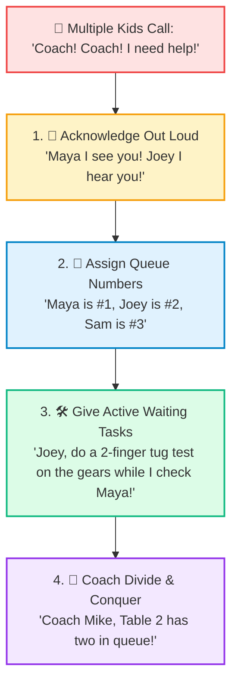

# 📇 Mentor CRM Workshop Cue Card: Everyday Session Facilitation

> **Everyday Hands-On Coaching Guide for FLL Team Sessions & Robotics Workshops**  
> *Dividing, Conquering, and Ensuring Every Kid is Heard When Multiple Hands Go Up!*

  <strong>🖨️ Printable Pocket Cue Cards (4" x 6" / Lanyard Badge Size):</strong> 
  Print this double-sided cardstock template to keep in your pocket or lanyard during sessions: <a href="mentor_crm_cue_card.html" style="font-weight: 700; color: #0369a1;">mentor_crm_cue_card.html &rarr;</a>

---

## 🙋 Side A: Workshop Triage & Queuing (When 5 Kids Ask for Help at Once)

> [!IMPORTANT]
> ### 🎯 Mentor Golden Rule #1: Never Leave a Hand Hanging in Silence
> Kids don't yell because they're impatient; they yell because **they fear being forgotten**. The moment you give them a queue number, anxiety drops from 100% to 0%.

### 📢 The "Acknowledge & Queue" Formula:
1. **Acknowledge Immediately:** *"Maya, I see you! Joey, I hear you!"*
2. **Sequence Publicly:** *"Maya is #1, Joey is #2, Sam is #3."*
3. **Assign an Active Waiting Task:** *"Joey, while I spend 90 seconds with Maya, do a 2-finger tug test on that arm and check your pin colors!"*  
   *(Now Joey is actively experimenting instead of getting frustrated).*

### 🤝 Coach-to-Coach "Divide & Conquer" (CRM Comms)
* **Zone Coverage:** Mentor A anchors Station A (Chassis), Mentor B anchors Station B (Motors/Code). Don't drift into the same corner.
* **Closed-Loop Callouts:** Call out loudly to your co-mentor:  
  * *"Coach Mike, Table 2 has two in queue!"* &rarr; *"Roger, heading to Table 2 now!"*
* **The "No Dual-Coaching" Rule:** Never let two mentors hover over the same child while other tables wait. One mentor steps back immediately.
* **The Peer Ambassador Redirect:**  
  * *"Have you asked Alex, our Station Ambassador? Check with Alex first, and if you're both stumped, call me over!"*

> [!TIP]
> **Scan for the "Silent Struggler":**  
> Loud kids get attention naturally. Keep your room radar scanning for the quiet student sitting back with crossed arms who hasn't raised a hand. Check in on them first!

---

## 💡 Side B: Socratic Facilitation (Guiding Without Taking Over)

> [!IMPORTANT]
> ### 👐 Mentor Golden Rule #2: Hands in Pockets!
> *If a mentor's hands are on the LEGO bricks or the tablet, the student has stopped learning.* Point with questions, not with your fingers or mouse.

### ⏱️ The 2-Minute Intervention Protocol (Don't Get Sucked In!)
If a mentor stays at one table for more than 3 minutes, you've stopped being a coach and become a teammate. Use this rapid 3-step loop:

| Step | Action | Coach Script Example |
| :--- | :--- | :--- |
| **1. Diagnose** | Ask what they expected to happen | *"What did you want the robot or mechanism to do just now?"* |
| **2. Locate** | Point to their checklist or guide | *"What does Step 2 on your Run Card say about the axle pin?"* |
| **3. Launch & Exit** | Set 1 micro-goal and walk away! | *"Test these two gear sizes for 2 minutes. I'll be back to see what you discovered!"* |

---

### 🗣️ Powerful Socratic Prompts (Ask, Don't Tell)

* **When a child is stuck:**  
  * *"What have you already tried that didn't work?"*
  * *"Where in the build instructions or checklist is that piece shown?"*
* **When partners are arguing:**  
  * *"You both have great ideas. How can we test Partner A's idea for 60 seconds, then Partner B's idea for 60 seconds?"*
* **When kids are rushing silently:**  
  * *"Pause for one deep breath. Who is pointing, and who is calling out the step?"*
* **When a child succeeds:**  
  * *"That was awesome! Now teach your partner how you figured that out."*

---

### ☕ The 30-Second Mid-Session Coach Huddle (At the Bio-Break)
Mentors tap base for 30 seconds while kids grab water:
1. *"Who was quiet or felt unheard in Block 1?"*
2. *"Which station is bottlenecked?"*
3. *"Can we send a Peer Ambassador over to Table B to help balance the load?"*

---

## 🔗 Related Resources

* [📄 Printable Workshop Cue Card HTML (4x6 / Lanyard)](mentor_crm_cue_card.html)
* [🧭 Coach Philosophy & Ambassador Handoffs](mentors_notes.md)
* [✈️ Full CRM Principles Guide](crew_resource_management.md)
* [⚡ Kids Pokémon Checklist Handout](../../marketing/handouts/crew_resource_management_kids.html)
