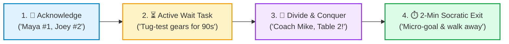

# 📋 Mentor Workshop CRM Checklist: Everyday Session Facilitation

> **Operational Checklist for Dividing, Conquering, and Ensuring Every Child is Heard**  
> *FIRST LEGO League Team #76265 BIOGLOW*

  <strong>🖨️ Printable Single-Page Checklist (Letter Size):</strong> 
  Print this 1-page operational checklist for your mentor clipboard or workshop table: <a href="mentor_workshop_checklist.html" style="font-weight: 700; color: #0369a1;">mentor_workshop_checklist.html &rarr;</a>

---

## 🎯 The Core Philosophy: "Hands in Pockets & Zero Unheard Hands"

When 9 kids are building complex SPIKE Prime mechanisms and coding autonomous missions, **multiple hands go up simultaneously**. 

Unmanaged, coaches get bottlenecked, kids yell louder out of fear of being ignored, and quiet students shut down. **This checklist keeps mentors coordinated and every child heard.**

---

## 1. 🛫 Pre-Session Sync (5 Minutes Before Kids Arrive)

- [ ] **Assign Mentor Zones:**
  - Mentor A: Anchors Station A (Chassis / Mechanical Build).
  - Mentor B: Anchors Station B (Motors / Code / Sensors).
  - Decide who oversees central bins, spare pins, and tablet charging.
- [ ] **Identify Station Peer Ambassadors:**
  - Nominate 1–2 student ambassadors per table who can answer basic assembly and app questions.
- [ ] **Review Watchlist:**
  - Identify any student who seemed frustrated, quiet, or disengaged during the last session.

---

## 2. 🚨 Live Room Operations (When 3+ Hands Go Up at Once)

- [ ] **Acknowledge & Sequence Publicly:**
  - Never leave a hand hanging in silence. Call out names immediately so anxiety drops:
  > *"Maya, I see you—you're #1. Joey, I hear you—you're #2. Sam, you're #3."*
- [ ] **Assign an Active Waiting Task:**
  - Never let a queued child sit idle:
  > *"Joey, while I spend 90 seconds with Maya, do a 2-finger tug test on your beam and check your pin colors!"*
- [ ] **Call Out Coach Divide & Conquer:**
  - If a table has multiple queued requests, call out loudly to your co-mentor:
  > *"Coach Mike, Table 2 has two in queue!"* &rarr; *"Roger, taking Table 2 now!"*
- [ ] **Redirect to Peer Ambassadors ("Ask 3 Before Me"):**
  - Don't let coaches become the single point of failure:
  > *"Have you asked Alex, our Station Ambassador? Check with Alex first, and if you're both stuck, call me!"*
- [ ] **Enforce the "No Dual-Coaching" Rule:**
  - Never have two mentors hovering over one child while other tables wait. One coach steps back immediately.
- [ ] **Scan for the "Silent Struggler":**
  - Keep your room radar scanning for the quiet kid sitting back with crossed arms who hasn't raised a hand. Check in on them first!

---

## 3. ⏱️ The 2-Minute Intervention Protocol (Don't Get Sucked In!)

- [ ] **Hands in Pockets!**
  - Keep your physical hands off the LEGO bricks and tablet. Point with guiding questions, never with your own hands.
- [ ] **Step 1: Diagnose Expectations:**
  > *"What did you want the robot or mechanism to do just now?"*
- [ ] **Step 2: Point to the Checklist or Guide:**
  > *"What does Step 2 on your Run Card or instruction say about that axle? Let's check the Technic ruler."*
- [ ] **Step 3: Set 1 Micro-Goal & Walk Away!**
  - Give a 90-second testing goal, then immediately exit so they own the solution and other kids get helped:
  > *"Try testing this gear ratio 2 times. I'll be back in 2 minutes to see what you discovered!"*

---

## 4. 🔄 Mid-Break Sync & Wrap-Up (Bio-Break & Closing Circle)

- [ ] **30-Second Coach Huddle at Break:**
  - Mentors tap base:
    1. *"Who was quiet or felt unheard in Block 1?"*
    2. *"Which table was bottlenecked?"*
    3. *"Do we need to rotate a Peer Ambassador to unblock Table B?"*
- [ ] **Closing Circle Inclusion:**
  - Ensure every student shares one discovery or win before leaving. Praise students who helped unblock their peers!

---

## 🔗 Related Resources

* [📄 Printable HTML Single-Page Checklist](mentor_workshop_checklist.html)
* [📇 Mentor CRM Pocket Cue Card (4"x6" / Lanyard)](mentor_crm_cue_card.html)
* [🧭 Coach Philosophy & Ambassador Handoffs](mentors_notes.md)
* [✈️ Full CRM Principles Guide](crew_resource_management.md)
* [⚡ Kids Pokémon Checklist Handout](../../marketing/handouts/crew_resource_management_kids.html)
