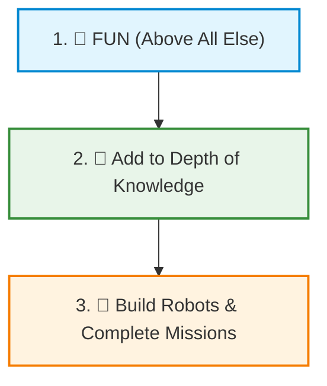
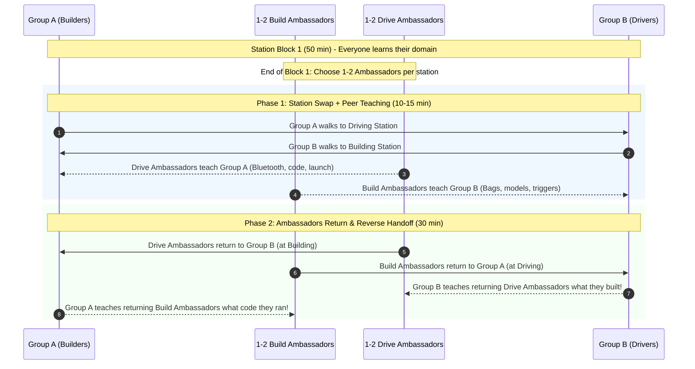

# 🧭 Coach's Philosophy, Season Goals & Mentoring Strategies

> *"We are not here to build a robot. We are here to build a team who happens to build robots."*

This guide captures our core coaching philosophy, long-term goals for the kids, and practical mentoring strategies for running fast-paced, high-engagement FIRST LEGO League sessions.

---

## 🎯 The Three Core Goals

Every activity, challenge, and station rotation is designed around three simple priorities:

1. **🎉 FUN (Above all else):**
   * If the kids aren't having fun, nothing else matters.
   * Robotics should never feel like a second school day. Celebrate funny mistakes, turn clean-up into a game, and keep the energy playful and collaborative.
2. **🧠 Add to Depth of Knowledge:**
   * Every session should expand each student's mental toolkit—whether it's mechanical understanding (gears, levers, friction), algorithmic thinking (loops, sensors, motor precision), public speaking, or strategic brainstorming.
3. **🤖 Build Robots:**
   * Hands-on engineering! Every student must have their hands on the bricks, write and modify code, and see their ideas come alive on the competition mat.

---

## 💡 Core Coaching Strategies

### 1. Culture & Connection First (First 15–20 Minutes)
* **Why:** Kids arrive with scattered energy from school or weekend activities. If we jump straight into complex technical tasks, communication breaks down.
* **The Practice:** Spend the first 15–20 minutes on a high-energy, low-stakes team challenge (e.g., *Blind Build*, *One-Hand Duck Build*, *Team Cheer/Name Brainstorms*).
* **The Goal:** Gets kids laughing, talking to each other, and breaking down social hesitation before tackling robot missions.

---

### 2. The Peer Ambassador System (Intuitive Information Handoff)

In FLL, every student is expected to try everything—both building and coding/driving. However, station rotations usually suffer from a painful barrier: **knowledge handoff**.

Traditional methods fail:
* ❌ *Mentor lectures incoming group:* Boring, takes too long, puts kids in passive student mode.
* ❌ *Throwing kids into the deep end:* Frustrating, leads to disengagement or repeating already solved problems.

**Our Solution: The "Peer Ambassador / Jigsaw" Handoff:**

#### How It Works Step-by-Step:
1. **Station Block 1 (50 min):**
   * Group A works on Mission Model Assembly; Group B works on Robot Driving & Code.
   * Toward the end of Block 1, each station picks **1–2 Peer Ambassadors**.
2. **Phase 1: The Teaching Handoff (10–15 min):**
   * Groups swap stations, but the **Ambassadors stay behind** at their original station.
   * At the Driving station: The Drive Ambassadors teach the incoming Group A students how to turn on the Hub, pair Bluetooth, open the project, and run the drive test.
   * At the Building station: The Build Ambassadors show the incoming Group B students which models are finished, which bag is open, and how to test the trigger mechanism.
   * **Mentors step back!** Do not interrupt. Let the kids explain in their own words.
3. **Phase 2: The Reverse Handoff (30 min):**
   * After 10–15 minutes, the Ambassadors rejoin their original teammates at the opposite station.
   * **Now the tables turn:** Because the Ambassadors were away teaching, they missed what their home team did for the last 15 minutes.
   * Their teammates must now **catch them up** (*"Look at the code we tested!"* or *"Here is the model we just assembled, let me show you how it works!"*).
4. **The Benefits:**
   * **No boring lectures:** Learning happens organically peer-to-peer.
   * **Deepens understanding:** To teach a concept, you must understand it.
   * **Fosters leadership:** Shy or quiet kids gain tremendous confidence when given the floor as the "expert teacher."
   * **FLL Judging Gold:** Judges love hearing: *"When we switched stations, our teammate taught us how the gyro turn worked!"*

---

### 3. Continuous Growth & Daily Learning Reflection
* **Start with Secret Goals:** On Day 1, each student writes 1–2 personal goals (e.g., coding, public speaking, mechanical design, making new friends). Mentors keep these private to guide individual mentoring.
* **Daily Learning Circle (Last 15 minutes):**
  * Before packing up, gather in a circle.
  * Every single kid answers:
    1. *"What is one new thing you learned today?"*
    2. *"What is one thing you taught someone else (or were taught by a teammate)?"*
* **Mentor Growth Tracking:** Mentors keep a lightweight running log of these takeaways to celebrate individual progress and ensure every student is advancing toward their personal season goals.

---

## 📋 The Golden Rules for Mentors

1. **Never touch the keyboard, tablet, or bricks if a kid can:**
   * If a student asks *"Where does this piece go?"*, point to the diagram or ask *"What does step 14 show?"*
   * If a student asks *"Why didn't the robot turn?"*, ask *"What does line 3 in your code tell motor B to do?"*
2. **Keep mentor talk under 2–3 minutes:**
   * Give crisp, actionable prompts, then step back and let them experiment.
3. **Praise effort and troubleshooting, not just success:**
   * High-five when something breaks and they figure out *why*. That's real engineering.
4. **Practice "Plus'ing":**
   * Never shoot down an idea with *"No, that won't work."* Always reply with *"I like where you're going with that! What if we also..."*
