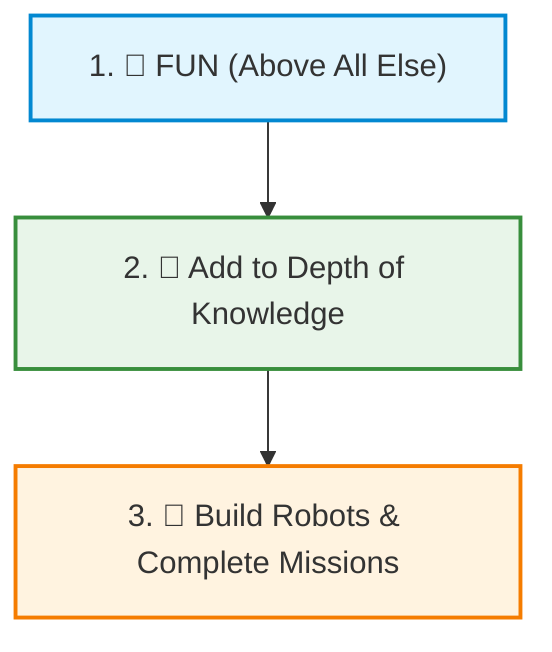
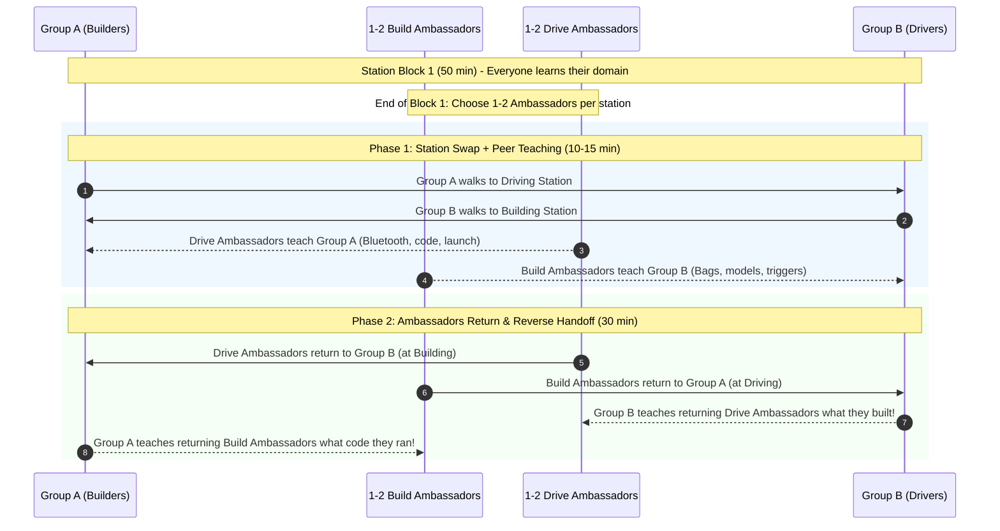

# 🧭 Coach's Philosophy, Season Goals & Mentoring Strategies

> *"We don't just build robots, we use robots to build students."*

This guide captures our core coaching philosophy, long-term goals for the kids, and practical mentoring strategies for running fast-paced, high-engagement FIRST LEGO League sessions.

---

## 🎯 The Three Core Goals

Every activity, challenge, and station rotation is designed around three simple priorities:

1. **🎉 FUN (Above all else):**
   * If the kids aren't having fun, nothing else matters.
   * Robotics should never feel like a second school day. Celebrate funny mistakes, turn clean-up into a game, and keep the energy playful and collaborative.
2. **🧠 Add to Depth of Knowledge:**
   * Every session should expand each student's mental toolkit—whether it's mechanical understanding (gears, levers, friction), algorithmic thinking (loops, sensors, motor precision), public speaking, or strategic brainstorming.
3. **🤖 Build Robots:**
   * Hands-on engineering! Every student must have their hands on the bricks, write and modify code, and see their ideas come alive on the competition mat.

---

## 💡 Core Coaching Strategies

### 1. Culture & Connection First (First 15–20 Minutes)
* **Why:** Kids arrive with scattered energy from school or weekend activities. If we jump straight into complex technical tasks, communication breaks down.
* **The Practice:** Spend the first 15–20 minutes on a high-energy, low-stakes team challenge (e.g., *Blind Build*, *One-Hand Duck Build*, *Team Cheer/Name Brainstorms*).
* **The Goal:** Gets kids laughing, talking to each other, and breaking down social hesitation before tackling robot missions.

---

### 2. The Peer Ambassador System (Intuitive Information Handoff)

In FLL, every student is expected to try everything—both building and coding/driving. However, station rotations usually suffer from a painful barrier: **knowledge handoff**.

Traditional methods fail:
* ❌ *Mentor lectures incoming group:* Boring, takes too long, puts kids in passive student mode.
* ❌ *Throwing kids into the deep end:* Frustrating, leads to disengagement or repeating already solved problems.

**Our Solution: The "Peer Ambassador / Jigsaw" Handoff:**

#### How It Works Step-by-Step:
1. **Station Block 1 (50 min):**
   * Group A works on Mission Model Assembly; Group B works on Robot Driving & Code.
   * Toward the end of Block 1, each station picks **1–2 Peer Ambassadors**.
2. **Phase 1: The Teaching Handoff (10–15 min):**
   * Groups swap stations, but the **Ambassadors stay behind** at their original station.
   * At the Driving station: The Drive Ambassadors teach the incoming Group A students how to turn on the Hub, pair Bluetooth, open the project, and run the drive test.
   * At the Building station: The Build Ambassadors show the incoming Group B students which models are finished, which bag is open, and how to test the trigger mechanism.
   * **Mentors step back!** Do not interrupt. Let the kids explain in their own words.
3. **Phase 2: The Reverse Handoff (30 min):**
   * After 10–15 minutes, the Ambassadors rejoin their original teammates at the opposite station.
   * **Now the tables turn:** Because the Ambassadors were away teaching, they missed what their home team did for the last 15 minutes.
   * Their teammates must now **catch them up** (*"Look at the code we tested!"* or *"Here is the model we just assembled, let me show you how it works!"*).
4. **The Benefits:**
   * **No boring lectures:** Learning happens organically peer-to-peer.
   * **Deepens understanding:** To teach a concept, you must understand it.
   * **Fosters leadership:** Shy or quiet kids gain tremendous confidence when given the floor as the "expert teacher."
   * **FLL Judging Gold:** Judges love hearing: *"When we switched stations, our teammate taught us how the gyro turn worked!"*

---

### 3. Continuous Growth & Daily Learning Reflection
* **Start with Personal Season Goals:** On Day 1, each student fills out their [Season Goal Worksheet](../../marketing/handouts/goals_worksheet.html) with one fun goal (e.g., trying a new attachment, making the robot complete a task, making new friends). Mentors keep these to guide individual mentoring.
* **Daily Learning Circle (Last 15 minutes):**
  * Before packing up, gather in a circle.
  * Every single kid answers:
    1. *"What is one new thing you learned today?"*
    2. *"What is one thing you taught someone else (or were taught by a teammate)?"*
* **Mentor Growth Tracking:** Mentors keep a lightweight running log of these takeaways to celebrate individual progress and ensure every student is advancing toward their personal season goals.

---

## ➕ The Art of "Plus'ing": Supercharging Collaboration

> *"Instead of criticizing or shooting down an idea, accept its creative seed and build on top of it. Say **'YES, AND...'** instead of **'NO, BUT...'**"*

Adapted from Pixar's creative Braintrust and theatrical improv, **"Plus'ing"** is our team's core collaboration tool. In elementary and middle school robotics, kids naturally want their own idea to "win." Left unchecked, brainstorming quickly devolves into *"That won't work,"* *"That's stupid,"* or quiet kids retreating into silence. Plus'ing flips this dynamic completely.

### 💡 Why Plus'ing Makes for Better Collaboration

1. **Eliminates Fear of Ridicule (Psychological Safety):**
   * If a student fears being told their idea is "dumb" or "impossible," they stop sharing.
   * When the rule is that every idea is received with enthusiasm and built upon, every kid—especially the quiet or shy ones—feels safe contributing.
2. **Transforms "Crazy" Ideas into Breakthrough Engineering:**
   * Groundbreaking engineering almost never starts with a boring, safe idea. It starts with an outlandish thought that contains a hidden, brilliant mechanic.
   * If you shoot down the crazy idea, you kill the breakthrough solution hiding behind it. Plus'ing uncovers that solution.
3. **Destroys "My Idea vs. Your Idea" Ego Battles:**
   * Saying *"No, let's do my idea instead"* creates winners and losers.
   * Plus'ing takes Kid A's foundation and weaves in Kid B's insight. The result is a **co-created solution** that belongs to both of them. Nobody is defensive because everyone has ownership.
4. **Directly Demonstrates FIRST Core Values:**
   * Judges actively look for how teams resolve disagreements and make technical decisions. When kids tell judges: *"I had a wild idea, and my teammate plussed it by adding a gear latch,"* the judges award top marks for **Inclusion**, **Teamwork**, and **Innovation**.

---

### 🛠️ Concrete Examples: How to "Plus" in FLL

Here is how mentors can model and coach Plus'ing during actual build and coding sessions:

#### Scenario 1: Mechanical Attachment Design
* **Kid A:** *"What if our robot had giant wings like an airplane?"*
* ❌ **The Idea Killer ("No, but..."):** *"That's dumb. Robots don't fly in FLL, and the size limit is 30 cm anyway."*
  * *Result:* Kid A feels embarrassed and checks out of the build.
* ✅ **Plus'ing ("Yes, and..."):** *"I love that big thinking! Having a wide reach would be amazing. AND what if we make those wings fold in on hinges so the robot stays under the 30 cm launch limit, and when the robot drives forward, rubber bands spring the wings open to sweep all the coral pieces into the scoring area?"*
  * *Result:* The crazy "wings" idea just became a legal, spring-loaded sweeper attachment!

#### Scenario 2: Autonomous Driving & Coding
* **Kid A:** *"Let's set the motor speed to 100% so we finish the mission run in 3 seconds!"*
* ❌ **The Idea Killer ("No, but..."):** *"No way, that will make the wheels slip, the robot will drift off course, and we'll crash into the mission model."*
  * *Result:* Kid A gets argumentative: *"You don't know that, let me try!"*
* ✅ **Plus'ing ("Yes, and..."):** *"YES! Saving seconds on the match clock is super smart! AND what if we zoom across the open field at 80% speed to save time, but right as we approach the mission model, our code slows down to 30% power so our attachment latches on with pinpoint precision?"*
  * *Result:* You just taught the kid two-stage velocity profiling without a single argument!

#### Scenario 3: Innovation Project Brainstorming
* **Kid A:** *"Let's train wild dolphins to swim around the ocean and pick up plastic bottles in little backpacks!"*
* ❌ **The Idea Killer ("No, but..."):** *"That's completely impossible. You can't train wild animals like that and plastic is toxic to them."*
  * *Result:* Brainstorming grinds to a halt.
* ✅ **Plus'ing ("Yes, and..."):** *"YES! Marine creatures are naturally incredible navigators of deep ocean trenches! AND what if we design a bio-mimetic autonomous underwater drone that swims smoothly like a dolphin, using ultrasonic echolocation to find and map deep-sea trash clusters?"*
  * *Result:* The team now has an award-worthy biomimetic robotics project topic!

#### Scenario 4: Team Disagreement on Mission Order
* **Kid A:** *"We have to do the Whale mission first—it's worth 30 points!"*
* **Kid B:** *"No, the Coral Nursery is right next to our launch area! We must do that first!"*
* ❌ **The Idea Killer:** *"Stop arguing! Let's just take a vote."* (Voting leaves the losing kid resentful).
* ✅ **Mentor-Coached Plus'ing:** *"Both of those missions are awesome point opportunities. Let's plus both ideas! Kid A, how can we use Kid B's short driving route to the Coral Nursery, and then use our remaining momentum to swing around and trigger the Whale on the way back? Can we design a dual-action run that does both?"*
  * *Result:* Both kids grab the field mat and work together on a combined multi-mission run.

---

### 🗣️ Mentor Catchphrases for the Workshop

When you hear a student say *"That won't work"* or *"No,"* gently step in with these prompts:
* *"Hold on—before we say what won't work, what's **one cool part** of that idea we can build on?"*
* *"I love where your brain is going! How can your partner plus that?"*
* *"How can we take your idea and their idea and mash them together into an epic super-idea?"*
* *"Remember our rule: We say **'Yes, and...'** not **'No, but...'**"*

*(See our printable [FIRST Core Values & Plus'ing Flyer](../../marketing/parents/core_values_flyer.html) to hang up in the workshop!)*

---

## 🧠 The "DIFI-IT" Mnemonic (Judging Cheat Code)

During tournament judging, judges almost always ask: *"Can you name the FIRST Core Values?"* Kids under pressure often freeze or miss one or two.

Teach them our team mnemonic: **"DIFI-IT"** *(pronounced like **"DEFY IT!"**)*:

| Letter | Core Value | What it means in practice |
| :---: | :--- | :--- |
| **D** | **Discovery** | We explore new mechanisms, math, and code concepts. |
| **I** | **Innovation** | We invent creative solutions when attachments or runs fail. |
| **F** | **Fun** | We laugh through the glitches and celebrate every high-five! |
| **I** | **Impact** | We apply our project to help real ocean wildlife and people. |
| **I** | **Inclusion** | Every single teammate has a voice, a role, and a superpower. |
| **T** | **Teamwork** | We are stronger together—Plus'ing ideas instead of competing. |

> 💡 **Coach's Practice Drill:** During warmups or circle-ups, call out *"What do we do to challenges?"* — Kids yell: *"DIFI-IT!"* Then go around the circle having each kid name one letter's value.

---

## 📋 The Golden Rules for Mentors

1. **Never touch the keyboard, tablet, or bricks if a kid can:**
   * If a student asks *"Where does this piece go?"*, point to the diagram or ask *"What does step 14 show?"*
   * If a student asks *"Why didn't the robot turn?"*, ask *"What does line 3 in your code tell motor B to do?"*
2. **Keep mentor talk under 2–3 minutes:**
   * Give crisp, actionable prompts, then step back and let them experiment.
3. **Praise effort and troubleshooting, not just success:**
   * High-five when something breaks and they figure out *why*. That's real engineering.
4. **Practice and Enforce "Plus'ing":**
   * Never shoot down an idea with *"No, that won't work."* Always reply with *"I like where you're going with that! What if we also..."* Catch kids when they use "Yes, and..." and celebrate their collaborative spirit!
5. **Remember the Team Motto:**
   * *"We don't just build robots, we use robots to build students."*

