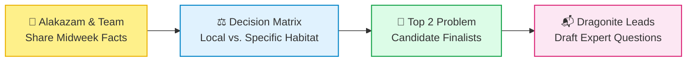
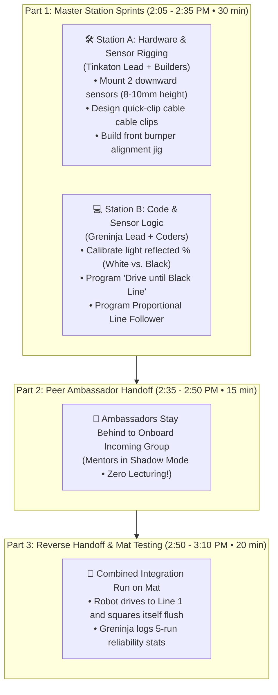
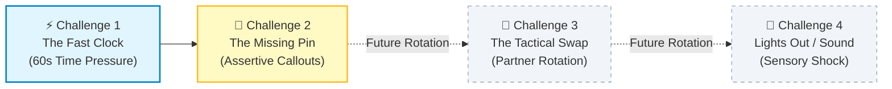

# FLL Session 4: Sensor Navigation, Line Tracking, Mission Routing & Innovation Problem Selection

**Date:** Saturday, October 4, 2026  
**Time:** 1:00 PM – 4:00 PM  
**Attendees:** Team Members, Mentors & Coaches  
**Season Phase:** Training Camp 3 — Sensor Navigation, Field Mission Routing & Innovation Problem Narrowing

> [!IMPORTANT]
>
> ### 🧭 Session 4 Coaching Architecture: Transitioning from Blind Guesswork to Sensor Intelligence
>
> In Session 3, students mastered mechanical modularity and physical chassis building. Today marks a major technical leap: **shifting from time/motor-degree dead-reckoning to closed-loop sensor feedback**.
>
> 1. **Innovation Problem Narrowing (1:15 – 1:55 PM):** While energy is fresh, synthesize midweek research findings, analyze existing solutions, and narrow the team's focus down to 1–2 high-potential problem statements ahead of the October 17 Zoo Field Trip.
> 2. **Dual-Station Sensor & Mission Lab (2:05 – 3:10 PM):** Hands-on implementation of dual color sensors, line following, and line squaring subroutines, driven by the **Peer Ambassador Handoff** protocol.
> 3. **The "Sensor Blind Navigation" Core Values Challenge (3:10 – 3:35 PM):** An experiential communication exercise that illustrates how robots perceive sensor thresholds, reinforcing trust, closed-loop callouts, and empathy.
> 4. __Roles in Action:__ Put the updated [Team Roles Matrix](../../../responsibilities/roles_matrix.md) into full practice—each student lead coordinates their domain!

---

## 📌 Coach's Prep & Materials Checklist

* **Innovation & Research Materials:**

   * Whiteboard and dry-erase markers for problem narrowing and decision matrix voting.
   * Research notes and completed [Printable Innovation Worksheets](../../../marketing/handouts/innovation_project_worksheet.html).
   * 1 copy of the [Mentor Innovation Project Rubric Guide](../guides/innovation_project_rubric_guide.md) for mentor reference.
   * Expert interview question prep sheets for the upcoming Zoo trip (Oct 17).

---

## 🕒 Master Timeline Overview (1:00 PM – 4:00 PM)

```mermaid
gantt
    title Session 4 Master Timeline (Saturday, Oct 4)
    dateFormat HH:mm
    axisFormat %H:%M

    section Kickoff
    Welcome & Role Briefing       :13:00, 15m

    section Innovation
    Midweek Research & Problem Selection :13:15, 40m

    section Recharge
    Bio Break & Energy Reset      :13:55, 10m

    section Robot Lab
    Station A/B Sensor & Code Camp :14:05, 30m
    Peer Ambassador Handoff       :14:35, 15m
    Reverse Handoff & Testing     :14:50, 20m

    section Core Values
    Sensor Blind Navigation Game  :15:10, 25m

    section Wrap-Up
    Clean-Up Protocol Sprint      :15:35, 15m
    Daily Learning Reflection     :15:50, 10m
```

---

## 📋 Minute-by-Minute Session Plan

### 1:00 - 1:15 PM | Welcome, Energy Check & Role Briefing (15 min)

* **Arrival & High-Five Welcome (5 min):** Greet students as they enter. Check in on personal energy and verify team badges.
* **The 3 Mission Goals for Today (5 min):**
   1. *Innovation:* Narrow down from broad habitat ideas to our top 2 specific problem candidates.
   2. *Robot:* Teach the robot to "see" using color sensors—mount sensors and code a line-stop program.
   3. *Core Values:* Trust each other in the "Sensor Blind Navigation" team challenge.

* __Activating the [Team Roles Matrix](../../../responsibilities/roles_matrix.md) (5 min):__
   * Remind the team: *"Leads do not work alone—leads facilitate, organize, include everyone, and safely store our gear!"*
   * **Machamp** (Presentation Lead): Keeps track of the master room clock and transition timers.
   * **Alakazam** (Research Lead): Keeps project discussions focused on specific evidence and citations.
   * **Tinkaton** (Prototype Lead): Manages building task assignments and LEGO sorting trays.
   * **Dragonite** (Outreach Coordinator): Compiles interview questions for our guest experts.
   * **Jigglypuff** (Creative Director): Captures photos/videos of robot testing and tracks design milestones.
   * **Meowth** (Budget Officer): Tracks supply wishlists and audits high-value electronic gear.
   * **Greninja** (Intelligence Scout): Leads test-run debriefs and records robot consistency scores.
   * **Psyduck** (Rubber Ducky): Sounding board for stuck teammates, ensures fair table turns, and monitors stress.

---

### 1:15 - 1:55 PM | Block 1: Innovation Project Problem Narrowing & Expert Outreach Prep (40 min)

* **Midweek Research Synthesis (15 min):**
   * Facilitated by **Alakazam** (Research Lead) and supported by mentors.
   * Teammates go around the table sharing one fascinating scientific fact or habitat challenge discovered during the week.
   * Capture ideas on the whiteboard grouped into ecosystem clusters:
      * *Deep Benthic Zone / Hydrothermal Vents:* Extreme pressure, darkness, unique chemosynthesis, light pollution from exploration subs.
      * *Coastal Estuaries / Salt Marshes:* Sediment runoff, artificial shoreline seawalls, microplastic biofouling.
      * *Kelp Forests / Rocky Reefs:* Wave energy damage, rising water temperatures, sea urchin imbalances.

* **Applying the FLL Problem-Narrowing Filter (15 min):**
   * Guide students through the Socratic evaluation framework from our [Mentor Innovation Rubric Guide](../guides/innovation_project_rubric_guide.md):
      * *"Is this problem too big for us to impact (e.g. 'clean the entire ocean') or specific enough to build a prototype for?"*
      * *"Can we find and interview a real human expert who works on this problem locally or regionally?"*
      * *"Can we explain who suffers from this problem in 2 sentences?"*

   * Narrow the list down to **2 strong finalist problems**.

* **Expert Outreach Prep for Zoo Field Trip (10 min):**
   * Led by **Dragonite** (Outreach Coordinator).
   * The team is visiting the Zoo on October 17 to interview biologists.
   * Draft 3–4 open-ended, high-leverage questions to ask:
      * *"What is the most difficult challenge you face when monitoring this habitat in the wild?"*
      * *"What tools do you currently use, and what is their biggest flaw?"*
      * *"If engineers could build any new tool to help your conservation work, what would it do?"*

---

### 1:55 - 2:05 PM | Bio Break & Physical Energy Reset (10 min)

* Hands off bricks and tablets immediately.
* Water break, nutritious snack, bathroom check, and physical stretch.
* Clear desks and prep the robot stations for engineering time.

---

### 2:05 - 3:00 PM | Block 2: Dual-Station Robot Engineering Camp (60 min)

> 💡 **Why Dual Color Sensors?**  
> Running on motor rotations alone causes errors due to wheel slip, battery drain, and mat friction variations. Adding two color sensors pointing down enables **line tracking** and **line squaring** (aligning perpendicular against field lines), resetting accumulated positioning errors to zero!

#### Station A: Mechanical Rigging & Sensor Mounting (Build Lab)

* **Lead:** **Tinkaton** (Prototype Lead) & Builders.
* **Objective:** Mount two SPIKE Prime Color Sensors to the front of the Advanced Driving Base.
* **Key Engineering Principles:**
   * **Ground Clearance:** Sensors must sit **8 mm to 10 mm** above the mat. Too high ($>15\text{ mm}$), and ambient room light introduces noise; too low ($<5\text{ mm}$), and the sensor will scrape mat wrinkles or seam lines.
   * **Sensor Spacing:** Space the two sensors wide enough apart to straddle standard mission lines (approximately 4–6 Technic studs apart).
   * **Cable Management:** Secure sensory cables tightly using Technic bush pins so wires cannot catch on mission models.
   * **Sturdy Bracing:** Perform the 2-finger tug test on the sensor bracket to ensure zero wobble.

#### Station B: Sensor Calibration & Navigation Logic (Code Lab)

* **Lead:** **Greninja** (Intelligence Scout) & Coders.
* **Objective:** Create modular Scratch/Python blocks for sensor-based navigation.
* **Programming Milestones:**
   1. **Light Reflection Threshold Test:**
      * Place sensor over white mat surface: record value (typically ~80–90%).
      * Place sensor over black line: record value (typically ~10–20%).
      * Calculate midpoint threshold: $\text{Threshold} = \frac{\text{White} + \text{Black}}{2} \approx 50\%$.

   2. **Block 1: "Drive Until Black Line" (Stop at Line):**
      * Start motors forward $\rightarrow$ Wait until Color Sensor $< 35\%$ $\rightarrow$ Stop motors.

   3. **Block 2: "Line Squaring" (Self-Alignment):**
      * Drive forward until either sensor detects black.
      * Pivot the opposite wheel until the second sensor also detects black.
      * Result: Robot is now aligned **100% perpendicular** to the line, regardless of starting angle!

#### 2:35 - 2:50 PM: The Peer Ambassador Handoff (15 min)

* Exactly at 2:35 PM, stations switch.
* **1–2 Ambassadors** stay at Station A to teach the incoming group how the sensors are mounted and calibrated.
* **1–2 Ambassadors** stay at Station B to guide incoming coders through the threshold math.
* *Coaching rule:* Mentors stand back in shadow mode. Let the kids explain and teach in their own words!

#### 2:50 - 3:10 PM: Integration & Mat Reliability Trials (20 min)

* Both halves re-unite at the official table.
* **Psyduck** ensures every teammate gets an active role during testing (launcher, spotter, data logger).
* Perform **5 trial runs** of the Line Squaring routine from the Launch Area:
   * **Greninja** logs success rate in the team notebook (e.g. 4/5 clean squares).
   * **Jigglypuff** films slow-motion video of the sensor behavior to verify detection timing.

---

## 🥊 3:00 - 3:45 PM | The CRM Stress Gauntlet (30 min)

> 💡 **Coaching Note:** We do **not** need to run all 4 challenges in every session! Running 2 focused challenges per session keeps the exercises crisp, prevents sensory fatigue, and keeps students on their toes. Today, we run **Challenge 1** and **Challenge 2** (with Challenge 3 & 4 reserved for future rotations).

### The Golden CRM Rule: "Aviate, Navigate, Communicate"
Before starting, gather pairs and review the 3-word pilot axiom (see [CRM Guide](../guides/crew_resource_management.md#the-core-pillar-aviate-navigate-communicate)):
1. **🛩️ Aviate:** Control the physical piece first—hold it steady!
2. **🧭 Navigate:** Check the clock and know what piece is missing or needed next.
3. **📢 Communicate:** Speak loud and clear so your partner acts as one brain!

### The Universal Ground Rule: The One-Handed Duo Constraint
* Each student puts their non-dominant hand firmly in their pocket (or behind their back).
* **They may only use ONE hand!**
* *Why:* One child cannot take over. One student must act as the **Anchor** (holding the beam steady) while the other acts as the **Builder** (inserting pins and sliding gears).

---

### ⚡ Challenge 1: The Fast Clock (60 Seconds)

* **The Scenario:** You have exactly **60 seconds** on the big screen timer to assemble the complete pivoting Technic lever arm.
* **What Mentors Will Observe:** Kids rushing, dropping pins, fumbling with one hand, getting quiet, or frantically yelling *"Hurry up!"*
* **The Rules:**
   1. Timer starts with an official match buzzer: *"3, 2, 1, LEGO!"*
   2. Build until the horn sounds at 0:00.
* **The 2-Minute Debrief:**
   - *"Raise your hand if your heart beat faster when you heard the countdown!"*
   - *"Did rushing make you faster or did it make pins slip out of your fingers?"*
   - **Coach Takeaway:** In FLL, **smooth is fast**. When you rush silently, you drop parts. Next time, tell your partner: *"Hold beam grey flat!"* then slide the pin calmly.

---

### 🧩 Challenge 2: The Missing Pin (Unforeseen Obstacle)

* **The Secret Setup:** Before starting, the mentor quietly removes **one black connector pin** from every team's tray without telling them!
* **The Scenario:** 60-second timer starts. Kids attempt to finish the arm, but quickly realize: *the final beam cannot be secured because a pin is missing!*
* **What Usually Happens:** Kids freeze, search through the carpet, blame their partner (*"Did you drop it?!"*), or stand paralyzed.
* **The Expected CRM Behavior:**
   - **Aviate:** Finish what can be assembled.
   - **Navigate:** Realize a required piece is physically absent.
   - **Communicate:** Raise a hand, look at the mentor/referee, and assertively call: *"Supply! We are missing one black friction pin!"*
   - Mentor immediately tosses them the missing pin.
* **The 2-Minute Debrief:**
   - *"Was it your fault the pin was missing?"* (No!).
   - *"Did blaming your partner help?"* (No!).
   - **Coach Takeaway:** At tournaments, models jam and parts break through no fault of your own. Don't waste 20 seconds freezing. **Aviate, Navigate, Communicate! Speak up assertively!**

*(Challenges 3 & 4: Tactical Mid-Build Swap and Lights-Out Sensory Shock are held in reserve for upcoming sessions!)*

---

### 3:45 - 3:50 PM | The Clean-Up Protocol Sprint (15 min)

* **Stop immediately at 3:35 PM.** Enforce clean-up discipline cleanly.
* **Role Leadership in Action:**
   * **Tinkaton** (Prototype Lead): Inspects table surface, checks sorting trays, and ensures modular attachment frames are packed in padded bins.
   * **Meowth** (Budget Officer): Performs electronics inventory:
      - [ ] 2 SPIKE Prime Hubs plugged into charging cables.
      - [ ] 4 Color Sensors verified and accounted for.
      - [ ] Tablets placed in storage dock and plugged in.

   * **Machamp** (Presentation Lead): Ensures whiteboard notes are photographed and research binders are filed in the cabinet.
   * **Floor Sweep Challenge:** Two-minute group sprint to ensure zero Technic pins or beams remain on the floor.

---

### 3:50 - 4:00 PM | Daily Learning Circle & Reflection (10 min)

* Gather team in a seated circle with all materials put away.
* **Machamp** monitors the 1-minute-per-speaker time.
* Each team member answers:
   1. *"What was one 'Aha!' moment you had about color sensors or our project today?"*
   2. *"Who is one teammate you saw using a FIRST Core Value (Discovery, Innovation, Impact, Inclusion, Teamwork, Fun) today?"*

* **Mentors Hand Out Recognition Tokens / Pokémon Cards:** Celebrate grit, thoughtful questions, and clean handoffs.
* Quick parent dismissal check-in.

---

## 🎯 Coach's Success & Evaluation Criteria

By 4:00 PM, Session 4 is a complete success if:

- [ ] The team evaluated their research ideas and agreed on **top 2 finalist problem statements**.
- [ ] At least 3 specific questions were drafted for domain experts on the upcoming Zoo trip.
- [ ] Both SPIKE Prime robots have dual color sensors rigidly mounted at **8–10 mm clearance**.
- [ ] Students programmed and verified a functioning **"Stop at Line"** or **Line Squaring** routine.
- [ ] The Peer Ambassador Handoff was executed with **students leading the explanation** without mentor lecturing.
- [ ] Every child participated in the "Sensor Blind Navigation" challenge.
- [ ] Clean-up protocol completed 100% with all batteries on charge.
- [ ] Every student shared a takeaway in the Daily Learning Circle.

---

## 🔗 Related Resources & Next Steps

* 🧭 [Master Schedule & Upcoming Sessions](../schedule.md)
* 👥 [Team Roles Matrix & Leadership Philosophy](../../../responsibilities/roles_matrix.md)
* 💡 [Mentor Innovation Project Rubric Guide](../guides/innovation_project_rubric_guide.md)
* ✈️ [Crew Resource Management (CRM) Guide](../guides/crew_resource_management.md)
* 📇 [Mentor CRM Pocket Cue Card](../guides/mentor_crm_cue_card.html)
* 🌿 [Printable Innovation Project Worksheet](../../../marketing/handouts/innovation_project_worksheet.html)
* ⏱️ [Interactive Match Practice Timer](../../../webtools/index.html)
