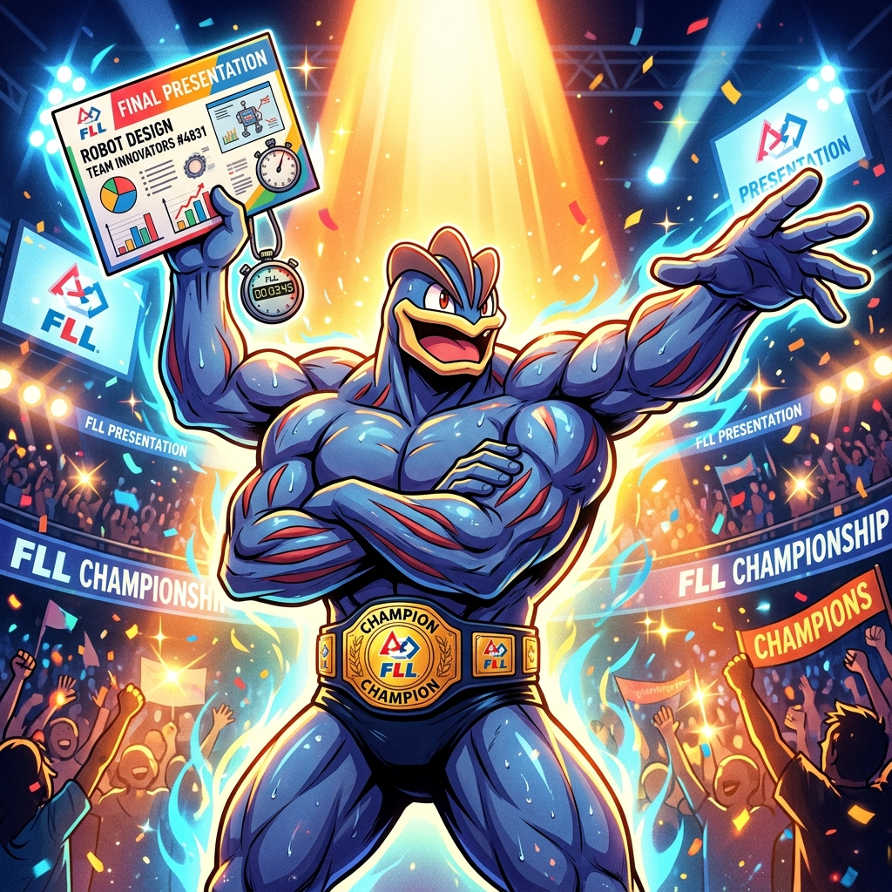
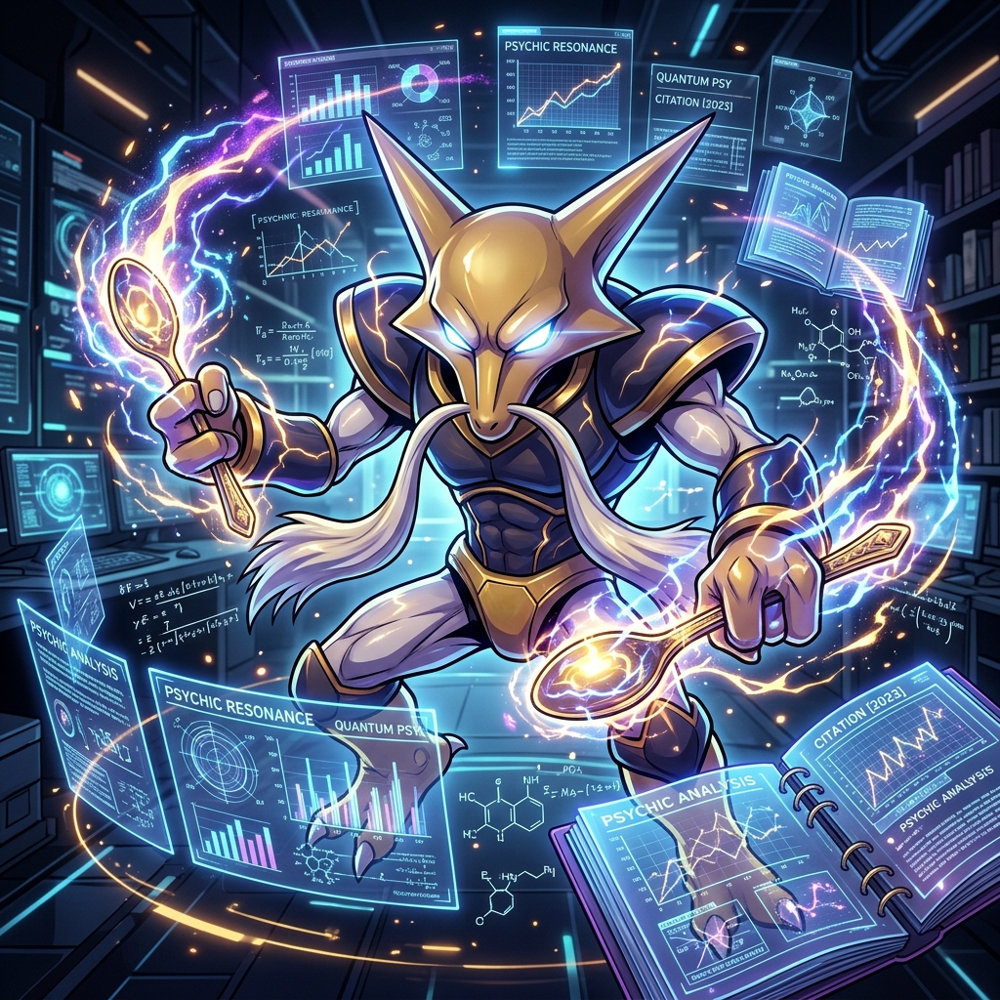
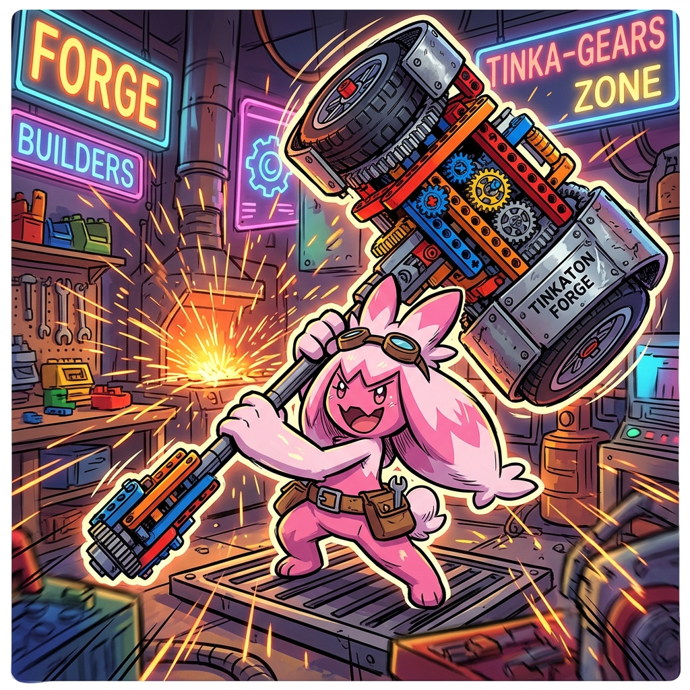
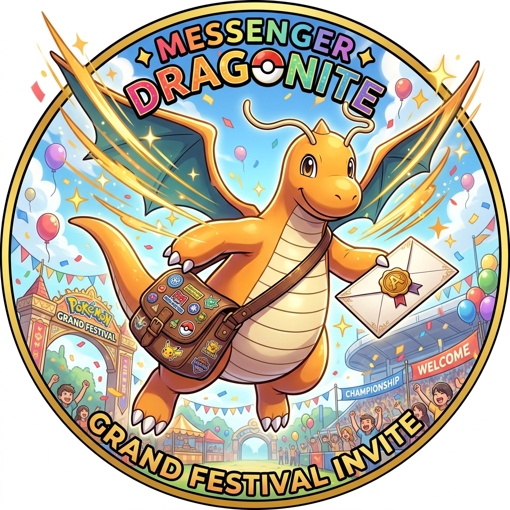
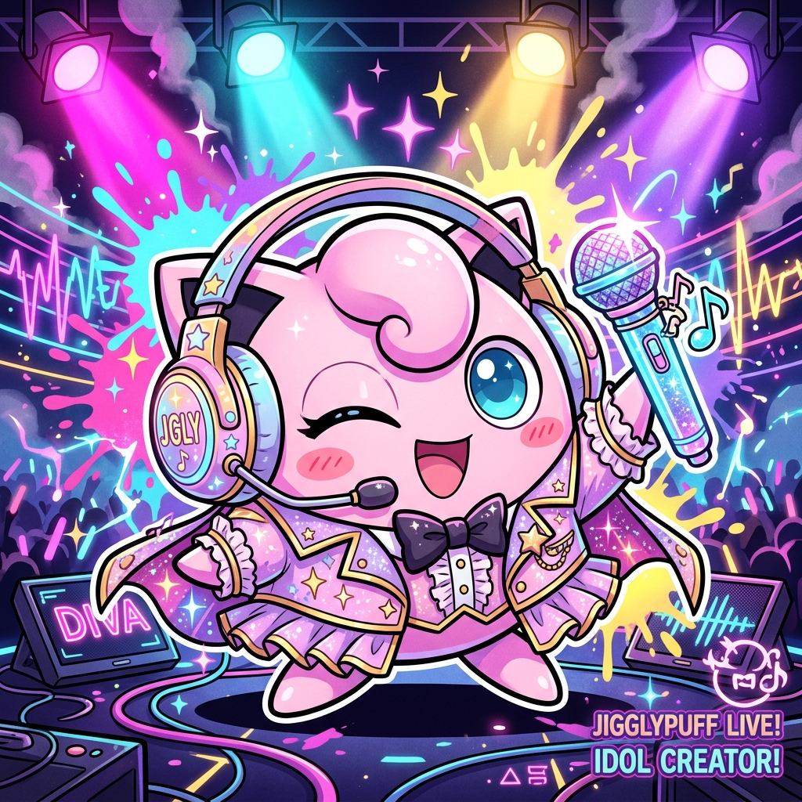
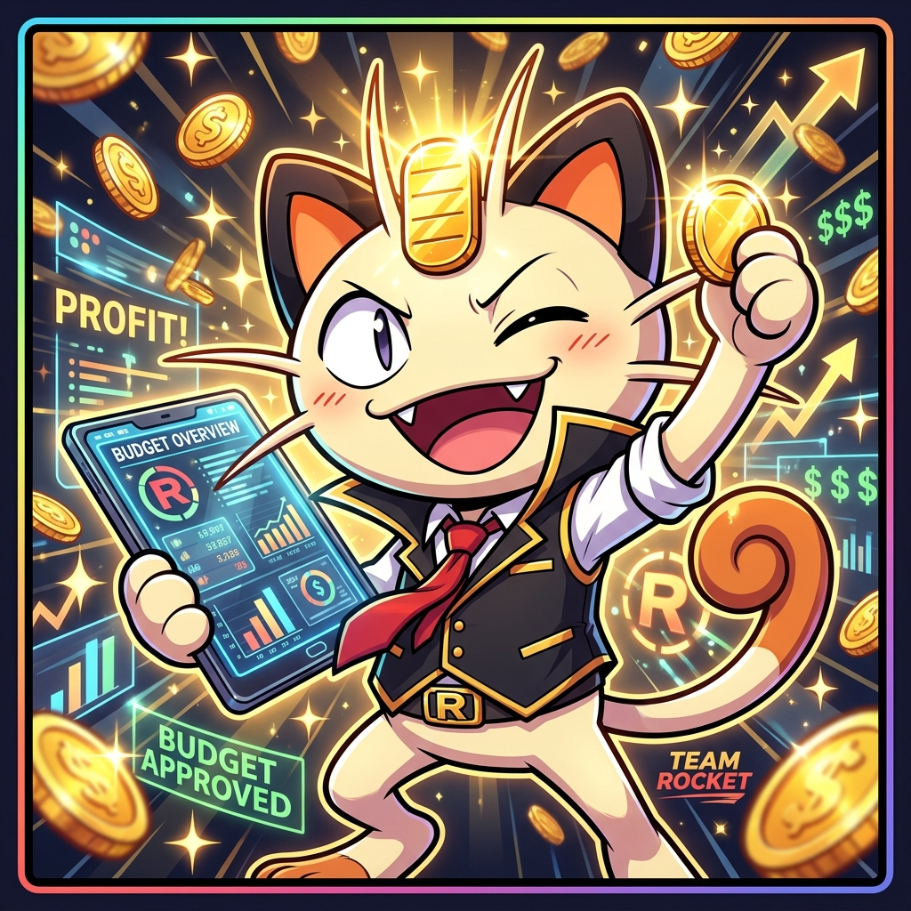
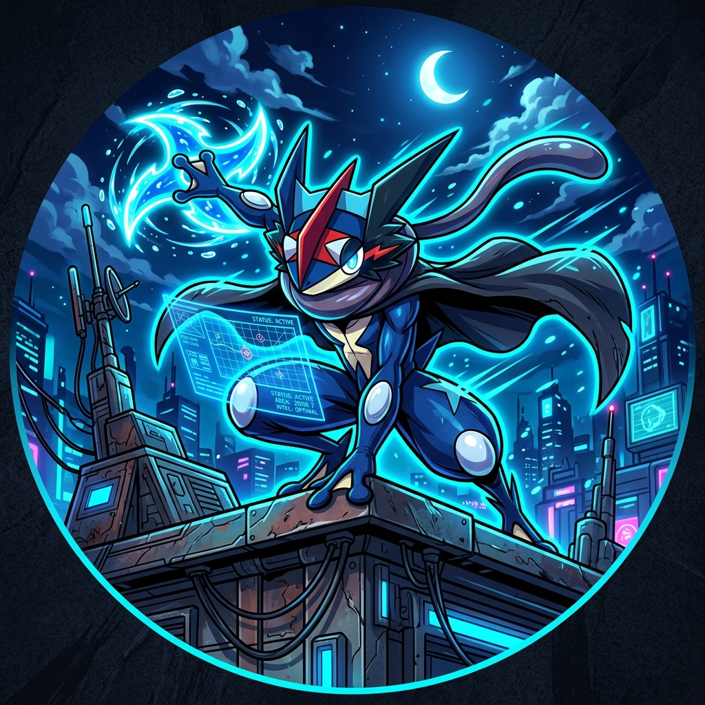
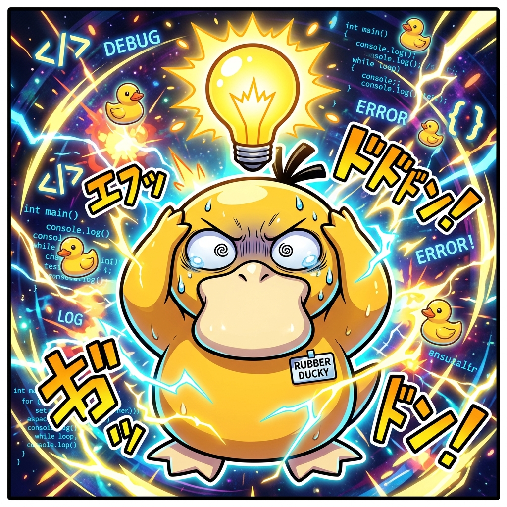

# Team 76265 Job Roles & Responsibility Matrix

**Season**: 2026 BIOGLOW  
*(Note: Refer to team members by role identifier or Pokémon codename in accordance with the [AI Constitution](../AI_CONSTITUTION.md))*

---

### Role Breakdown

> 💡 **The Lead Philosophy (Coordinators & Custodians):**  
> In FIRST® LEGO® League, tasks like building, coding, researching, and presenting are **collaborative team efforts**—no single person works alone!  
> Each role lead serves as a **facilitator, coordinator, and custodian**:
> 1. **Facilitate & Focus:** Keeps discussions positive, productive, and on-track.
> 2. **Include Everyone:** Ensures every teammate has a task and a voice.
> 3. **Safely Store Materials:** Ensures robot parts, props, binders, and tools are packed away safely between meetings.

| Role | Codename | Avatar | 💡 Project Leadership & Coordination | 🤖 Robot Leadership & Coordination |
| :--- | :--- | :---: | :--- | :--- |
| **Presentation Lead** | Machamp 💪 |  | Speaking time balance, 5-min rehearsal timer, prop storage | Robot design presentation coordination, 2.5-min match timer, pit cleanup |
| **Research Lead** | Alakazam 🧠 |  | Focus during research, citations, project binder organization | Focus during rule/strategy discussions, Q&A rulings, engineering log |
| **Prototype Lead** | Tinkaton 🔨 |  | Crafting task allocation, craft supply care & model storage | Build task allocation, LEGO sorting & robot cleanup, design concept logs |
| **Outreach Coordinator** | Dragonite 📬 |  | Expert contacts, interview questions, fundraising plans | Tournament swag/trading, team ambassador/Coopertition, demos |
| **Creative Director** | Jigglypuff 🎤 |  | Theme & costume ideas, poster visuals, presentation deadlines | Robot branding/icons, testing photo/video reminders, build milestone tracking |
| **Budget Officer** | Meowth 🪙 |  | Project supply wishlists, budget limits, receipt tracking | Robot parts wishlists, Hub/tablet inventory checks, budget limits |
| **Intelligence Scout** | Greninja 🥷 |  | Compiling research on existing market solutions & novelty | Compiling robot ideas/mechanisms, match debriefs, strategy notes |
| **Rubber Ducky** | Psyduck 🦆 |  | Listening, team fun, inclusion, anonymous mentor bridge | Code/build sounding board ("rubber ducking"), fair table turns, stress resets |

---

### Detailed Role Responsibilities

#### 📦 Presentation Lead — Machamp

  
  

    <strong>Codename:</strong> Machamp 💪 
    <strong>Leadership Focus:</strong> Participation, Rehearsals & Timekeeping 
    <strong>Superpower:</strong> Stage presence, keeping everyone on schedule, and ensuring every single teammate has their moment in the spotlight.
  

* **💡 Innovation Project:**
  - Makes sure everyone knows what they are contributing and that speaking time is shared fairly.
  - Keeps an eye on the clock during practice so the presentation stays within the 5-minute limit.
  - Ensures presentation boards, props, and cue cards are safely packed away after each session.
* **🤖 Robot Game & Robot Design:**
  - Coordinates the **Robot Design judging prep** so every builder and coder gets a chance to explain their work to the judges.
  - Keeps time during practice runs so the drive team learns to operate within the 2.5-minute match clock.
  - Ensures pit displays and match run-sheets are packed and organized between sessions.

---

#### 🔬 Research Lead — Alakazam

  
  

    <strong>Codename:</strong> Alakazam 🧠 
    <strong>Leadership Focus:</strong> Discussion Focus, Knowledge Organization & Citations 
    <strong>Superpower:</strong> Synthesizing facts, keeping discussions on-topic, and guarding the team's scientific citations and rulebook rulings.
  

* **💡 Innovation Project:**
  - Keeps the team focused and on-topic during project research discussions.
  - Collects and organizes the team’s research notes, facts, and source citations into the master binder.
  - Ensures everyone’s questions and findings from expert interviews get properly documented.
* **🤖 Robot Game & Robot Design:**
  - Keeps the team focused when reviewing official Robot Game rules, mission scoring updates, and Q&A rulings.
  - Gathers and logs the team's engineering lessons, math, and discoveries into the team notebook.
  - Makes sure the rulebook is handy at the table whenever a scoring question comes up.

---

#### 🛠️ Prototype Lead — Tinkaton

  
  

    <strong>Codename:</strong> Tinkaton 🔨 
    <strong>Leadership Focus:</strong> Hands-On Task Allocation & Hardware Custody 
    <strong>Superpower:</strong> Workshop forge master—making sure every builder has a mechanism in hand and every Technic brick is sorted and put away.
  

* **💡 Innovation Project:**
  - Makes sure everyone has an active task during prop and model crafting time.
  - Collects and organizes prototype sketches and craft ideas from the group.
  - Ensures all project craft materials and display models are safely stored in team bins.
* **🤖 Robot Game & Robot Design:**
  - **Robot & LEGO Custodian:** Ensures the robot base, attachments, and LEGO bins are sorted and safely put away at the end of every session.
  - Makes sure everyone has something to work on during build time (no one is left standing around waiting).
  - Documents design ideas and build concepts from the whole group.

---

#### 📬 Outreach Coordinator — Dragonite

  
  

    <strong>Codename:</strong> Dragonite 📬 
    <strong>Leadership Focus:</strong> External Connections, Team Spirit & Swag 
    <strong>Superpower:</strong> Champion messenger—connecting with scientists, sharing buttons with fellow teams, and championing Coopertition®.
  

* **💡 Innovation Project:**
  - Gathers contact information for experts the team wants to invite to speak.
  - Coordinates teammate questions so everyone gets a turn to ask during expert calls.
  - Brainstorms and tracks fundraising plans for project materials and team travel.
* **🤖 Robot Game & Robot Design:**
  - Organizes ideas for team "swag" (stickers, buttons, handouts) to trade and share with other teams at tournaments.
  - Acts as the team ambassador to greet visiting teams, share ideas, and promote *Coopertition®*.
  - Coordinates community demonstrations where the team shows off the robot.

---

#### 🎨 Creative Director — Jigglypuff

  
  

    <strong>Codename:</strong> Jigglypuff 🎤 
    <strong>Leadership Focus:</strong> Theme, Visual Identity & Milestone Deadlines 
    <strong>Superpower:</strong> Creative vision, show-stopping presentation aesthetics, and keeping our visual story unforgettable.
  

* **💡 Innovation Project:**
  - Collects theme ideas, costumes/props, and visual concepts from the whole group for the presentation.
  - Organizes presentation display materials and ensures the team hits delivery deadlines.
* **🤖 Robot Game & Robot Design:**
  - Collects ideas from the team for robot aesthetics (team nameplate, decals, colors, SPIKE Hub light-matrix icons).
  - Reminds the team to capture photos and video clips of testing and attachments for our engineering records.
  - Helps keep the group aware of key robot milestones (e.g., target dates for finishing drive base or specific mission attachments).

---

#### 🪙 Budget Officer — Meowth

  
  

    <strong>Codename:</strong> Meowth 🪙 
    <strong>Leadership Focus:</strong> Supply Wishlists, Inventory & Approvals 
    <strong>Superpower:</strong> Financial vigilance, keeping receipts in check, and guarding high-value electronic hubs and tablets.
  

* **💡 Innovation Project:**
  - Collects and tracks all project supply wishlists (poster boards, markers, craft materials).
  - Ensures all purchase ideas stay under budget before passing requests to mentors for final approval.
* **🤖 Robot Game & Robot Design:**
  - Tracks all robot parts and supply requests (e.g., replacement cables, storage trays, extra bricks).
  - Helps do an end-of-session inventory check for high-value items (SPIKE Hub, motors, sensors, tablets).
  - Ensures robot purchase requests stay within team budget limits before mentor review.

---

#### 🥷 Intelligence Scout — Greninja

  
  

    <strong>Codename:</strong> Greninja 🥷 
    <strong>Leadership Focus:</strong> Scouting, Strategy Compiling & Match Debriefs 
    <strong>Superpower:</strong> Tactical recon, breaking down champion mechanism videos, and logging match run reliability statistics.
  

* **💡 Innovation Project:**
  - Tracks and compiles everyone’s research on existing products and solutions to see what's already out there.
  - Helps the team identify and document what makes their own solution unique.
* **🤖 Robot Game & Robot Design:**
  - Tracks and compiles everyone's research on existing robot designs, mechanism ideas, and match strategies.
  - Facilitates match debriefs after practice runs (collects what worked, what failed, and what to tweak).
  - Ensures novel strategy ideas and routing suggestions from the group are documented and shared.

---

#### 🦆 Rubber Ducky — Psyduck

  
  

    <strong>Codename:</strong> Psyduck 🦆 
    <strong>Leadership Focus:</strong> Team Dynamics, Active Listening & Inclusion 
    <strong>Superpower:</strong> Rubber duck debugging listener, calling team resets when stress rises, and protecting teammate inclusion and psychological safety.
  

* **💡 Innovation Project:**
  - Listens to the team, checks in on teammates, and makes sure everyone is having fun and feels included.
  - Acts as a sounding board: If someone is frustrated or stuck on a problem, talking it out helps them get unstuck.
  - Serves as a safe, confidential person to go to if you want to pass anonymous feedback to mentors.
* **🤖 Robot Game & Robot Design:**
  - **"Rubber Duck" Debugging Partner:** When coders or builders are stuck, they explain their logic out loud to the Rubber Ducky to spot their own mistakes.
  - Makes sure everyone gets fair table time to test code and launch runs.
  - Calls for a quick breather or team reset when frustration or pressure gets high at the table.
